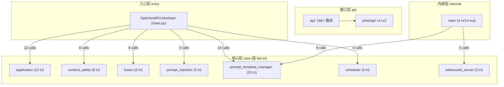
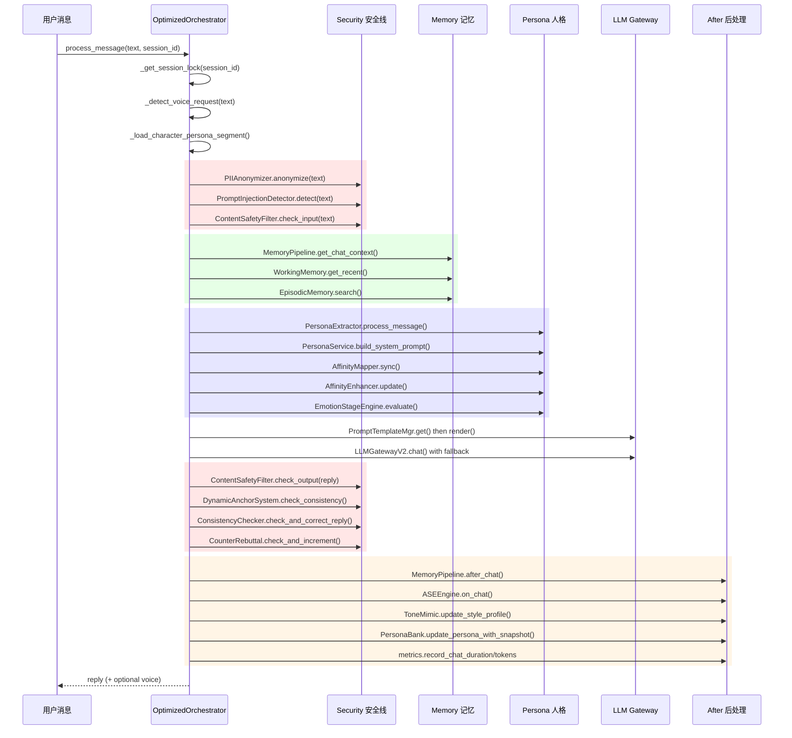

# 代码图谱 — unique-you (唯一的你) v3.0.0

> 由 codebase-memory 图谱工具 知识图谱自动生成 | 2026-06-30
> 5983 节点 · 24923 边 · 309 Python 文件 · 79 TypeScript 文件 · 332 API 路由

---

## 1. 全局指标

| 维度 | 数值 |
|------|------|
| 总节点 | 5983 |
| 总边 | 24923 |
| Method | 1885 |
| Function | 1294 |
| Class | 471 |
| File | 424 |
| Module | 423 |
| Route | 332 |
| Interface (TS) | 163 |
| 测试用例 (TESTS 边) | 1413 |
| 相似函数对 (SIMILAR_TO) | 118 |
| 语义关联 (SEMANTICALLY_RELATED) | 110 |
| HTTP 跨服务调用 | 49 |
| 协同变更文件对 (FILE_CHANGES_WITH) | 31 |
| 继承关系 (INHERITS) | 10 |

**边类型分布（前 8）**：USAGE(6331) > CALLS(6116) > DEFINES(5110) > DEFINES_METHOD(1885) > WRITES(1549) > TESTS(1413) > IMPORTS(755) > DECORATES(621)

**语言分布**：Python 309 · TypeScript 79 · YAML 14 · Bash 5 · TOML 1 · JS 1 · HTML 1 · CSS 1

---

## 2. 架构分层

知识图谱基于 fan-in/fan-out 自动识别出 4 个架构层：

**分层逻辑**：
- **entry** — 只有出站调用，是系统总指挥
- **core** — 高 fan-in（被很多模块调用），是基础设施和服务
- **api** — 定义 HTTP 路由
- **internal** — 工具/部署脚本，fan-in=0 或很低

---

## 3. 核心数据流 — process_message 热路径

`OptimizedOrchestrator.process_message`（main.py:881-1138）处理每一条用户消息，是全系统最关键调用链：

**关键风险**：该路径上所有 hop=1 节点都被标记为 CRITICAL — 任何一个故障都会中断整个对话流程。

---

## 4. 模块目录与职责

### 4.1 入口与编排

| 模块 | 文件 | 职责 |
|------|------|------|
| `main.py` | main.py (94KB) | 入口 + OptimizedOrchestrator + 多模式启动 |
| `orchestrator.py` | orchestrator.py (31KB) | 基础 Orchestrator 类 |
| `user_scheduler.py` | user_scheduler.py (13KB) | 多用户调度，每个微信用户独立情感状态 |

**OptimizedOrchestrator 运行模式**：
- `_run_fast_mode` — 快速模式，跳过重计算 (complexity=15)
- `_run_full_mode` — 完整模式，全管线 (complexity=19)
- `run_console_chat` — 控制台交互 (complexity=24，最高)
- `run_wechat_mode` — 微信模式
- `run_clone_pipeline` — 克隆训练管线

### 4.2 API 层（332 路由）

三个路由来源：

| 来源 | 路径 | 路由数 | 说明 |
|------|------|--------|------|
| `api/_*_routes.py` | 8 个子路由文件 | ~71 端点 | 旧版路由：chat/users/personality/training/tools/safety/clone/misc |
| `api/routers/` | 13 个域路由 | ~97 端点 | 新版域路由：character/auth/admin/invite/voice/mimo/storyline/wechat/emotion/memory/knowledge/persona_card/demo |
| `shisi/api/` | v1 + v2 | ~164 端点 | shisi 域：affinity/character/emotion_stage/memory/persona/stats/sticker/training/vital_signs + v2 健康检查/迁移 |

### 4.3 shisi/ — Clean Architecture 重构（核心域）

DDD 分层架构，是项目最重要的重构成果：

| 子包 | 职责 | 关键类 |
|------|------|--------|
| `application/` | 应用服务 | CharacterService, MemoryService, PersonaService, KnowledgeService, PromptService, MigrationService |
| `core/models/` | 领域模型 | AffinityLevel, CharacterId, EmotionalState, PersonaProfile, CharacterAggregate |
| `core/ports/` | 端口接口 | CharacterRepository |
| `core/services/` | 领域服务 | EmotionDetector, PromptBuilder |
| `infrastructure/persistence/` | 持久化 | SQLiteRepository, Schema |
| `infrastructure/migration/` | 迁移 | MigrationRunner, RollbackRunner |
| `memory/legacy/` | 记忆管线 | WorkingMemory(49 fan-in), EpisodicMemory, SemanticMemory, StructuredMemory, VectorMemory, MemoryPipeline, FactExtractor, ImportanceScorer, ReflectionEngine, ConversationSummarizer, DiarySummarizer |
| `affinity/` | 亲密度 | AffinityEnhancer(46 fan-in), AffinityMapper, DecayEngine, UnlockManager |
| `storyline/` | 剧情线 | Engine, Detector, Config |
| `emotion_stage/` | 情感阶段 | StageEngine, EventDispatcher, StageConfig |
| `vital_signs/` | 生命体征 | VitalEngine, EmotionMapping |
| `sticker/` | 表情包 | StickerManager, EmotionRecommender, SafetyCheck, Importer |
| `voice/` | 语音 | CharacterVoice, EmotionTTS |
| `wechat/` | 微信集成 | CommandHandler, CommandParser, ProactiveMessenger, StickerAdapter |
| `vault/` | 数据收集 | CollectLoop, PersonaAdapter |
| `ase/` | 场景叙事 | SceneNarrator, TriggerEngine |
| `knowledge/` | 知识检索 | Retriever, CharacterKnowledgeService, CrawlerAdapter |

### 4.4 my_character/ — 角色引擎（21 模块）

| 模块 | 职责 | 备注 |
|------|------|------|
| `character_config.py` | ConfigLoader | **423 fan-in，全项目最高** |
| `emotion_engine.py` | 情感引擎核心 | — |
| `emotion_memory.py` | 情感记忆 | — |
| `emotion_style_coupler.py` | 情感-风格耦合 | — |
| `enhanced_prompt_engine.py` | TimeContext | **103 fan-in** |
| `persona_engine.py` | 人格引擎 | — |
| `persona_evaluator.py` | 人格评估 | — |
| `style_enhancer.py` / `style_enhancer_v2.py` | 风格增强 | v1/v2 共存 |
| `tone_mimic.py` | 语气模仿 | — |
| `consistency_checker.py` | 回复一致性检查 | 热路径节点 |
| `counter_rebuttal.py` | 反驳计数器 | 热路径节点 |
| `dynamic_anchor.py` | 动态锚点系统 | 热路径节点 |
| `anchor_protection.py` | 锚点保护 | — |
| `constraint_validator.py` | 约束验证 | — |
| `contextual_behavior.py` | 上下文行为 | — |

### 4.5 persona_extractor/ — 人格提取器（12 模块）

| 模块 | 职责 |
|------|------|
| `fusion.py` | PersonaExtractor 融合入口（6 fan-in） |
| `style_vectorizer.py` | 风格向量化 |
| `mental_health.py` | 心理健康分析 |
| `dark_triad.py` | 暗黑三人格检测 |
| `hexaco.py` | HEXACO 人格模型 |
| `liwc_analyzer.py` | LIWC 语言分析 |
| `pado_detector.py` | PADO 检测 |
| `cognitive_distortions.py` | 认知偏差检测 |
| `emotion_coupler.py` | 情感耦合器（chameleon filter） |
| `persona_bank.py` | 用户人格库 |

### 4.6 security/ — 安全模块

| 模块 | 类 | fan-in | 检查时机 |
|------|-----|--------|---------|
| `content_safety.py` | ContentSafetyFilter | 8 | 输入 + 输出 |
| `prompt_injection.py` | PromptInjectionDetector | 5 | 输入 |
| `pii_anonymizer.py` | PIIAnonymizer | — | 输入 |
| `encryption.py` | 加密模块 | — | — |

安全检查在 process_message 中执行两次：输入检查（3 层）+ 输出检查（4 层）。

### 4.7 llm_provider/ — LLM 网关

| 模块 | 职责 |
|------|------|
| `llm_gateway.py` | LLMGatewayV2，自动 fallback 链 |
| `multi_provider_gateway.py` | 多供应商网关 |
| `openai_compatible_provider.py` | OpenAI 兼容供应商 |
| `opencode_zen_provider.py` | OpenCode Zen 供应商 |
| `prompt_template_manager.py` | PromptTemplateMgr（**54 fan-in**） |

### 4.8 voice/ — 语音合成（5 Provider）

| Provider | 文件 | 说明 |
|----------|------|------|
| MiMo Cloud | `mimo_tts_provider.py` | 默认引擎 |
| Edge-TTS | `edge_tts_provider.py` | 免费 |
| SoVITS | `sovits_provider.py` | 本地模型 |
| Bert-VITS2 | `bert_vits2_provider.py` | 本地模型 |
| CosyVoice | `cosyvoice_provider.py` | 本地模型 |
| TTS Manager | `tts_manager.py` | 统一管理 |
| Voice Training | `voice_training.py` | 语音训练 |
| Audio Converter | `audio_converter.py` | 音频格式转换 |

### 4.9 前端（React 19 管理控制台）

- 15 个页面（LoginPage, RolesPage, CreateRole, RoleSettings, SettingsLLM/Security/Logs, UsersPage, AdminUsersPage, WeChatPage, BindingDetailPage, UserWorkspace, DemoPage, NotFoundPage）
- 12 个 API 模块（auth, characters, chat, admin, clone, demo, mimo, system, training, users, wechat, client）
- 4 个 Zustand store（authStore, chatStore, errorStore, characterBuilderStore）
- React Query hooks
- Playwright E2E 测试

---

## 5. 社区聚类（Leiden 算法）

知识图谱通过 Leiden 社区检测识别出 12 个自然模块：

| ID | 标签 | 成员数 | 内聚度 | 涉及包 |
|----|------|--------|--------|--------|
| 8 | my_character | 269 | 0.50 | api, shisi, my_character, proactive, character_card |
| 17 | my_character | 245 | 0.59 | weclone_adapter, my_character, tests, proactive |
| 0 | api | 209 | 0.52 | main, frontend, shisi, api, utils |
| 9 | shisi | 207 | 0.69 | api, shisi, tests, clone_training, llm_provider |
| 3 | tests | 164 | 0.66 | main, tests, shisi, api, voice |
| 49 | tests | 158 | 0.58 | shisi, tests, proactive, my_character, api |
| 12 | shisi | 150 | 0.75 | shisi, tests, my_character, frontend, api |
| 11 | api | 134 | 0.61 | api, shisi, persona_extractor, tests, character_card |
| 99 | tests | 132 | 0.80 | shisi, frontend, tests, orchestrator, api |
| 2 | shisi | 117 | 0.72 | main, shisi, proactive, my_character, tests |
| 6 | tests | 112 | 0.65 | main, shisi, proactive, persona_extractor, tests |
| 48 | tests | 95 | 0.67 | shisi, tests |

**观察**：
- shisi 模块内聚度最高（0.69-0.80），Clean Architecture 重构效果显著
- my_character 模块跨越多个包，是系统的胶水层
- 测试节点占大量聚类成员，测试覆盖良好

---

## 6. 热点函数（fan-in Top 10）

| 排名 | 函数 | fan-in | 文件 | 角色 |
|------|------|--------|------|------|
| 1 | `ConfigLoader.get` | 423 | my_character/character_config.py | 配置读取中枢 |
| 2 | `SafetyLogManager.append` | 234 | api/state/safety_log.py | 安全日志 |
| 3 | `deploy.setup.info` | 209 | deploy/setup.sh | 部署日志 |
| 4 | `TimeContext.now` | 103 | my_character/enhanced_prompt_engine.py | 时间上下文 |
| 5 | `deploy.setup.error` | 80 | deploy/setup.sh | 部署错误 |
| 6 | `WeChatConnector.run` | 63 | wechat_direct/wechat_connector.py | 微信连接 |
| 7 | `PromptTemplateMgr.get` | 54 | llm_provider/prompt_template_manager.py | Prompt 模板 |
| 8 | `WorkingMemory.add` | 49 | shisi/memory/legacy/memory_pipeline.py | 工作记忆 |
| 9 | `AffinityEnhancer.update` | 46 | shisi/affinity/enhancer.py | 亲密度更新 |
| 10 | `MigrationService.execute` | 44 | shisi/application/migration_service.py | 数据迁移 |

**风险**：ConfigLoader.get 的 423 fan-in 意味着它是单点故障 — 出问题则 423 个调用点受影响。

---

## 7. 复杂度热点（transitive_loop_depth）

main.py 中的函数占满前 6 名：

| 函数 | 复杂度 | 传递循环深度 | 风险 |
|------|--------|-------------|------|
| `main.run_clone_pipeline` | 3 | 12 | O(n^12) 最坏情况 |
| `main.main` | 4 | 12 | O(n^12) 最坏情况 |
| `main._run_fast_mode` | 15 | 12 | 高复杂度 + 高嵌套 |
| `main._run_full_mode` | 19 | 12 | 高复杂度 + 高嵌套 |
| `main.run_console_chat` | 24 | 11 | **最高复杂度** |
| `main.run_wechat_mode` | 3 | 9 | — |
| `main._detect_voice_request` | 17 | 4 | 含 4 次线性扫描 |

**建议**：main.py 的 94KB 体量和 12 层传递循环深度表明它是重构的首要候选。

---

## 8. 模块间边界（跨模块调用 Top 10）

| 调用方 to 被调方 | 调用次数 | 性质 |
|------------------|---------|------|
| OptimizedOrchestrator to prompt_template_manager | 14 | 编排 to Prompt |
| OptimizedOrchestrator to application | 13 | 编排 to 应用服务 |
| main to prompt_template_manager | 9 | 入口 to Prompt |
| OptimizedOrchestrator to content_safety | 8 | 编排 to 安全 |
| OptimizedOrchestrator to fusion | 6 | 编排 to 人格融合 |
| main to websocket_server | 5 | 入口 to WebSocket |
| OptimizedOrchestrator to prompt_injection | 5 | 编排 to 安全 |
| OptimizedOrchestrator to scheduler | 4 | 编排 to 调度 |
| OptimizedOrchestrator to setup | 4 | 编排 to 初始化 |
| OptimizedOrchestrator to main | 4 | 编排 to 入口（循环依赖风险） |

**注意**：`OptimizedOrchestrator to main` 的 4 次调用可能形成循环依赖。

---

## 9. main to shisi 跨模块调用

| main 调用方 | shisi 被调方 | 目标文件 |
|------------|-------------|---------|
| `_detect_voice_request` | `KeywordRetriever.search` | shisi/knowledge/retriever.py |
| `run_console_chat` | `WorkingMemory.start_session` | shisi/memory/legacy/memory_pipeline.py |
| `run_console_chat` | `StructuredMemory.count_chats_today` | shisi/memory/legacy/structured_memory.py |
| `_run_full_mode` | `PersonaService` | shisi/application/persona_service.py |
| `_run_full_mode` | `ShisiMemoryService` | shisi/application/memory_service.py |
| `_run_full_mode` | `ShisiKnowledgeAdapter` | shisi/application/knowledge_service.py |

`_run_full_mode` 是 main.py 与 shisi/ Clean Architecture 的主要集成点。

---

## 10. 技术栈依赖

| 类别 | 依赖 |
|------|------|
| Web 框架 | FastAPI + uvicorn + Pydantic v2 |
| 数据库 | SQLAlchemy 2.0 + aiosqlite + ChromaDB |
| 向量 | sentence-transformers + rank-bm25 |
| LLM | httpx + tenacity（自动 fallback） |
| 语音 | edge-tts + FFmpeg（可选） |
| 缓存 | Redis（可选） |
| 可观测 | prometheus-client + OpenTelemetry + Sentry SDK |
| 安全 | pycryptodome + python-jose + passlib[bcrypt] |
| 调度 | APScheduler + schedule |
| 前端 | React 19 + Vite + Zustand + React Query + Playwright |
| 测试 | pytest + pytest-asyncio + pytest-cov + ruff + mypy |

---

## 11. 风险与建议

| 风险 | 严重度 | 位置 | 建议 |
|------|--------|------|------|
| main.py 94KB 巨型文件 | 高 | main.py | 拆分为多个模式模块（console/wechat/api/clone） |
| ConfigLoader.get 423 fan-in | 中 | my_character/character_config.py | 加缓存、加降级，避免单点故障 |
| OptimizedOrchestrator to main 循环依赖 | 中 | main.py | 检查 4 次回调是否可消除 |
| process_message 全链 CRITICAL | 中 | main.py:881-1138 | 每个 hop=1 节点都需要降级路径 |
| _run_full_mode 复杂度 19 | 中 | main.py | 提取子函数降低圈复杂度 |
| run_console_chat 复杂度 24 | 中 | main.py | 提取交互逻辑到独立类 |

---

## 12. 查询指南

代码图谱已索引到 codebase-memory 图谱工具，项目名为 `D-Desktop-ai-girlfriend`：

- **架构概览**：`get_architecture(project="D-Desktop-ai-girlfriend")`
- **搜索函数**：`search_graph(project="D-Desktop-ai-girlfriend", query="emotion engine")`
- **追踪调用链**：`trace_path(project="D-Desktop-ai-girlfriend", function_name="process_message", mode="calls", depth=3)`
- **Cypher 查询**：`query_graph(project="D-Desktop-ai-girlfriend", query="MATCH (r:Route) RETURN r.file_path, r.method, r.name")`
- **找热点路径**：`MATCH (f:Function) WHERE f.transitive_loop_depth >= 3 RETURN f.qualified_name, f.complexity ORDER BY f.transitive_loop_depth DESC`

图谱存储于 `.codebase-memory/graph.db.zst`（3.3MB）。

---

*本代码图谱由 维护者 基于 codebase-memory 图谱工具 知识图谱生成。*
