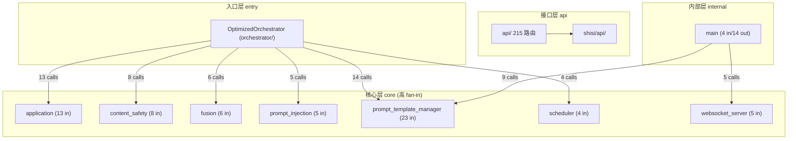
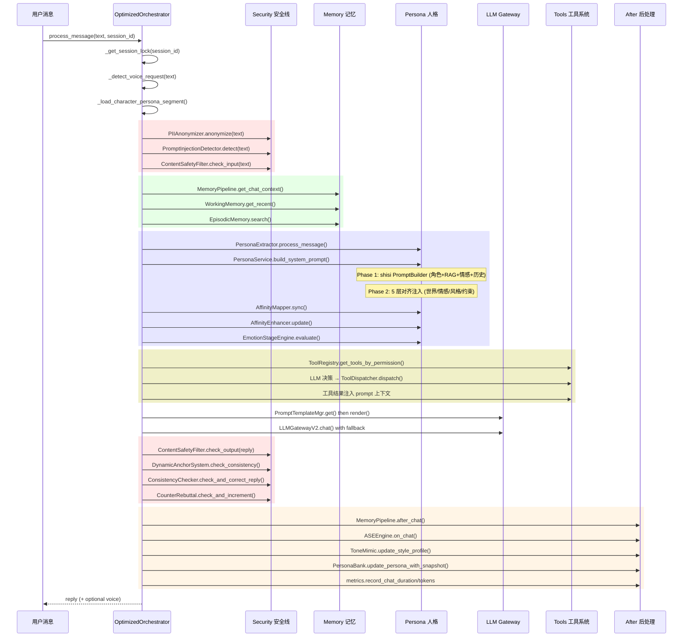

# 代码图谱 — unique-you (唯一的你) v3.8.7

> 由 维护者 手动维护 | 最后核实: 2026-09-20（v3.8.8 增量：**提醒意图管线批次**——① 新 `orchestrator/tool_gate.py`：三级意图管线（L0 零成本晋级线 should_escalate 只晋级不裁决，旧 `_tool_intent_names` 关键词裁决删除 → L1 LLM function calling 终审：全量权限内工具+`ask_user` 伪工具三分支=调真工具/自然澄清提问（direct_reply 直复通道跳过主链）/闲聊；防假承诺守卫无回执不承诺强制复核一次）；② 新 `proactive/reminder_delivery.py`+scheduler `register_reminder_task`（调度任务 6→**7**：每分钟 `reminder_check` 到期定向投递 session_key→`send_text(to_user)`，豁免静默时段，文案 LLM 投递前一刻生成原文兜底，失败 3 次判 failed，存量无主提醒永不投递）；③ StructuredMemory `sqlite.db` 新表 `pending_intents`（澄清状态机：会话级槽位合并/两轮上限=第二轮猜测+复述确认/15min TTL）+ reminders 表迁移 +session_key/user_id/status/delivered_at/fail_count（`_migrate_reminders_columns` 幂等）；时区改应用层北京时间比较（弃 SQL `datetime('now')` UTC 差 8h）；④ set_reminder trigger_time 必填+北京时间格式、`_meta` 服务端注入调用归属、query_reminders 按会话过滤。+34 回归 test_reminder_intent_pipeline；**1307 收集/1303 通过/4 跳过**（=1273 口径 1269+34）；端点数不变；生产实证端到端送达 1/1+3 次失败判死 1/1。v3.8.7 增量：**回复质量根治批次**——① 对话上下文真源改 DB `chat_history`（`memory_pipeline.get_chat_context`/`get_recent_context` 会话过滤 + `N:wxid`/裸双形态合并 + `get_chats_by_session_limit`；治重启失忆【[prompt] 埋点 hist_msgs 归零实证】/跨用户串扰/698 行无读者）；② fact_extractor 增 `commitment` 类别（承诺/约定四组模式）；③ 沉浸式 3~25 字→10~80 字跟话题（禁动作/禁编造保留；小说式零改动）+41 卡 mes_example 多轮话题演进 +19 卡句数硬限弹性化；④ 微信追问链键错位双修（`_peer_wxid_from_session`：发送 to 与 context_token 键均需裸 wxid，ret=-3 全灭根因；取消改会话键）。+14 回归 test_reply_quality_overhaul；1273 收集/1269 通过/4 跳过；生产实证空 RAM 恢复 50 条历史。v3.8.6 增量：**全仓遍历·文档对齐批次（零代码变更）**——09-19 白天全仓扫描落账之后，当晚 22:26 落地了**每人独立微信通道隔离**大型批次（`3e66930`，+2195 行）与 **JWT-only 复核收口**，次日又有材质/角色/提示词三批次，均未回扫本图谱：本次逐一历遍补齐——**端点 204→215 / 唯一路径 171→181**（新增 `wechat-channel` 9 + `admin-wechat` 2，`api/routers/wechat_channel_routes.py`）、include_router 16→**18**、api/ 44→**45 文件**（+byok/consent/password_policy 补登记 + wechat_channel_routes）、routers 21→**22 模块**、api/database.py **6→8 表**（+`wechat_channel_sessions`/`wechat_peer_preferences`）、wechat_direct 2→**5 文件**（+`channel_paths`/`connector_registry`/`peer_character`）、默认链双真源补注（system.yaml agnes 首选经编排器传入 vs `config/llm_providers.json` 自带链 zhipu 首选仅裸 `get_llm()` 生效）、认证口径改 **JWT 优先**（用户侧 API 仅 JWT，API Key 留给机器/E2E）、新增 `utils/reply_mode.py`（沉浸式/小说式回复模式）与**对话内追问**（follow_up）、安全 LLM 分类/注入检测默认关闭改规则闸门为实际生效、RoleSettings **六 tab→五 tab**（StickersTab 撤除）、§10 语音行残留 edge-tts 清除；测试口径复测不变 1259 收集/1255 通过/4 跳过 + vitest 98/98 + tsc 0 错。v3.8.5 增量（同日二批）：**提示词构建行业对齐**——41 卡移除 scenario（根因级修复开场锚定；代码保留守卫渲染兼容导入卡）、creator_notes 移至历史后（SillyTavern/卡规范的 post-history 位）、新增 # 对话示例 段（mes_example）、PersonaService 知识库双重注入去重、orchestrator 人设片段精简为身份绑定（SillyTavern docs + chara-card-spec-v2 取证，详见 LOG）。测试 1259 收集 / 1255 通过 / 4 跳过 + vitest 98/98（16 文件）；生产实证：服务器 41 卡 API 全可见、知识库 stats 全源（米彩 18 块含 8 锚点）、「昭阳是谁」检索命中。v3.8.3 增量：**主动消息「配额/投递解耦」批次** —— `ASEEngine.tick()` 返回值语义变更（未记账候选）＋新增 `commit_sent()`、`scheduler._deliver()` 改为返回 bool、免打扰前置到生成层（`ASEEngine.set_quiet_hours` + `_check_ase` 短路）、`_check_frequency()` 签名 `bool → (bool, reason)`、新增 `sanitize_message()` 输出清洗与归一化去重（窗口 6）、调度任务 **5 → 6**（新增「重要日期补发检查」每小时）、`/api/proactive/state` 增 3 字段、`/api/proactive/send` 响应剔除内部字段；端点数不变（training_router 13）。修复根因：静默时段内引擎生成即扣配额、投递层却丢弃 → 配额凌晨被空耗致全天零投递（详见 §13）；v3.8.2 增量：**09-19** 全仓逐一扫描·文档对齐批次——16 处 include_router + setup_shisi 口径修正（§1.1 旧写"17 处"）、§4.7 默认 fallback 链修正为 **4 家**（DeepSeek 注册可用但不入默认链）、§4.9 前端口径拉齐实测（页面 17 / API 模块 13 / store 3 / vitest 87·15 文件，补 IntroPage=SP-11 介绍页）；**09-18** v3.8 增量：全仓性能与正确性扫描——项目根路径锚定 + 12 处 CWD 缺陷 + 并发/缓存/热路径修复 + 移动端适配 + **端点口径系统性纠错 208→204**；双角色库收敛为 `config/characters` 唯一权威真源（7 处代码改指向 + `sync_character_files.py` 删除）、CI 门禁十四连红根治（FF-0006 `client.ts` 函数抽离 + ruff F401 清理）；测试口径见 §1.1 与 §13；**09-18 晚**：`shisi/api/v2/` 死模块（6 文件）删除 → `shisi/api/` 现 **11 文件 / 31 端点**（端点数与合计 204 不变，因 v2 从未挂载）+ `DELETE /api/shisi/memory/{id}` 假端点改 501 + `/api/shisi/status` 纳入认证使 shisi 域 **31/31** 全覆盖）v3.8.4 增量：**角色卡库扩充 + 知识库激活批次** —— ① `config/characters` **25 → 41 张**：新增《我的26岁女房客》4 张（米彩/昭阳/乐瑶/简薇）、《从你的全世界路过》5 张（陈末/幺鸡/茅十八/荔枝/猪头）、《云边有个小卖部》3 张（刘十三/王莺莺/程霜）、《某某》2 张（江添/盛望）、《天堂旅行团》2 张（宋一鲤/余小聚），全部含全量字段（personality/speaking_style 数值字典 + core_anchors×8 + mes_example 示例对话）；② **既有 25 卡全量完善**：伊蕾娜卡损坏字段（desc 3 字/scenario 3 字/notes 2 字）按《魔女之旅》重写、23 张补 persona/speaking_style 数值字典、25 张全补 mes_example、椎名真昼/莉莉娅 scenario 扩写、孙颖莎补 personality_text；③ **知识库激活**：`scripts/rebuild_knowledge_index.py` 补透传 `persona(core_anchors)`+`source_data`（此前重建比运行时抽取少两类块：锚点/示例对话），`CharacterKnowledgeService.search()` 双路合并改**交错式**（修复扩展路占满窗口把原路高 idf 块挤出 top-8 的缺陷，实测米彩「昭阳是谁」修复前 top-8 丢块/修复后命中），41 索引全量重建（合计约 1750 块，7 类知识源齐备）。v3.8.5 增量（同日二批）：**提示词构建行业对齐**——41 卡移除 scenario（根因级修复开场锚定；代码保留守卫渲染兼容导入卡）、creator_notes 移至历史后（SillyTavern/卡规范的 post-history 位）、新增 # 对话示例 段（mes_example）、PersonaService 知识库双重注入去重、orchestrator 人设片段精简为身份绑定（SillyTavern docs + chara-card-spec-v2 取证，详见 LOG）。测试 1259 收集 / 1255 通过 / 4 跳过 + vitest 98/98（16 文件）；生产实证：服务器 41 卡 API 全可见、知识库 stats 全源（米彩 18 块含 8 锚点）、「昭阳是谁」检索命中。v3.8.3 增量：**主动消息「配额/投递解耦」批次** —— `ASEEngine.tick()` 返回值语义变更（未记账候选）＋新增 `commit_sent()`、`scheduler._deliver()` 改为返回 bool、免打扰前置到生成层（`ASEEngine.set_quiet_hours` + `_check_ase` 短路）、`_check_frequency()` 签名 `bool → (bool, reason)`、新增 `sanitize_message()` 输出清洗与归一化去重（窗口 6）、调度任务 **5 → 6**（新增「重要日期补发检查」每小时）、`/api/proactive/state` 增 3 字段、`/api/proactive/send` 响应剔除内部字段；端点数不变（training_router 13）。修复根因：静默时段内引擎生成即扣配额、投递层却丢弃 → 配额凌晨被空耗致全天零投递（详见 §13）；v3.8.2 增量：**09-19** 全仓逐一扫描·文档对齐批次——16 处 include_router + setup_shisi 口径修正（§1.1 旧写"17 处"）、§4.7 默认 fallback 链修正为 **4 家**（DeepSeek 注册可用但不入默认链）、§4.9 前端口径拉齐实测（页面 17 / API 模块 13 / store 3 / vitest 87·15 文件，补 IntroPage=SP-11 介绍页）；**09-18** v3.8 增量：全仓性能与正确性扫描——项目根路径锚定 + 12 处 CWD 缺陷 + 并发/缓存/热路径修复 + 移动端适配 + **端点口径系统性纠错 208→204**；双角色库收敛为 `config/characters` 唯一权威真源（7 处代码改指向 + `sync_character_files.py` 删除）、CI 门禁十四连红根治（FF-0006 `client.ts` 函数抽离 + ruff F401 清理）；测试口径见 §1.1 与 §13；**09-18 晚**：`shisi/api/v2/` 死模块（6 文件）删除 → `shisi/api/` 现 **11 文件 / 31 端点**（端点数与合计 204 不变，因 v2 从未挂载）+ `DELETE /api/shisi/memory/{id}` 假端点改 501 + `/api/shisi/status` 纳入认证使 shisi 域 **31/31** 全覆盖）
> ✅ 路由/文件/模块/测试数已通过 create_api_app 实扫 + Glob + pytest + vitest 实时核实（2026-08-28）。
> ✅ 图数据库已于 2026-08-28 由 codebase-memory 图谱工具 v0.10.8 重新索引（artifact.json schema v2: **7706 节点 / 32367 边**，commit c32af54），历史矛盾（543277c 声称的 6771 节点未持久化）就此消案。

---

## 1. 全局指标

### 1.1 实时核实指标（2026-09-20 create_api_app/Glob/pytest/vitest/tsc 全量复测）

| 维度 | 数值 | 核实方法 |
|------|------|---------|
| API 业务端点（`APIRoute` 实扫） | **215 端点 / 181 条唯一路径**（101 GET / 78 POST / 16 PUT / 20 DELETE） / **18 处 include_router + setup_shisi**（2026-09-20 复测；较 09-17 口径 +11 = `wechat-channel` 9 + `admin-wechat` 2） | 2026-09-20 内省 `create_api_app()`：`len([r for r in app.routes if isinstance(r, APIRoute)])`。⚠️ 旧口径"208 端点"实为 `len(app.routes)`，含 4 条框架路由（`/openapi.json`、`/docs`、`/docs/oauth2-redirect`、`/redoc`），非业务端点；本轮 `len(app.routes)=219` |
| main.py 体量 | **约 17.4 KB / 438 行** | 2026-09-20 实测（08-28 两轮瘦身基线后随通道批次 ± 微调） |
| 前端页面 | **17 个** | Glob `frontend/src/pages/*.tsx`（另有 `StorylinePage` 为 App.tsx 内联包装组件） |
| 前端 API 模块 | **13 个** | Glob `frontend/src/api/*.ts`（09-18 CI 门禁根治新增 `emotion.ts` / `normalize.ts`，原 11） |
| 前端 Zustand store | **3 个** | LS `frontend/src/store/`（authStore / characterBuilderStore / errorStore） |
| Python 测试用例 | **1303 passed + 4 skipped**（收集 1307） | 2026-09-20 系统 Python 3.12 分块实跑（373+336+391+203，与 `--collect-only` 1273 精确吻合；`test_knowledge_routes_index.py` 已在分块清单内，无需再单独跑）。⚠️ **单进程整跑会在随机位置停住**（非用例失败，属聚合态资源问题），分块跑法见 `AGENTS.md` §4.3 口径注记 |
| 现役角色卡 | **41 张**（`config/characters/*.json`） | Glob 实扫 2026-09-20：25 既有 + 16 文学导入（我的26岁女房客×4 / 从你的全世界路过×5 / 云边有个小卖部×3 / 某某×2 / 天堂旅行团×2）；目录 gitignore（不入公开仓，服务器私有投递）；persona 注入参数化用例数 = 2 × 卡数 |
| 前端测试用例 | **98 个全部通过 / 16 文件** | 2026-09-20 `npm test -- --run`（vitest）+ `tsc --noEmit` 0 错误 |
| 测试用例合计 | **1401 个**（1303 Python 通过 + 98 前端通过） | pytest + vitest 实跑 2026-09-20。⚠️ 旧口径 1117（1042 Python + 75 前端，2026-09-01 .venv 实测）随 09-14 主仓事故丢失环境后**已作废**，不再作为可复现基线 |
| tools/builtin 工具文件 | 8 个（含 __init__.py） | Glob |

### 1.2 知识图谱快照指标（✅ 2026-09-02 重新索引·第二次）

| 维度 | 数值 |
|------|------|
| 总节点 | **7997**（artifact.json schema v2，commit ef328a2，2026-09-02 下午重索引，参赛准备批次） |
| 总边 | **33187**（同上） |
| 图谱工具 | codebase-memory 图谱工具 **v0.10.8**（pip 安装，DeusData/codebase-memory 图谱工具 ★40.9k，MIT） |
| 旧快照 | 2026-09-02 早 / 7992 节点 / 33182 边（commit 3c3e31e5；再前为 08-28/7706、06-30/5983） |
| 543277c 的 6771 节点声明 | 未持久化（artifact.json 未更新），已废弃消案 |

> **注**: `.codebase-memory/artifact.json` 是图谱库状态的唯一权威载体。重新索引命令：
> `codebase-memory 图谱工具 cli index_repository --repo-path D:/Desktop/ai-girlfriend`
> 查询：`codebase-memory 图谱工具 cli search_graph --project D-Desktop-ai-girlfriend --name-pattern ".*X.*" --label Function`
> 索引排除 .git/.venv 类 gitignore 目录（本轮 excluded 69 dirs）。parse_partial 3 处（BOARD.md 16-16 / SettingsLLM.test.tsx / pyrightconfig.json 行段，best-effort 信号不影响图完整性）。not_indexed 7 文件均为 gitignore/ignored-suffix（.env/.coverage/memory-config.json 等设计如此）。

**边类型分布（前 8，2026-07-09 历史快照，仅供对照）**：USAGE(6331) > CALLS(6116) > DEFINES(5110) > DEFINES_METHOD(1885) > WRITES(1549) > TESTS(1413) > IMPORTS(755) > DECORATES(621)

**语言分布**：Python 309 · TypeScript 79 · YAML 14 · Bash 5 · TOML 1 · JS 1 · HTML 1 · CSS 1

**2026-07-28 后新增/重构的包**：
- `shisi/character/`（8 文件，新增完整角色卡子系统：character_card_v2 / exporter / importer / manager / models / png_codec / store / validator）
- `api/routers/clone_routes.py`（+`/api/clone/upload` 端点）
- `api/routers/knowledge_routes.py`（+`/api/characters/{id}/enrich` 端点）
- `api/routers/misc_routes.py`（+`/api/user/llm-config` GET/POST 端点）
- `api/run_api.py`（+flock 文件锁自动恢复微信连接）
- `api/database.py` User 模型（+`llm_config` JSON 字段）
- `llm_provider/__init__.py`（+`invalidate_user_llm()` 用户级 gateway 缓存失效）
- `frontend/src/pages/AdminProvidersPage.tsx`（+LLM 供应商管理页面，admin 角色）
- `frontend/src/api/llmProviders.ts`（+LLM 供应商管理 API 客户端）
- `api/routers/llm_providers_routes.py`（+LLM 供应商 CRUD 端点）

---

## 2. 架构分层

知识图谱基于 fan-in/fan-out 自动识别出 4 个架构层：



**分层逻辑**：
- **entry** — 只有出站调用，是系统总指挥
- **core** — 高 fan-in（被很多模块调用），是基础设施和服务
- **api** — 定义 HTTP 路由
- **internal** — 工具/部署脚本，fan-in=0 或很低

---

## 3. 核心数据流 — process_message 热路径

`OptimizedOrchestrator.process_message`（`orchestrator/optimized_orchestrator.py`）处理每一条用户消息，是全系统最关键调用链。

> **架构变更 (2026-07-26)**: `OptimizedOrchestrator` 现在继承 `_InitPhasesMixin` + `_StreamPipelineMixin`：
> - `orchestrator/optimized_orchestrator.py` (920行): 主类 `__init__` / 会话锁 / `_prepare_context` / `process_message` / `health_check`
> - `orchestrator/_init_mixin.py` (438行): `initialize` 拆分为 9 个 `_init_*` 阶段
> - `orchestrator/_stream_mixin.py` (238行): `process_message_stream` SSE 真流式/伪流式降级
>
> **最新更新 (2026-07-01)**: PersonaService.build_system_prompt 已重构为**两阶段构造**，第一阶段由 shisi PromptBuilder 生成角色 + RAG 知识 + 情感 + 对话历史，第二阶段注入 PersonaEngine 的 5 层对齐层（世界/时间信息 → RAG 上下文 → 情感 → 风格 → 约束）。



**新增（2026-07-01）**：PersonaService 调用链上方新增 Tools 工具系统中间层：LLM 通过函数调用感知工具 → 按 affinity 权限过滤 → 执行后注入上下文作为 prompt 增强。

---

## 4. 模块目录与职责

### 4.1 入口与编排

| 模块 | 文件 | 职责 |
|------|------|------|
| `main.py` | main.py（**~17.4 KB / 438 行**，2026-09-20 实测） | 入口 + `_run_orchestrator` 统一启动 + 控制台/微信模式 |
| `orchestrator/` | orchestrator/ (8 文件包) | `optimized_orchestrator.py` 主类 + `_init_mixin.py` **10 阶段初始化**（唯一真相源） + `_stream_mixin.py` SSE 流式 + `session_locks.py` + `voice_detector.py` + `console_chat.py`（2026-08-28 自 main.py 迁入，命令处理函数拆分） |
| `api/run_api.py` | api/run_api.py | API-Only 启动入口（uvicorn 直接挂载），含 `_autostart_wechat_connector()` flock 文件锁自动恢复微信连接 |
| `user_scheduler.py` | user_scheduler.py | 多用户调度，每个微信用户独立情感状态 |

**架构演进 (2026-07-28 双模式合并)**：
- 原 `_run_fast_mode` + `_run_full_mode` 双路径合并为 `_run_orchestrator` 单入口（-297 行）
- `_init_mixin.initialize()` 是唯一初始化真相源（10 阶段），`_run_full_mode` 的 300 行手工组件注入已删除
- 修复双调度器 bug：原 `_init_mixin` 与 `_run_*_mode` 各创建一个 `ProactiveScheduler` 并行运行，现统一复用
- `_init_mixin` 新增第 10 阶段 `_init_multimodal`，并补齐 `EncryptionManager` / `classifier_mode` / `prompt_mode` 参数

**OptimizedOrchestrator 运行模式**：
- `_run_orchestrator(mode="fast")` — 快速模式（fusion_cfg.orchestrator_mode="fast"）
- `_run_orchestrator(mode="full")` — 完整模式（默认，与 fast 共用 initialize()）
- `run_console_chat` — 控制台交互
- `run_wechat_mode` — 微信模式

### 4.2 API 层（**215 业务端点 / 181 唯一路径** — 2026-09-20 内省实扫）

两个路由来源：

| 来源 | 路径 | 端点数 | 文件数 | 说明 |
|------|------|--------|------|------|
| `api/routers/` | 22 个域路由模块（不含 `__init__.py`） | 181 | 23 | character/auth/admin/invite/voice/mimo_voice/storyline/wechat/wechat_channel/emotion/memory/knowledge/persona_card/chat/clone/misc/personality/safety/tools/training/users/llm_providers |
| `api/`（非 routers） | `health_routes.py` / `qrcode_store.py` | 3 | 2 | health(2) + wechat/qrcode(1，admin 兼容面) |
| `shisi/api/` | v1（`v2/` 死模块已于 2026-09-18 删除，见 DELETION_LOG） | 31 已挂载 | 11 | affinity/character/emotion_stage/memory/persona/stats/sticker/vital_signs |
| **合计（`APIRoute` 内省）** | | **215** | | 101 GET / 78 POST / 16 PUT / 20 DELETE |

> ⚠️ **口径纠错（2026-09-17）**：旧口径"206 / 208 端点"取自 `len(app.routes)`，
> 其中固定含 **4 条 FastAPI 框架自带路由**（`/openapi.json`、`/docs`、
> `/docs/oauth2-redirect`、`/redoc`），故系统性偏高 4。
> **业务端点数应取 `APIRoute` 实例数**：`len(app.routes)=208`，`APIRoute=204`。

**按 tag 的端点分布**（内省实测，权威口径）：

```
character 21 │ misc 16 │ training 13 │ safety-infra 12 │ chat 11
wechat-channel 9 │ personality 10 │ memory 10 │ wechat 9 │ clone 8 │ auth 8 │ knowledge 8
users 7 │ characters 7 │ tools 6 │ voice 6 │ mimo-tts 6 │ storyline 6
llm-providers 6 │ stickers 5 │ admin 5 │ affinity 4 │ invite 4
emotion-stage 3 │ persona 3 │ persona-card 3 │ health 2 │ admin-wechat 2 │ emotion 2
vital-signs 1 │ stats 1 │ (untagged) 1
                                          ────────── 合计 215
```

> 注：`character`(21) 为 `api/routers/character_routes.py`；`characters`(7) 为
> `shisi/api/character_routes.py`。`memory`(10) = api `memory_routes`(4) +
> shisi `memory_routes`(6)。`persona`(3) 为 shisi；`persona-card`(3) 为 api。
> `wechat-channel`(9)+`admin-wechat`(2) 为 09-19 新增的每人独立微信通道域
> `api/routers/wechat_channel_routes.py`（一个文件双 router）。

**app_factory.py 实际挂载策略**（核实于源码）：

```
health_router          → /api/health, /api/ready（2 端点，无认证）
misc_router            → /api/stats, /api/dashboard, /api/memory/facts,
                        /api/logs, /api/logs/stream, /api/config,
                        /api/user/llm-config (GET/POST),
                        /api/channels, /api/routes（16 端点）
chat_router            → /api/chat/*, /api/session/*, /api/wechat/status（11 端点）
personality_router     → /api/emotion/*, /api/persona/*, /api/psych/*（10 端点）
users_router           → /api/users/*（7 端点，admin only）
training_router        → /api/training/*, /api/proactive/*（13 端点）
tools_router           → /api/system/tools, /api/system/tools/health, /api/plugins/*（6 端点）
safety_router          → /api/safety/*, /api/rag/*, /api/voice/*, /api/files/*, /api/cache/*（12 端点）
clone_router           → /api/clone/*（8 端点）
auth_router            → /api/auth/*（8 端点）
admin_router           → /api/admin/*（5 端点）
invite_router          → /api/auth/register-invite, /api/admin/invites（4 端点）
character_router       → /api/characters/*, /api/presets/*（21 端点，含 .png 导入/导出）
voice_router           → /api/character/voice/*（6 端点）
mimo_voice_router      → /api/mimo/*（6 端点）
memory_bridge_router   → /api/memory/*（4 端点，桥接 shisi FavoriteManager/ForwardManager）
persona_card_router    → /api/persona-card/*（3 端点）
storyline_router       → /api/storyline/*（6 端点）
knowledge_router       → /api/characters/{id}/knowledge/*, /api/characters/{id}/enrich（8 端点）
wechat_router          → /api/wechat/*（8 端点）
emotion_params_router  → /api/emotion/params/*（2 端点）
llm_providers_router   → /api/llm-providers/*（6 端点，admin）
qrcode_router          → /api/wechat/qrcode（1 端点，admin 兼容面）
wechat_channel_router  → /api/wechat/channel/*（9 端点，JWT 本人：状态/list/connect/
                         qrcode/disconnect/reconnect/peers/{wxid}/character GET+PUT/characters）
wechat_admin_router    → /api/admin/wechat/*（2 端点，admin：通道摘要/强制下线）
+ shisi setup          → /api/shisi/* 域路由（31 端点已挂载）
```

> **上表端点数为 2026-09-20 按 tag 内省实测**（09-17 基线 204 之上，
> 09-19 晚通道批次 +11：wechat-channel 9 + admin-wechat 2）。
> 注意 `api/routers/` 内 181 个装饰器 + health 2 + qrcode 1 + shisi 31 = 215。

**`api/app_factory.py:84 create_api_app()`** 是 FastAPI 应用唯一构造入口，被 `api/run_api.py:232` 和 `main.py` 调用。FastAPI 实例 `version="3.1.0"`。

### 4.3 shisi/ — Clean Architecture 重构（核心域）

DDD 分层架构，是项目最重要的重构成果：

| 子包 | 职责 | 关键类 |
|------|------|--------|
| `application/` | 应用服务 | CharacterService, MemoryService, PersonaService, KnowledgeService, PromptService, MigrationService |
| `character/`（新增 2026-07-28） | 角色卡完整子系统 | **CharaCardV2/V3**, **PNGCodec**, Importer, Exporter, Manager, Store, Validator |
| `core/models/` | 领域模型 | AffinityLevel, CharacterId, EmotionalState, PersonaProfile, CharacterAggregate |
| `core/ports/` | 端口接口 | CharacterRepository |
| `core/services/` | 领域服务 | EmotionDetector, PromptBuilder |
| `infrastructure/persistence/` | 持久化 | SQLiteRepository, Schema |
| `infrastructure/migration/` | 迁移 | MigrationRunner, RollbackRunner |
| `memory/legacy/` | 记忆管线 | WorkingMemory(49 fan-in), EpisodicMemory, SemanticMemory, StructuredMemory, VectorMemory, MemoryPipeline, FactExtractor, ImportanceScorer, ReflectionEngine, ConversationSummarizer, DiarySummarizer |
| `affinity/` | 亲密度 | AffinityEnhancer(46 fan-in), AffinityMapper, DecayEngine, UnlockManager |
| `storyline/` | 剧情线 | Engine, Detector, Config |
| `emotion_stage/` | 情感阶段 | StageEngine, EventDispatcher, StageConfig |
| `vital_signs/` | 生命体征 | VitalEngine, EmotionMapping |
| `sticker/` | 表情包 | StickerManager, EmotionRecommender, SafetyCheck, Importer |
| `voice/`（shisi） | 语音 | CharacterVoice（EmotionTTS 仅余 VoiceEnhancer，Mapper 已删） |
| `wechat/` | 微信集成 | CommandHandler, CommandParser, ProactiveMessenger, StickerAdapter |
| `vault/` | 数据收集 | CollectLoop, PersonaAdapter |
| `ase/` | 场景叙事 | SceneNarrator, TriggerEngine |
| `knowledge/` | 知识检索 | Retriever, CharacterKnowledgeService, **CrawlerAdapter** |

**shisi/character/ 详细说明（2026-07-28 新增）**：

| 文件 | 类/函数 | 职责 |
|------|---------|------|
| `png_codec.py` | `extract_card_from_png()` / `embed_card_to_png()` / `has_chara_chunk()` / `is_png()` | SillyTavern PNG tEXt chunk 编解码：PNG → base64 → JSON 解析；JSON → base64 → 嵌入 PNG tEXt chunk（关键字 `chara`）。依赖 Pillow |
| `importer.py` | `import_file()` / `import_directory()` | 角色卡批量导入，支持 .json 与 .png |
| `exporter.py` | `export_card_png()` / `export_card_png_to_file()` | 角色卡导出为 PNG（含 chara tEXt chunk） |
| `character_card_v2.py` | `CharaCardV2` / `CharaCardV2Parser` | SillyTavern V2/V3 角色卡 schema 解析 |
| `manager.py` | `CharacterManager` | 角色卡 CRUD（被 `shisi/api/registry.py:setup_shisi` 装配） |
| `store.py` | 持久化 | 角色卡 JSON 文件存储 |
| `validator.py` | 校验 | 角色卡 schema 合法性 |
| `models.py` | Pydantic 模型 | 角色卡数据模型 |

PNG tEXt chunk 集成路径：`api/routers/character_routes.py:520` 调用 `extract_card_from_png()`，`api/routers/character_routes.py:593` 调用 `embed_card_to_png()`。前端 `frontend/src/api/characters.ts` 调用 `POST /api/characters/import` 与 `GET /api/characters/{id}/export?format=png`。

**shisi/knowledge/ 关键更新 (2026-07-01)**：

| 新增/变更 | 说明 |
|-----------|------|
| `CrawlerAdapter` | 双阶段索引管线：_index_card（角色卡结构化分块）→ crawl_and_index（Web 爬取 + BM25 索引） |
| `CharacterKnowledgeService.ensure_index()` | 新增：检查记忆 → 尝试磁盘加载 → 从角色卡构建 → 自动保存，一句调用"让它就绪" |
| `CharacterKnowledgeService.add_knowledge_chunks()` | 新增：增量追加知识块到现有 BM25 索引，爬虫使用 |
| 名称索引 | 修复：`CharacterKnowledgeService.index_character()` 现在提取 name chunk（解决"她叫什么名字"查询） |
| BM25 持久化 | `save_index()` / `load_index()` 到 `data/knowledge/{character_id}.json` |
| `PersonaService.build_system_prompt()` | 重构为两阶段：Phase 1 shisi PromptBuilder 构建角色基础 prompt → Phase 2 注入 PersonaEngine 的 5 层对齐（世界/时间/RAG/情感/风格/约束） |
| `_build_character()` | 双路径解析：角色卡优先（character_id）→ PersonaEngine 回退 |
| `normalize_character_card()` | 新增 `utils/character_helpers.py`，统一展平 SillyTavern 角色卡格式 |

### 4.4 my_character/ — 角色引擎（21 模块）

| 模块 | 职责 | 备注 |
|------|------|------|
| `character_config.py` | ConfigLoader | **423 fan-in，全项目最高** |
| `emotion_engine.py` | 情感引擎核心 | — |
| `emotion_memory.py` | 情感记忆 | — |
| `emotion_style_coupler.py` | 情感-风格耦合 | — |
| `enhanced_prompt_engine.py` | TimeContext | **103 fan-in** |
| `persona_engine.py` | 人格引擎 | — |
| `persona_evaluator.py` | 人格评估 | — |
| `style_enhancer.py` / `style_enhancer_v2.py` | 风格增强 | v1/v2 共存 |
| `tone_mimic.py` | 语气模仿 | — |
| `consistency_checker.py` | 回复一致性检查 | 热路径节点 |
| `counter_rebuttal.py` | 反驳计数器 | 热路径节点 |
| `dynamic_anchor.py` | 动态锚点系统 | 热路径节点 |
| `anchor_protection.py` | 锚点保护 | — |
| `constraint_validator.py` | 约束验证 | — |
| `contextual_behavior.py` | 上下文行为 | — |

### 4.5 persona_extractor/ — 人格提取器（12 模块）

| 模块 | 职责 |
|------|------|
| `fusion.py` | PersonaExtractor 融合入口（6 fan-in） |
| `style_vectorizer.py` | 风格向量化 |
| `mental_health.py` | 心理健康分析 |
| `dark_triad.py` | 暗黑三人格检测 |
| `hexaco.py` | HEXACO 人格模型 |
| `liwc_analyzer.py` | LIWC 语言分析 |
| `pado_detector.py` | PADO 检测 |
| `cognitive_distortions.py` | 认知偏差检测 |
| `emotion_coupler.py` | 情感耦合器（chameleon filter） |
| `persona_bank.py` | 用户人格库 |

### 4.6 security/ — 安全模块

| 模块 | 类 | fan-in | 检查时机 |
|------|-----|--------|---------|
| `content_safety.py` | ContentSafetyFilter | 8 | 输入 + 输出 |
| `prompt_injection.py` | PromptInjectionDetector | 5 | 输入 |
| `pii_anonymizer.py` | PIIAnonymizer | — | 输入 |
| `encryption.py` | 加密模块 | — | — |

安全检查在 process_message 中执行两次：输入检查（3 层）+ 输出检查（4 层）。

**安全日志更新 (2026-07-01)**：`content_safety.py` 新增 `_log_safety_event()` 函数，在每次规则命中/LLM 分类命中后记录安全事件（category、direction、text_length、text_hash、时间戳，按用户隔离）。日志失败从不阻塞安全执行。

### 4.7 llm_provider/ — LLM 网关（5+ 供应商）

| 模块 | 职责 |
|------|------|
| `llm_gateway.py` | LLMGatewayV2，自动 fallback 链 |
| `multi_provider_gateway.py` | 多供应商网关（默认 fallback 链 **Agnes → 智谱AI → 讯飞星火 → 百度千帆**，生产经编排器传 `config/system.yaml fallback_chain`；`DEFAULT_FALLBACK_CHAIN` 同序）+ 用户级 gateway 缓存 + **常驻同步事件循环**（09-19 性能修复：`chat_sync` 原每次 `asyncio.run` 新建事件循环致 httpx 连接池失效、单条消息 2 次 LLM 累计 11~20s → 守护线程常驻 loop 后稳态 ~2.7s） |
| `openai_compatible_provider.py` | OpenAI 兼容供应商（被 agnes/zhipu/xunfei/baidu 共用） |
| `prompt_template_manager.py` | PromptTemplateMgr（**54 fan-in**） |
| `__init__.py` | **`invalidate_user_llm(user_id)`**（新增 2026-07-28）— 清除用户级 gateway 缓存，下次对话按新配置重建 |

> ⚠️ **链双真源补注（2026-09-20）**：运行时链有两处声明——① `config/system.yaml`
> `llm.fallback_chain`（agnes 首选）：编排器 `_init_llm` 经 `get_llm(provider=auto,
> config=cfg.llm)` **显式传入**，是生产主链；② `config/llm_providers.json` 顶层
> `fallback_chain`（**zhipu 首选**，[zhipu, agnes, xunfei, baidu, deepseek]，与供应商
> 管理页 sort_order 一致）：仅在**未显式传链**的裸 `get_llm()` 路径生效。生产口径
> 以 ① 为准（agnes 首选不变）。

**供应商现状 (2026-09-20 更新)**：

| 供应商 | 注册方式 | 模型 | 认证方式 |
|--------|---------|------|---------|
| **agnes（首选）** | `get_llm(provider="agnes")` | agnes-3.0-flash / 2.5-flash / 2.5-pro | Bearer Token |
| 智谱AI (zhipu) | `get_llm(provider="zhipu")` | glm-4-flash | Bearer Token |
| 讯飞星火 (xunfei) | `get_llm(provider="xunfei")` | spark-lite | Bearer Token |
| 百度千帆 (baidu) | `get_llm(provider="baidu")` | ernie-speed-128k | OAuth (API Key + Secret) |
| DeepSeek | `get_llm(provider="deepseek")` | deepseek-chat / deepseek-reasoner | LLMGatewayV2 |

> ⚠️ **sensenova 已于 2026-09-18 移除**（原 fallback 链首选）。原因：生产 `.env`
> **从未配置 `SENSENOVA_API_KEY`**，导致**每次对话都先白跑一轮失败尝试**才回退到
> zhipu —— 这是响应慢的固定来源。现首选为 **agnes**（`apihub.agnes-ai.com/v1`）。
> 默认链共 4 家；**deepseek** 为第 5 个已注册供应商，可经 `get_llm(provider="deepseek")`
> 或用户级 llm_config 单独使用，不入 auto 默认链。

**多用户 API Key 隔离（2026-07-28 新增）**：

| 组件 | 位置 | 职责 |
|------|------|------|
| `User.llm_config` JSON 字段 | `api/database.py:71` | 每用户独立 LLM 配置（provider/api_key/model 等） |
| `/api/user/llm-config` GET | `api/routers/misc_routes.py:288` | 普通用户读取自己的 LLM 配置（脱敏 api_key 为 `****`），未配置时回退到全局 admin 配置 |
| `/api/user/llm-config` POST | `api/routers/misc_routes.py:314` | 普通用户保存自己的 LLM 配置（不再 403），自动调用 `invalidate_user_llm()` 清缓存 |
| `invalidate_user_llm(user_id)` | `llm_provider/__init__.py:259` | 失效用户级 gateway 缓存，下次对话按新配置重建 LLM 实例 |

**调用链**：前端 `SettingsLLM.tsx` → `frontend/src/api/system.ts` → `POST /api/user/llm-config` → 写入 `users.llm_config` → `invalidate_user_llm(user_id)` → 下次 `OptimizedOrchestrator.process_message` 时按 `user_id` 取用户专属 LLM。

### 4.7.1 wechat_direct/ — 每人独立微信通道（2026-09-19 新架构，5 文件 2191 行）

> 用户裁决 2026-09-19（报障「他人注册后未扫自己的微信却显示已连接，且连的是管理员通道」）：
> 通道层由**全局单例**改为 **per-user × slot 多租户**；一人最多 2 条通道
> （`MAX_CHANNELS_PER_USER=2`），全局并发上限 `WECHAT_MAX_CHANNELS`（默认 100）。
> 方案文档：`docs/plans/2026-09-19-每人独立微信通道方案.md`。

| 文件 | 职责 |
|------|------|
| `channel_paths.py` | 磁盘路径唯一真源：`data/wechat_sessions/<user_id>/slotN/`（credentials/state/qrcode/context_tokens/poll.lock）；全局上限解析 `max_channels()`；`list_user_slots_with_credentials()` |
| `connector_registry.py` | `ConnectorRegistry`（`get_registry()` 单例）：`(owner_user_id, slot)` 键控连接器注册表；`ensure/disconnect/status_for_user/primary_status/start_login/restore_on_boot`；`ChannelQuotaError`/`ChannelSlotError`；**每会话目录 poll.lock 文件锁**去重多 worker 轮询；`get_connector_for_user()` |
| `peer_character.py` | **好友自选角色**（用户裁决「让他们自己选」）：`(owner_user_id, peer_wxid) → character_card_id`（DB 表 `wechat_peer_preferences`）；微信内回复「角色」弹菜单、回复序号切换（`try_handle_character_choice`）；会话键 `owner:peer` |
| `wechat_connector.py`（1659 行） | 连接器本体按 owner/slot 隔离：`load_session_state/qrcode(user_id, slot)`、`get_wechat_state(user_id)`、**`split_reply_for_wechat()` 回复拆分**（修连发罐头语）、**对话内追问引擎**（`_schedule_followup/_followup_thread/_send_followup`，没等到接话自动补一句，参数 `data/scheduler_config.json` follow_up 块 web 可调）、图片/语音/emoji 发送、收包入口守卫（1/3/34） |
| `__init__.py` | 导出 |

**遗留通道迁移**：`scripts/migrate_legacy_wechat_channel.py` 启动时一次性把旧全局
`~/.weixin_cow_credentials.json` 迁入 admin（user_id=1）`data/wechat_sessions/1/slot0/`；
`api/run_api.py:_autostart_wechat_connector()` 改为按 `channel_paths` 逐 user/slot 恢复
（旧全局单例 flock 启动方式废止，改每会话目录锁）。
旧全局端点语义变化：`/api/channels/wechat/*` 与 `/api/wechat/qrcode` 收敛为 **admin 兼容面**；
普通用户一律走 `/api/wechat/channel*`（仅 JWT，只操作自己的通道）。

### 4.8 voice/ — 语音合成（MiMo 唯一引擎，2026-08-28 收敛）

> **MiMo-only 收敛（用户裁决 A）**：Edge-TTS/SoVITS/CosyVoice/Bert-VITS2 四 provider 与 voice_training.py（GPT-SoVITS LoRA 训练器）已删除；`/api/mimo/*` 为唯一语音 API（clone/voices/synthesize/design）；MiMo 云故障由 Windows SAPI 本地合成兜底（fallback_local，pywin32 可选依赖 win-tts-fallback）；语音克隆=MiMo voiceclone（前端 SettingsVoice 唯一入口，本就 MiMo-only 无需改）。shisi 语音训练 API（4 端点）与 EmotionVoiceMapper（Edge 专用）一并删除。

| 文件 | 说明 |
|------|------|
| `mimo_tts_provider.py` | 唯一引擎：MiMo Cloud API（8 情感映射内置）+ SAPI 本地兜底 |
| `tts_manager.py` | 单引擎管理（历史多引擎降级链已删） |
| `tts_provider_base.py` | Provider 抽象基类 |
| `audio_converter.py` | 音频格式转换（silk） |
| `clone_data_manager.py` | 聊天克隆数据管理（克隆域，与 TTS 无关） |

### 4.9 前端（React 19 管理控制台）

- **17 个页面文件**（全部挂载路由；幽灵层三页与 DemoPage 已于 08 月删除；2026-09-01 新增 PsychProfilePage（T2，见 §13 T1-T5 批次）；IntroPage=SP-11 产品介绍页（f4aa51c，公开静态门面接替已删 Demo，根路径未登录重定向 `/intro`））：
  - 公开：IntroPage（`/intro`）, LoginPage, PsychProfilePage（`/psych`，**09-18 起包 AuthGuard 需登录**，修未登录 3×401）
  - 用户/认证：AdminUsersPage
  - 角色管理：RolesPage, CreateRole, RoleSettings
  - 设置：SettingsLLM, SettingsSecurity, SettingsLogs, SettingsVoice
  - 工具/状态：ToolsDashboard, StatusCenter
  - 微信集成：WeChatPage
  - LLM 供应商管理：AdminProvidersPage（admin 角色）
  - 其他：NotFoundPage, SystemSettingsLayout（设置域布局）
- **13 个 API 模块**（demo.ts、users.ts、chat.ts 已删除；09-18 CI 门禁根治新增 `emotion.ts` / `normalize.ts`）：
  - admin, auth, characters, client, clone, emotion, llmProviders, mimo, normalize, queryClient, system, training, wechat
- 3 个 Zustand store（authStore, errorStore, characterBuilderStore；chatStore 已于 09-17 死代码清洗删除）
- React Query hooks
- 98 个 Vitest 测试用例（across 16 files，全部通过 2026-09-20）
- Playwright E2E 测试配置

**页面说明**：

| 页面 | 文件 | 功能 |
|------|------|------|
| **ToolsDashboard** | `ToolsDashboard.tsx` | 内置工具仪表盘：展示所有已注册工具的实时健康状态（绿点/红点）、启停控制（toggle）、描述提示。通过 `/api/system/tools` 和 `/api/system/tools/health` 获取数据。 |
| **StatusCenter** | `StatusCenter.tsx` | 系统状态中心 |
| **SettingsVoice** | `SettingsVoice.tsx` | 语音设置页 |
| **WeChatPage**（2026-07-28 简化） | `WeChatPage.tsx` | 移除冗余 StatsBar 与绑定列表表格，仅保留 LiveStatusBanner + QrCodeConnectionModal，避免数据为 0 的误导 |
| **SettingsLLM**（2026-07-28 修复 403） | `SettingsLLM.tsx` | 改用 `/api/user/llm-config`（用户级配置端点）替代 `/api/config`，普通用户不再 403 |
| **PsychProfilePage**（2026-09-01 新增） | `PsychProfilePage.tsx` | `/psych` 路由：心理画像展示（后端 /api/psych/* 五端点就绪后的消费层，差异化卖点页）。**09-18 起包 AuthGuard 需登录**（修未登录 3×401 + 白屏闪烁） |
| **IntroPage**（SP-11 产品介绍页，f4aa51c） | `IntroPage.tsx` | `/intro` 公开静态门面：产品定位/玩法/邀请入口，接替已删 Demo 的访客转化职责；根路径 `RootRedirect` 未登录时重定向至此 |
| **CreateRole**（2026-08-28 智能体代跑改造） | `CreateRole.tsx` | 克隆好友 tab 三步流：①准备 AI 智能体（推荐 OpenCode，免费模型充足）②一键复制「智能体任务书」（内嵌 `constants/cloneAgentGuide.ts`，指向 wechat-decrypt 仓库 AGENTS.md 冷启动决策树）③仅上传 JSON 分析；移除旧"三工具卡片+本地命令教学" |
| **RoleSettings** | `RoleSettings.tsx` | DataTab 新增"网络增强"按钮，调用 `/api/characters/{id}/enrich`；`RoleSettingsConstants.tsx` 中 `ENGINE_OPTIONS` 简化为仅保留 `mimo-tts` |

### 4.10 tools/ — 工具系统（新增 2026-07-01）

插件式工具系统，为 AI 伴侣提供可调用的功能，以 OpenAI Function Calling schema 暴露给 LLM：

```
tools/
├── __init__.py          # 导出 BaseTool, ToolResult, ToolRegistry, ToolDispatcher
├── base_tool.py         # 核心框架（4 个类）
└── builtin/             # 具体工具实现（12 个工具）
    ├── __init__.py      # 重新导出全部内置工具
    ├── calendar_tool.py          # CalendarTool + CalculatorTool
    ├── character_crawler_tool.py # CharacterCrawlerTool (角色资料爬虫)
    ├── extra_tools.py            # MemoryTool, WebSummaryTool, ImageGenTool (新增), SchedulerTool
    ├── reminder_tool.py          # ReminderTool + CalendarQueryTool
    ├── search_tool.py            # SearchTool (DuckDuckGo + Bing 回退)
    ├── time_awareness_tool.py    # TimeAwarenessTool (农历/节假日)
    └── weather_tool.py           # WeatherTool (插件 → wttr.in 回退)
```

**12 个已注册工具**：

| 工具名 | 类 | 权限 | 说明 |
|--------|-----|------|------|
| `weather` | WeatherTool | public | 天气查询（插件优先 → wttr.in 回退） |
| `search` | SearchTool | public | 联网搜索（DDGS → Bing HTML 回退） |
| `calendar` | CalendarTool | public | 当前日期时间 |
| `calculator` | CalculatorTool | public | 安全表达式计算（AST 解析） |
| `set_reminder` | ReminderTool | friend | 设置提醒（trigger_time 必填北京时间 YYYY-MM-DD HH:MM；`_meta` 服务端注入 session_key/user_id 归属；到点由 reminder_check 定向投递，豁免静默时段） |
| `query_reminders` | CalendarQueryTool | friend | 查询待处理提醒（按会话过滤） |
| `memory` | MemoryTool | public | 长期记忆事实查询 |
| `scheduler` | SchedulerTool | friend | 一次性日程安排 |
| `time_awareness` | TimeAwarenessTool | public | 农历/节假日/工作日查询 |
| `character_card` | CharacterCrawlerTool | friend | Web 爬取角色资料（baike → wiki → baidu 回退） |
| `web_summary` | WebSummaryTool | public | URL 内容摘要 |
| `image_gen` | ImageGenTool | public | **AI 图片生成**（Agnes-AI apihub 端点，新增 2026-07-01，已修复 API 端点） |

**核心类架构**：

| 类 | 职责 | 关键功能 |
|----|------|---------|
| `BaseTool` | 抽象基类 | name/description/permission_level/parameters_schema → `execute()` → ToolResult；`to_openai_fc_schema()` 生成 OpenAI 函数调用 JSON |
| `ToolResult` | 返回包装 | success + data/error；`to_dict()` / `to_fc_result()` 序列化 |
| `ToolRegistry` | 注册中心 | `register()` / `get()` / `get_tools_by_permission(affinity)` / `health_check_all()` |
| `ToolDispatcher` | 执行网关 | dispatch → 权限检查 → 速率限制（3次/分钟/工具）→ 执行 → 重试 → 埋点 |

**集成方式**：main.py 中 `OptimizedOrchestrator.__init__` 创建 `ToolRegistry` → 注册所有工具 → 包装为 `ToolDispatcher` → 存入 `self.components`。`_execute_tool_calls()` 在 LLM chat 管线中调用，工具结果注入 prompt 上下文。

**安全特性**：
- SSRF 防护：`CharacterCrawlerTool._validate_url()` 拦截 localhost/私有 IP/未注册协议
- 安全 eval：`CalculatorTool` 使用 AST 解析替代 eval()
- 权限门控：public/friend/intimate/admin 四级
- 优雅降级：每个工具有依赖不满足时的回退路径

---

## 5. 社区聚类（Leiden 算法）

知识图谱通过 Leiden 社区检测识别出 12 个自然模块：

| ID | 标签 | 成员数 | 内聚度 | 涉及包 |
|----|------|--------|--------|--------|
| 8 | my_character | 269 | 0.50 | api, shisi, my_character, proactive, character_card |
| 17 | my_character | 245 | 0.59 | weclone_adapter, my_character, tests, proactive |
| 0 | api | 209 | 0.52 | main, frontend, shisi, api, utils |
| 9 | shisi | 207 | 0.69 | api, shisi, tests, clone_training, llm_provider |
| 3 | tests | 164 | 0.66 | main, tests, shisi, api, voice |
| 49 | tests | 158 | 0.58 | shisi, tests, proactive, my_character, api |
| 12 | shisi | 150 | 0.75 | shisi, tests, my_character, frontend, api |
| 11 | api | 134 | 0.61 | api, shisi, persona_extractor, tests, character_card |
| 99 | tests | 132 | 0.80 | shisi, frontend, tests, orchestrator, api |
| 2 | shisi | 117 | 0.72 | main, shisi, proactive, my_character, tests |
| 6 | tests | 112 | 0.65 | main, shisi, proactive, persona_extractor, tests |
| 48 | tests | 95 | 0.67 | shisi, tests |

**观察**：
- shisi 模块内聚度最高（0.69-0.80），Clean Architecture 重构效果显著
- my_character 模块跨越多个包，是系统的胶水层
- 测试节点占大量聚类成员，测试覆盖良好

---

## 6. 热点函数（fan-in Top 10）

| 排名 | 函数 | fan-in | 文件 | 角色 |
|------|------|--------|------|------|
| 1 | `ConfigLoader.get` | 423 | my_character/character_config.py | 配置读取中枢 |
| 2 | `SafetyLogManager.append` | 234 | api/state/safety_log.py | 安全日志 |
| 3 | `deploy.setup.info` | 209 | deploy/setup.sh | 部署日志 |
| 4 | `TimeContext.now` | 103 | my_character/enhanced_prompt_engine.py | 时间上下文 |
| 5 | `deploy.setup.error` | 80 | deploy/setup.sh | 部署错误 |
| 6 | `WeChatConnector.run` | 63 | wechat_direct/wechat_connector.py | 微信连接 |
| 7 | `PromptTemplateMgr.get` | 54 | llm_provider/prompt_template_manager.py | Prompt 模板 |
| 8 | `WorkingMemory.add` | 49 | shisi/memory/legacy/memory_pipeline.py | 工作记忆 |
| 9 | `AffinityEnhancer.update` | 46 | shisi/affinity/enhancer.py | 亲密度更新 |
| 10 | `MigrationService.execute` | 44 | shisi/application/migration_service.py | 数据迁移 |

**风险**：ConfigLoader.get 的 423 fan-in 意味着它是单点故障 — 出问题则 423 个调用点受影响。

---

## 7. 复杂度热点（transitive_loop_depth）

> ✅ **2026-07-28 双模式合并后 main.py 已从 35.9 KB → 22.7 KB / 574 行**。
> 原 `_run_fast_mode`（complexity=15）与 `_run_full_mode`（complexity=19）已合并为单一 `_run_orchestrator`，复杂度大幅降低。
> 以下为 2026-07-09 codebase-memory 图谱工具 历史快照，仅供对照：

| 函数（历史快照） | 历史复杂度 | 历史传递循环深度 | 当前状态 |
|------|--------|-------------|---------|
| `main.run_clone_pipeline` | 3 | 12 | ✅ 已删除（2026-08-28，克隆收敛为本地提取+JSON 上传） |
| `main.main` | 4 | 12 | 仍在 main.py（精简） |
| `main._run_fast_mode` | 15 | 12 | ✅ 已删除（合并入 `_run_orchestrator`） |
| `main._run_full_mode` | 19 | 12 | ✅ 已删除（合并入 `_run_orchestrator`） |
| `main.run_console_chat` | 24 | 11 | ✅ 已迁出并拆分（2026-08-28）：`orchestrator/console_chat.py`，命令处理函数化，复杂度消解 |
| `main.run_wechat_mode` | 3 | 9 | 仍在 main.py |
| `main._detect_voice_request` | 17 | 4 | 已迁移到 `orchestrator/voice_detector.py` |
| `main._run_orchestrator` | — | — | ✅ 新增（替代双模式，复杂度 ~10） |

**建议**：`run_console_chat`（complexity=24）仍是 main.py 的复杂度热点，但已不阻塞主路径。下一轮可考虑迁移到 `orchestrator/` 包。

---

## 8. 模块间边界（跨模块调用 Top 10）

| 调用方 to 被调方 | 调用次数 | 性质 |
|------------------|---------|------|
| OptimizedOrchestrator to prompt_template_manager | 14 | 编排 to Prompt |
| OptimizedOrchestrator to application | 13 | 编排 to 应用服务 |
| main to prompt_template_manager | 9 | 入口 to Prompt |
| OptimizedOrchestrator to content_safety | 8 | 编排 to 安全 |
| OptimizedOrchestrator to fusion | 6 | 编排 to 人格融合 |
| main to websocket_server | 5 | 入口 to WebSocket |
| OptimizedOrchestrator to prompt_injection | 5 | 编排 to 安全 |
| OptimizedOrchestrator to scheduler | 4 | 编排 to 调度 |
| OptimizedOrchestrator to setup | 4 | 编排 to 初始化 |
| OptimizedOrchestrator to main | 4 | 编排到入口（循环依赖风险） |

**注意**：`OptimizedOrchestrator to main` 的 4 次调用可能形成循环依赖。

---

## 9. main to shisi 跨模块调用

| main 调用方 | shisi 被调方 | 目标文件 |
|------------|-------------|---------|
| `_detect_voice_request` | `KeywordRetriever.search` | shisi/knowledge/retriever.py |
| `run_console_chat` | `WorkingMemory.start_session` | shisi/memory/legacy/memory_pipeline.py |
| `run_console_chat` | `StructuredMemory.count_chats_today` | shisi/memory/legacy/structured_memory.py |
| `_run_full_mode` | `PersonaService` | shisi/application/persona_service.py |
| `_run_full_mode` | `ShisiMemoryService` | shisi/application/memory_service.py |
| `_run_full_mode` | `ShisiKnowledgeAdapter` | shisi/application/knowledge_service.py |

`_run_full_mode` 是 main.py 与 shisi/ Clean Architecture 的主要集成点。

**新增热点 (2026-07-01)**：`OptimizedOrchestrator` 中增加的 `_execute_tool_calls()` 将 main.py 与 `tools/` 包联结，`ToolRegistry.get_tools_by_permission()` 和 `ToolDispatcher.dispatch()` 成为热路径上的新节点。

---

## 10. 技术栈依赖

| 类别 | 依赖 |
|------|------|
| Web 框架 | FastAPI + uvicorn + Pydantic v2 |
| 数据库 | SQLAlchemy 2.0 + aiosqlite + ChromaDB |
| 向量 | sentence-transformers + rank-bm25 |
| LLM | httpx + tenacity（自动 fallback） |
| LLM 供应商 | **Agnes (agnes-3.0-flash，首选)**, 智谱AI (glm-4-flash), 讯飞星火 (spark-lite), 百度千帆 (ernie-speed-128k)——生产主链 4 家（system.yaml，经编排器传入）；DeepSeek (deepseek-chat) 注册可用，仅在 llm_providers.json 自带链的第 5 位 |
| 语音 | MiMo Cloud TTS（唯一引擎）+ Windows SAPI 本地兜底 + FFmpeg（可选，转码） |
| 缓存 | Redis（可选） |
| 可观测 | prometheus-client + OpenTelemetry + Sentry SDK |
| 安全 | pycryptodome + python-jose + passlib[bcrypt] |
| 调度 | APScheduler + schedule |
| 前端 | React 19 + Vite + Zustand + React Query + Playwright |
| 测试 | pytest + pytest-asyncio + pytest-cov + ruff + mypy |
| 工具系统 | httpx, requests, beautifulsoup4, cloudscraper, duckduckgo_search, chinese_calendar, lunarcalendar |

---

## 11. 风险与建议

| 风险 | 严重度 | 位置 | 建议 |
|------|--------|------|------|
| ~~main.py 巨型文件~~ | ~~高~~ | ~~main.py~~ | ✅ **已解决** (2026-07-28)：双模式合并后 22.7 KB / 574 行，`_run_full_mode`/`_run_fast_mode` 已删除 |
| ~~双调度器并行运行 bug~~ | ~~高~~ | ~~main.py + _init_mixin~~ | ✅ **已修复** (2026-07-28)：原 `_init_mixin` 与 `_run_*_mode` 各创建一个 `ProactiveScheduler`；现统一复用 |
| `run_console_chat` complexity=24 | 中 | main.py | 仍是 main.py 最高复杂度函数，但已不阻塞主路径。下一轮可迁移到 `orchestrator/` 子模块 |
| ConfigLoader.get 423 fan-in | 中 | my_character/character_config.py | 加缓存、加降级，避免单点故障 |
| OptimizedOrchestrator to main 循环依赖 | 中 | main.py | 检查 4 次回调是否可消除 |
| process_message 全链 CRITICAL | 中 | orchestrator/optimized_orchestrator.py | 每个 hop=1 节点都需要降级路径 |
| **多用户 LLM 缓存失效边界** | 低 | llm_provider/__init__.py:259 `invalidate_user_llm` | 用户改 LLM 配置 → 缓存失效 → 下次对话按新配置重建。验证：worker 进程间缓存一致性 |
| **微信 flock 文件锁仅在 Linux 生效** | 低 | api/run_api.py:165 `fcntl.flock` | Windows 开发环境会 fallback 到 `ImportError`，开发模式下无锁竞争（单 worker） |
| **工具系统引入热路径新节点** | 低 | tools/base_tool.py | ToolRegistry/ToolDispatcher 成为 LLM 回复前必经路径，需确保可用性 |
| ~~测试基线漂移~~ | ~~中~~ | ~~tests/~~ | ✅ **已修复** (2026-07-30)：实测 1025 Python 测试 + 79 前端测试 = 1104 全部通过；前端 6 个过时测试已修正(WeChatPage 绑定功能迁移到 UsersPage、SettingsVoice ENGINE_OPTIONS 精简为 MiMo Cloud、SettingsLLM mock 补全 useAuthStore/listProviders) |

---

## 12. 查询指南


代码图谱已重新索引到 codebase-memory 图谱工具（2026-07-03 确认可用），项目名为 D-Desktop-ai-girlfriend：

| 需求 | MCP 工具 | 命令 |
|------|----------|------|
| 架构概览 | get_architecture | get_architecture(project="D-Desktop-ai-girlfriend") |
| 搜索函数/类 | search_graph | search_graph(project="D-Desktop-ai-girlfriend", query="emotion engine") |
| 追踪调用链 | trace_path | trace_path(project="D-Desktop-ai-girlfriend", function_name="process_message", mode="calls", depth=3) |
| 自定义查询 | query_graph | query_graph(project="D-Desktop-ai-girlfriend", query="MATCH (f:Function) WHERE f.transitive_loop_depth >= 3 RETURN f.qualified_name, f.complexity") |
| 找热点路径 | query_graph | MATCH (f:Function) WHERE f.transitive_loop_depth >= 3 RETURN f.qualified_name ... ORDER BY f.transitive_loop_depth DESC |

**备选方案**（MCP 工具不可用时）：

| 需求 | 方法 | 命令 |
|------|------|------|
| 搜索函数/类 | ripgrep 全局搜索 | rg "class PersonaService" / rg "def process_message" |
| 追踪调用链 | grep 调用点 | rg "PersonaService\." --type py |
| 目录概览 | 目录树 | tree /F |
| 路由列表 | 搜索路由装饰器 | rg "router\." --type py \| rg "\.(get\|post\|put\|delete)\(" |
| 前端页面 | 列出 pages | ls frontend/src/pages/ |

图谱存储于 .codebase-memory/graph.db.zst（3.3MB）。
---

## 13. 更新记录

| 日期 | 提交 | 变更摘要 |
|------|------|---------|
| 2026-09-20 (提醒意图管线) | working tree + 服务器 | **v3.8.8 「六点叫起床」事故全链路修复**（提交 `7a6e6f1`+`2ab5ffb`，+34 回归）：三级意图管线（`tool_gate.py` L0 晋级线→L1 LLM 终审+ask_user 三分支+防假承诺）→ 澄清状态机（`pending_intents` 表，两轮上限+15min TTL）→ 到期投递（`reminder_delivery.py`+scheduler 第 7 任务每分钟轮询：定向投递/豁免静默/LLM 文案原文兜底/3 次判死）；reminders 迁移 +session_key/user_id/status/delivered_at/fail_count；应用层北京时间比较弃 SQL UTC 口径。验证：**1307 收集/1303 通过/4 跳过**（373+336+391+203 分块精确吻合）+ ruff 绿 + mypy（改动文件）0 错 + create_api_app 内省 219=215+4 不变；生产实证：端到端送达 1/1（id=3 delivered@10:27:12 用户实收）+ 3 次失败判死 1/1；首验失败系微信 web 协议会话窗口失效（L2 既有脆弱性），重试兜住 |
| 2026-09-20 (回复质量根治) | working tree + 服务器 | **v3.8.7 用户报障「回复生硬、固定回两句、不按话题演进」四组根因根治**（提交 `e7fb801`，+14 回归）：① **失忆（主犯）**——`memory_pipeline.get_chat_context` 读全局 RAM deque（`_legacy_working_memory`），重启即清空（生产 [prompt] 埋点 hist_msgs 12→18→0 实证）、无 session 标签跨用户串扰、DB `chat_history` 表 698 行无读者；改 **DB 会话过滤真源**：`_load_session_history` 双形态（`N:wxid`+裸 `wxid`）合并查询 + `StructuredMemory.get_chats_by_session_limit`；`get_recent_context(n, session_id)` 同步隔离（orchestrator 传 session_id）；working deque 保留给后台归档。② **承诺事实**——`fact_extractor` 新增 `commitment` 类别与四组模式（提醒我/叫我/记得/说好了/约好/答应），治「你不是答应提醒我吗」无据可查。③ **语气**——沉浸式 `3~25 字+不要追问` → `10~80 字+长短跟随话题+允许反问`（禁括号动作/禁编造/非共处全保留；小说式零改动）；41 卡 mes_example 升级 3~4 轮话题演进（索引全量重建）；19 卡句数硬限弹性化。④ **追问链键错位**——`_schedule_followup` 以会话键登记，`_send_text` 的 to 与 `_context_tokens` 键均为裸 wxid：发送目标错（ret=-3）+ token 恒空；`_cancel_followup(from_user)` 裸键取消会话键永不匹配；新增 `_peer_wxid_from_session` + 取消改 `self._session_key(from_user)`。验证：**1269 passed / 4 skipped**（收集 1273）+ ruff 全绿；生产实证（e7fb801f 部署后空 RAM 恢复 50 条历史/沉浸式新措辞/键还原/health 200）。⚠️ 遗留：错误占位回复写入 chat_history 污染上下文；user_facts 无用户维度 |
| 2026-09-20 (全仓遍历·文档对齐) | working tree（零代码变更） | **v3.8.6 逐一历遍补齐 09-19 晚以来的代码漂移**：09-19 白天全仓扫描落账后，当晚 22:26 `3e66930` 落地**每人独立微信通道隔离**（+2195 行：`wechat_direct` 新增 `channel_paths`/`connector_registry`/`peer_character` 三模块、`api/routers/wechat_channel_routes.py` 双 router 11 端点、DB 新表 `wechat_channel_sessions`+`wechat_peer_preferences`（6→**8 表**）、`scripts/migrate_legacy_wechat_channel.py` 遗留凭证迁 admin、旧全局端点 `/api/channels/wechat/*` 与 `/api/wechat/qrcode` 收敛 admin 兼容面、前端 WeChatPage 改「我的微信」+ system.ts 五函数切 `/wechat/channel*`）＋ **JWT-only 复核收口**（`verify_api_key_dep` 有效 Bearer JWT 优先放行——用户侧 API 仅 JWT，API Key 留给机器/E2E，前端 dist 不再含 API Key 明文）＋ 后续 09-20 材质/克隆假进度/角色/提示词四批次。本次实扫修正：端点 **204→215**（唯一路径 171→181，+`wechat-channel` 9+`admin-wechat` 2）、include_router 16→**18**、routers 21→**22 模块**、api/ 44→**45 文件**（补登记 byok/consent/password_policy）、wechat_direct 2→**5 文件**、main.py 438 行；§4.7 补**链双真源**注记（system.yaml agnes 首选=生产主链 vs llm_providers.json 自带链 zhipu 首选仅裸 get_llm 生效）+ 网关**常驻同步事件循环**性能修复（单条消息 2 次 LLM 11~20s→~2.7s）；新增 §4.7.1 通道子系统；§10 语音行清除 edge-tts 残留；安全侧 **LLM 分类/注入检测默认关闭**（`SAFETY_LLM_CLASSIFY`/`PROMPT_INJECTION_LLM` 开关，规则闸门为实际生效层，注入超时不再误判为攻击）；`utils/reply_mode.py` 新模块（沉浸式/小说式回复模式，web 可切，真源 `data/scheduler_config.json`）+ **对话内追问** follow_up（delay1/delay2/daily_max web 可调）；websocket `_send_to_all` 改**真实送达语义**（0 送达抛异常，不再谎报 websocket 送达）。验证：分块实跑 **1255 passed/4 skipped**（410+317+319+209，与收集 1259 精确吻合）+ vitest **98/98** + tsc **0 错** + 端点内省 215/181 |
| 2026-09-20 (提示词构建行业对齐) | working tree | **v3.8.5 移除场景字段 + prompt 重排**：① 41 卡 scenario 字段全量删除（scenario 是开场情境却被缓存每轮复用 → 角色永久锚定开场画面，09-19 生产实证 62105bca；`CharacterAggregate.build_system_prompt` 保留带守卫的场景渲染兼容导入 ST 卡）；② 参照 [SillyTavern docs](https://docs.sillytavern.app/usage/prompts/) 默认序列与 [chara-card-spec-v2](https://github.com/malfoyslastname/character-card-spec-v2) post_history_instructions 条目——**历史之后的指令权重远高于历史之前**：creator_notes（扮演规则）移至对话历史之后；新增 **# 对话示例**（mes_example → dialogueExamples 位，`<START>` 分块、上限 2000 字，此前该字段只进知识库从未进 prompt）；③ PersonaService 知识去重（rag_context 与 prompt_builder 同源，旧实现同一知识注入两次且一份为 JSON dump；仅 base 无知识段时兜底）；④ orchestrator `_load_character_persona_segment` 精简为身份绑定（移除简介/备注 500 字、锚点 60 字截断重复与数值维度——全量版已在 base prompt，SillyTavern 惯例角色定义只注入一次）；口头禅/开场白保留。验证：分块 **1255 passed / 4 skipped**（收集 1259，含 +5 TestSystemPromptStructure 结构回归：PHI 位序/示例位序/场景守卫/无场景不渲染/无示例不渲染）+ 2 契约测试改写（锚点不再截断重复）+ vitest 98/98 + ruff 全绿；部署 HEAD `86b3ec21`，生产 41 卡 0 scenario、米彩 stats 17 块无 scenario 源、检索正常 |
| 2026-09-20 (角色卡库扩充+知识库激活) | working tree | **v3.8.4 角色完善与文学导入批次**：① `config/characters` **25→41 张**——《我的26岁女房客》米彩/昭阳/乐瑶/简薇、《从你的全世界路过》陈末/幺鸡/茅十八/荔枝/猪头、《云边有个小卖部》刘十三/王莺莺/程霜、《某某》江添/盛望、《天堂旅行团》宋一鲤/余小聚（角色设定经通用搜索核实：百度百科/维基百科/知乎书评，来源见 LOG）；② 既有 25 卡全量完善——伊蕾娜损坏字段按《魔女之旅》重写、23 卡补 personality/speaking_style 数值字典（此前仅孙颖莎/林挽夏有）、**25 卡全补 mes_example**、椎名真昼/莉莉娅 scenario 扩写、孙颖莎补 personality_text；③ **知识库激活三修**——`scripts/rebuild_knowledge_index.py` 补透传 `PersonaProfile(core_anchors)` + `source_data`（旧重建比运行时抽取**少 core_anchors 与 mes_example 两类块**，且磁盘索引被运行时 `load_index` 优先加载致缺口常驻）；`CharacterKnowledgeService.search()` 双路合并由 ext+base 拼接截断改**交错合并**（缺陷：扩展路「X是谁」命中 8 个身份锚点块时把原路高 idf 块整体挤出注入窗口，实测米彩卡「昭阳是谁」top-8 无含"昭阳"块）；41 卡索引全量重建（约 1750 块，character_name/core_anchors/description/personality/scenario/creator_notes/mes_example 7 源齐备）+ 典型问题检索冒烟 5/5 命中。**新增回归测试 2 个**（`tests/test_shisi_knowledge.py::TestDualPathInterleave`）。验证：分块实跑 **1250 passed / 4 skipped**（收集 1254，零失败）+ vitest **98/98** + ruff 全绿。**三端闭环**：A 档 3 提交（`4ba171f9`/`c37e0a19` 孤立清理失效修复【startswith("")恒真短路整段逻辑】/`31b9015` knowledge 路由建索引统一聚合根路径——旧 `index_from_card(CharaCardV2)` 路径缺 core_anchors 且**首次 API 访问即降级覆盖全量索引**，实测米彩 18 块被覆盖成 7 块）已部署服务器（HEAD `31b90157`，health 200，unit `ai-girlfriend` active）；`config/characters` 41 卡 scp 私有投递（服务器原 25 卡 tar 备份 `data/archive/characters-config-backup-20260920.tar.gz`）+ 服务器端索引重建 41 份；生产实证：`/api/characters` 41 可见、米彩 stats 18 块 7 源、「昭阳是谁」top-3 命中（`config/characters` 仍为 gitignore 不入公开仓） |
| 2026-09-19 (主动消息配额/投递解耦) | working tree | **v3.8.3 修复「白天一条主动消息都不发」**：根因是**静默时段（23-7）内引擎照常生成消息并扣配额，消息却在投递层被丢弃** —— `ase.tick()` 内部 `_generate_and_return()` 即调 `_record_proactive_sent()`（daily_count+1 / 写 `_last_proactive_time` / `urgency.reset()`），而投递在 tick 返回**之后**由 `_deliver()→_send_to_all()` 执行，后者首句判 `_is_quiet_hours()` 即 `return False`。生产实证 `00:02–04:05` 每 35 分钟一条、**8 条全丢却全计数** → 配额凌晨即 8/8 → 07:00 后全天 `result=False` 零投递（09-18 同模式，每天重演）。修复：(1) **记账与投递解耦** —— `tick()` 返回**未记账候选**，新增 `ASEEngine.commit_sent()`，`scheduler._deliver()` 改为**返回 bool**，仅投递成功后 commit；(2) **免打扰前置到生成层** —— `_check_ase` 在 `tick()` 前短路（只 `dry_run` 更新紧迫度），新增 `ASEEngine.set_quiet_hours()` 并随 `reload_config`/`set_quiet_hours` 同步；(3) **场景日期标记延迟置位**（`_check_scene_triggers(commit=False)` 带 `_scene`/`_scene_date`）；(4) **LLM 输出清洗** 新增 `sanitize_message()`，拦截推理泄漏/超长(>60字)/多行（旧只判 `len>5`）；(5) **去重** 归一化精确匹配 + 窗口 50→**6**（模板池 3~8 条/类），并把最近 6 条注入 prompt 要求换角度 ＋ `_select_type_by_urgency()` 同类节流（⚠️ 相似度去重实测不可用，见 AGENTS v1.13）；(6) **可观测性** `_check_frequency()` `bool→(bool,reason)`、`tick()` 输出 `_last_skip_reason`、修正 `result=True` 行 `urgency=0.00` 误导；(7) **连带修重要日期祝福** —— 原仅 00:05 每日维护调用（恒在静默内）→ **从未送达**，改为每小时任务 + 静默跳过 + 当日幂等。**端点数不变**（training_router 13；`/api/proactive/state` 增 `max_daily`/`quiet_hours`/`last_skip_reason`，`/api/proactive/send` 剔除内部字段）。调度任务 **5→6**。验证：`--collect-only` **1086**、分块实跑 **1082 passed / 4 skipped**（164.2s，+22 用例零回归） |
| 2026-09-19 (全仓扫描·文档对齐) | working tree | **v3.8.2 全仓逐一扫描，文档拉齐代码实况（代码领先、文档落后批次，零代码变更）**：内省复核端点 **204/171** 不变、`include_router` 实测 **16 处 + setup_shisi**（§1.1/§14 旧写"17 处"修正）；默认 fallback 链确认 **agnes→zhipu→xunfei→baidu 4 家**（§4.7 旧写含 DeepSeek 修正；DeepSeek 注册可用不入链）；§4.9 前端口径拉齐实测——页面 **17**（§4.9 旧写 16 且清单漏 IntroPage=SP-11 产品介绍页 f4aa51c）、API 模块 **13**（旧列表残留已删 chat.ts、漏 emotion/normalize）、store **3**（旧写 4 含已删 chatStore）、vitest **87/15 文件**（旧写 59/11）；`/psych` 09-18 起包 AuthGuard。同步刷新 README/AGENTS §0/docs 入口/CODEMAPS 六件/FUNCTION_INVENTORY（PSYCH-6 需登录 + 补 INTRO 条目）/DECISION_LEDGER（09-18/19 体验批次行 + SP-1 已执行）/VISION（链·页面·端点·测试·SP-1/SP-11）/P1_BACKLOG。验证：pytest **1060 passed/4 skipped**（178.27s）+ vitest **87/87** + tsc **0 错** + `--collect-only` 1064 |
| 2026-09-18 (死代码与假端点清理) | 6fdc769 / 9bdf9d7 | **① 删除 `shisi/api/v2/` 全 6 文件**——`v2_router` 全仓零 `include_router` 挂载、零代码 import（grep 取证），推翻 `DELETION_LOG` 早先「保留待将来集成」裁决并就地加 ⚠️ 标注；同步清除 4 处文档引用（AGENTS Owner Map / 本文件分层表·Mermaid·端点数表·注 / CODEMAPS DATABASE·MODULES）。**② `DELETE /api/shisi/memory/{memory_id}` 假端点改 501**——旧实现回「已移入回收站（30天保留期）」却**不做任何事**（谎报成功比显式失败更危险）；`memory_recycle_bin` 表已存在于 `shisi/migrations.py` 而删除链路从未落地；**保留未确认时的 400 前置校验**以免越 `tests/**` 的 owner 边界。**③ `unfavorite_memory` 的 `fav_id` 修复**——路径参数此前被完全忽略（实调 `unfavorite(character_id, memory_id)`，后者两参数有空默认值可被无参省略调用），改为唯一判据 + 新增 `FavoriteManager.unfavorite_by_id`。**④ `/api/shisi/status` 纳入认证** → shisi 域 **31/31** 全覆盖（该端点暴露 12 个内部模块初始化状态，属控制面；探活职责由刻意豁免认证的 `/api/health`·`/api/ready` 承担）。验证：ruff 0.16.8 全绿 + 1060 passed/4 skipped 零回归 + `--collect-only` 1064 收集（无 import 断裂）+ 生产 hash 抽验 3/3 + F1 告警生产实证 |
| 2026-09-18 (删除 directus 冗余反代) | b7b2ff9 | **删除 `location /directus/` 反代段**（含 `= /directus` 的 301，共 12 行；线上已实施）。原配置指向 `127.0.0.1:18083`，该端口**从未有服务**（端口扫描 18080-18084 仅 18082 通）→ 持续 502。**归属彻查**：directus 属**校友平台**（docker 栈 `alumni_prod_*`，本项目零关系），其真实入口是 127.0.0.1:**18082**（原配置写错一位数字），且校友平台已有**独立且公网可达**的完整入口 **:8080**（其容器内 nginx 自身就把 directus 挂在 `/directus/` 下，实测 `/directus/admin` 200）→ 本条属「在两个公网端口重复暴露同一后台」，保留只有坏处。**删除前置核查**：参赛材料给评委的 Demo 地址是 `http://139.199.199.174`（根路径），全部材料内 `/directus` 引用 **0** 处。**实测结果**：`:80/directus/` 由 502 变为 **200**（落到 `location /` 的 `try_files ... /index.html` 兜底，**非**预判的 404 —— 预判有误，已在 LOG 如实记录）；本项目 :80 与校友平台 :8080 全路径均 200；`listen`/`server_name` **未动**。另**重建 `alumni_prod-nginx-1` 容器**：其 bind mount 源 `/opt/alumni-current-82a4c1a/deploy/nginx.conf` 已被部署版本切换删除、仅靠 inode 存活 2 个月，重建后挂载源切至现行 `alumni-current-53396f0`，解除「容器重启即挂」隐患（端口映射与 healthz 不变）|
| 2026-09-18 (nginx 传输层整改) | 410cd99 | **补齐 gzip + 静态强缓存**（线上已实施并实测）。**根因**：`deploy/nginx-ai-girlfriend.conf` 内的 gzip / `Cache-Control` / 安全头**全部写在 `listen 443 ssl http2` 块内**，而线上从未启用 HTTPS（无域名 → certbot 无法为裸 IP 签发证书）→ **一切与 TLS 无关的优化全部空转**：首屏 8 资源裸传 671KB、每次访问重新协商缓存。**实测收益**：首屏传输 **675,185 B → 204,802 B（↓70%）**（`vendor.js` 223,259→70,520 / `index.js` 187,244→57,154 / `index.css` 78,463→13,289）、冷启动 wall-clock **2437ms → 1421ms（↓42%）**、TTFB 80ms。配置要点：`gzip_types` **不可**含 `text/html`（恒被压缩，重复列入触发 duplicate 告警）；`/assets/` → `immutable` 1 年；`index.html` → `no-cache`（否则旧 HTML 引用已删 hash 资源致白屏）；`sub_filter_types` 去重复声明（**已用可逆探针实验证实 `text/html` 仍由隐式默认值提供，未破坏 `/fastrun` 路径重写**）。**HTTP/2 未启用系客观前提缺失**：certbot 无法为裸 IP 签证书 + 浏览器不支持明文 h2c → 需先绑定域名（升级步骤与安全头已写入模板末尾，HSTS 明确标注禁止在纯 HTTP 下开启） |
| 2026-09-18 (鼠标动效重构) | c755090 | **`CustomCursor` 由「圆环 + 圆点」重构为「遮罩光晕 + 内核 + 拖尾粒子」三层**（结构参考校友网站 `cursorGlow`/`cursorDot`/`firefly`；品牌色保持海盐蓝 `#7DD3FC`＝`--color-accent-200`，暖黄/薄荷青作 `data-hover` 变体）——**刻意规避参考实现的 3 处性能缺陷**：逐帧 `left/top`→`translate3d`、每帧 `createElement`/`removeChild`→**16 节点对象池复用**、`setTimeout` 堆→单 rAF 统一驱动。**修正两处帧率相关缺陷**：① 拖尾寿命按「帧」衰减，高刷屏下寿命只剩 1/4 几乎不可见 → 帧时长归一化（`k = dt/16.67`，lerp 用 `1-(1-α)^k`，`dt` 钳制 50ms 防切页大跳），实测寿命 **601ms**/理论 640ms；② 原停帧条件会把衰减中的粒子**冻结在可见态**（屏幕残留不灭光点，实测 4003ms 不消散）→ 改为「静止超时 **且** 无存活粒子」才停 + 粒子生成**位移闸门**。附带 hover 判定由仅 `data-hover` 扩展为 `a/button/input/select/textarea/label/summary` 等可交互元素。**归因依据（隔离实测，非推断）**：鼠标动效单独跑 **60.6fps / 0% 卡顿**，**并非卡顿主因**；真凶为 `ParticleCanvas` 全帧重绘 × `backdrop-filter` 毛玻璃（**24.1fps / 86.1% 卡顿**，且降模糊半径 12→6px 无效），本批**未动**该组合，留待裁决。验证：tsc 0 错 + vitest 87/87 + 构建通过 + 实测 240fps / p95 4.3ms / 卡顿率 0% |
| 2026-09-18 (CI 门禁根治) | 4fbcffb | **CI 十四连红根治**（09-15 09:41 `2a675ae` 起连续 14 次失败，红的是**两条门禁**而非功能回归——pytest/frontend 作业始终全绿）：**FF-0006** —— `client.ts` 内的 `normalizeDetail`（`49c4550` 引入）+ `emotionState`/`emotionTrend`（`8a34b23` 引入）抽离为 `api/normalize.ts` + `api/emotion.ts`，client.ts 331→298 行纯 re-export（`api` 命名空间与所有既有具名导出**签名不变**，`useQueries.ts` 与 `client.test.ts` 零改动即兼容）；**ruff F401** —— 删 5 处孤儿 import（`tests/test_wechat.py` ×4、`tests/test_tool_health.py` ×1）+ 1 处多余 `# noqa: F401`（括号内中文使 ruff 指令解析失败）。根因含**本地 ruff 0.15.16 vs CI 0.16.8**（`pyproject` 声明 `ruff>=0.3.0` 无上限）+ 仓库无 `.pre-commit-config.yaml`——**门禁只在 CI 跑，本地零拦截**，红色因此累积 14 次无人察觉。验证：1060 passed / 4 skipped 零回归 + ruff 全仓 All checks passed + vitest 87/87 + tsc 0 错 + FF-0006 门禁正则本地模拟无命中 |
| 2026-09-18 (双角色库收敛) | working tree + 服务器 | **裁决① 执行：config/characters 为唯一权威真源**——本地/服务器 data/characters 共 53 张旧卡 tar 备份（data/archive/characters-data-backup-20260918.tar.gz）后删除；4 张无对应孤立卡（重度病娇by诗/修仙妹3.0/茉莉/纯对话版仙尊）裁决废弃封存；本地 config 拉齐服务器 25 张（JSON 校验全过）。**7 处代码改指向**：knowledge_routes（删不存在的 characters/ 相对路径与 data 兜底 → 单一 project_path 锚定）、shisi manager 默认 data_dir/importer/exporter 默认输出、migration_service/migration_runner 默认卡目录、preflight_check；**sync_character_files.py（config→data 双库同步脚本）删除**。旧路径引用 grep 归零；新基线 **1060 passed/4 skipped**（+48=25 卡 persona 注入参数化全覆盖） |
| 2026-09-18 (裁决批次) | working tree | **用户裁决四项执行**：③⑤ `ASEEngine._monologues` 冗余副本删除（内容=内部 `ReflectionEngine.reflect()` 返回对象，全仓零读取；独白唯一 owner=ReflectionEngine，`InnerMonologue` import 保留作返回注解）；④ `security/prompt_injection.extract_intent` 零调用死方法删除（内埋 chat_sync 同步阻塞雷；在用部分 detect/sanitize 保留）；① 双角色库裁决收敛为 config/characters 单库——迁移清单待过目（53 旧卡对 25 新库：49 张旧版候选删除、4 张无对应候选迁入）；② bg 背景不恢复。裁决入 DECISION_LEDGER 09-18 行 |
| 2026-09-17 (批次收尾) | working tree | **v3.8.0 收尾**：D29 第二层隔离——构造默认 `_quiet_hours=(23,7)` 在 23:00–07:00 运行仍触发门禁（23:40 复跑踩中），补 `_is_quiet_hours` 方法替换使其与挂钟解耦；落地第二轮报告 §5 建议的 D26 正向用例 `test_reflection_engine_get_latest_after_reflect`（收集 1015→1016）；LoginPage 补 `autoComplete`。终态 **1012 通过 / 4 跳过**（117.85s）+ vitest 87/87 + tsc 0 错 |
| 2026-09-17 (全仓扫描第二轮) | working tree | **v3.8.0 续：类定向扫描覆盖首轮未读的大模块（D22-D29）**：① `_request_emotion_engines` 运行期**无界增长**（仅 `shutdown()` 整体清空）→ TTL(1h) 优先 + 最久未访问淘汰（上限 256，`close()` 锁外，`keep` 保护当前项）；② **重复 owner 消除**——`OptimizedOrchestrator` 内联会话锁逻辑与 `orchestrator/session_locks.py::SessionLockManager` 逐行重复 → 删除副本改委托（该类此前零生产调用）；③ `persona_engine` 人设提示词缓存**半失效**（`reload_config`/`rollback` 漏清 `_prompt_cache`，且其 key 不含人设内容）→ 两处补 clear；④ `persona_evaluator._history` 无界 → `history_max=200` + 裁剪；⑤ `ReflectionEngine._monologues` **只暴露不记录**致 `get_latest_monologue()` 恒返回 `None`（测试还把该 bug 当期望行为断言）→ `reflect()` 收敛后 append + 有界 deque；⑥ `ASEEngine._monologues` 无界且只写不读 → `deque(maxlen=200)`；⑦ `shisi/affinity/enhancer.py` 的 `with sqlite3.connect(...)` **经典陷阱**（上下文管理器只管事务**不关连接**）→ `closing(...)`，否则每次好感度变更/审计都泄漏连接；⑧ 存量**时间相关假失败** `test_scheduler_deliver_in_plain_thread`（读真实免打扰时段 22-08，21:5x 绿 / 22:0x 红）→ 构造前隔离 `_CONFIG_PATH`。同轮留痕「查了但不是缺陷」10 项（工具层 `requests` 已 `to_thread`、`time.sleep` 在独立线程、`extract_intent` 零调用、LRU/deque/FIFO 已就位、两处 `BaseException` 捕获正当、无可变默认参数）。测试终态 **1011 通过 / 4 跳过 / 0 失败**（200.12s，22:19 运行即落在免打扰时段内，反证 ⑧ 修复有效）+ ruff 0 错 + 残留三项归零 |
| 2026-09-17 (全仓扫描批次) | working tree | **v3.8.0 全仓性能与正确性扫描 + 文档口径系统性纠错**：新增 `utils/project_paths.py`（项目根锚定唯一真源），修复 12 处 CWD 相对路径（scheduler 配置/角色库、LLM 供应商配置、角色库/预设/剧情线/重要日期/音色/表情包/角色 manager/SQLite 仓储/迁移与回滚）；并发与热路径：`MultiProviderGateway` 供应商指针竞态 + 失败判定误报（`startswith("（")` 丢弃含内心独白的合法回复）、`_after_process` 每消息新建线程→共享单线程池、人设缓存无锁 + `len<100` 满后彻底失效→加锁 + FIFO、`UserManager` 引擎无界增长→上限 8 + 淘汰、`set_user_character` 补锁、4 处 `asyncio.get_event_loop()`→`get_running_loop()`、限流器清理 O(K×R)→O(K) 并加 `_max_keys` 上限；正确性：`ConfigLoader.reload()` 伪原子→暂存+单次发布+回滚、`/api/chat/history` `before` 类型不匹配（TEXT 列 vs 秒级整数，翻页恒空）→UTC 格式化 + `to_thread` 去阻塞、`PersonaService._load_character_card` 加 mtime 缓存（修 id-glob 分支 mtime 未记录导致缓存永不命中）；MiMo-only 残留：`VoiceConfig.engine` 默认 `edge-tts`→`mimo-tts` 并删 4 个已删引擎字段；移动端：13 处响应式 grid、MobileDrawer 滚动锁 + `inert`、ParticleCanvas 双 rAF 循环 + resize 防抖、`100dvh`、`bg-dynamic`/`bg-orbs` 死类清理、tap-highlight/text-size-adjust、`background-attachment: fixed`→fixed 伪元素、移动端毛玻璃降级、日志面板视口相对高度；**文档口径纠错**：§1.1 端点 208→**204**（旧口径为 `len(app.routes)`，含 4 条框架路由；业务端点 = `APIRoute` = 204 / 171 唯一路径 / 17 include_router）、页面 15→17、API 模块 12→11、store 4→3、测试 1030→1011+4 跳过；README 与 CODEMAPS/ARCHITECTURE 全面重写；`api/app_factory.py` 内联端点数逐条校正。报告：`docs/verification/2026-09-17-全仓扫描验证报告.md` |
| 2026-09-17 | 10c8f0f + 5e4ecb5 + 8a34b23 + 4f6ed29 | **v3.7.0 人设/主动消息三连修 + web 控制端开关 + 死代码清洗（生产日志实证驱动）**：**批次一（10c8f0f+5e4ecb5）**：(1) `character_routes.py` activate 带 JWT 时同步当前登录用户全部 `wechat_bindings`（复用 `upsert_binding` 刷新运行中进程缓存，web 切角色→微信实时生效）——修复 web"设为活跃"与微信人设真源断裂；(2) 角色卡长锚点截断保留（旧 >20 字整条丢弃）；(3) emoji 五处提示词语义化（默认=每条最多一个、仅情绪强烈时用）；(4) `scheduler._deliver()` asyncio.run 替代非主线程必炸的 get_event_loop（生产 64 触发 0 送达→修复后 1/1 送达）；`_check_ase` 回退 ASE 自身 `_hours_since_last_chat()`；发送目标改 `get_bound_wxids()` 定向；(5) `MultiProviderGateway` 补 `chat_sync`（ASE LLM 生成静默回落模板根因）；(6) update/activate 新增 `_invalidate_knowledge_index`（ensure_index 优先磁盘旧索引永不重建）；(7) 服务器同步 24 张唯一卡（53 张同名去重）。**批次二（8a34b23+4f6ed29，用户裁决）**：(8) 免打扰时段 web 可调（/proactive/config 扩展 quiet_hours_*；MessageTab 滑条）；(9) 知识库定期采集 web 开关（+/api/knowledge/collect-config GET/POST；DATA tab Toggle；scheduler vault_collect APScheduler 任务）；(10) 跨 worker 一致性：`data/scheduler_config.json` 为真源（4 worker 仅 master 持调度器，GET 文件兜底/POST 双写/master 每 tick reload ≤5min 生效）；(11) 死代码清洗：删 shared/Badge.tsx、chatStore.ts+api/chat.ts（侧栏圆点改接 useWechatStatus 真源）、shisi 微信指令系统 command_handler/command_parser（生产未接线）+ 测试联动。端点 206→208；测试口径 09-17：系统 Python **1014 收集/1010 通过/4 跳过** + vitest **87/87** + tsc 0 错；部署 remote_deploy 全流程（含服务端前端构建）+ health 200 + "微信主动发送成功/主动消息已投递: wechat"送达实证 |
| 2026-09-15 | 91f2042 (merge w3-code: d104ce6/79dbae3/d74a8e6) | **v3.6.0 W3 多模态收编**：(1) 新增 `multimodal/image_attachment.py`（入站图片归一化：裸 base64/dataURL→dataURL，magic bytes 判型，全程内存不落盘）；(2) `wechat_direct/wechat_connector.py` 入口守卫 `msg_type not in (1,3,34)`（修复图片 3/语音 34 在入口被丢弃→提案 16-A1）+ 图片处理 auto/direct/describe/off 四模式（默认 auto：配 vision_model 走直传，否则降级 VisionHandler 描述注入）；(3) `llm_provider/llm_gateway.py` chat()/_build_messages 新增 attachments 参数（附件并入末条 user message——不用 messages= 传图，避免 system_prompt 与 history 被整体丢弃）；(4) `orchestrator/optimized_orchestrator.py`/`user_scheduler.py` attachments 全链路透传；`_init_mixin` 补传 asr_config 消除 ASR 双 owner；(5) `voice/audio_converter.py` pilk silk 编解码（可选依赖 voice-silk；实测 ffmpeg 8.1 essentials 无 silk decoder），to_wav 按 rate=16000 重采样防变速变调；(6) `config/system.yaml` 新增 `multimodal.image` 段（mode=off 为零代码回滚路径）；(7) 测试 +3（W4 收包用例转绿并入，tests owner=W4）；端点数不变（无新路由）；(8) 部署闭环：服务器 pull→remote_deploy→health 200，git hash-object 三端抽验 3/3 一致 |
| 2026-07-01 | 9c0b636..b455222 (7 commits) | 初始创建：新增 tools/ 工具系统、sensenova LLM 供应商、PersonaService 两阶段构造、18 个前端页面、安全日志 |
| 2026-07-03 | 9a0ca50, 78acdc9 (2 commits) | 修复 ImageGenTool Agnes API 端点 (apihub.agnes-ai.com)，删除 response_format 参数；更新环境模板文档 |
| 2026-07-09 | — | 知识图谱索引刷新（+12 节点 / +8 边，扫描时间更新至 2026-07-09） |
| 2026-07-14 | — | 投产前安全审计修复：路径遍历防护、认证统一、IDOR 修复、部署加固；清理墓碑代码（8个 set_dependencies 函数、2个死函数）、删除18个一次性脚本和临时文件、恢复 app_factory.py |
| 2026-07-26 | c436ed5 / 3488e60 / 118affd | orchestrator 架构债清理：拆分 optimized_orchestrator.py 为 5 文件包（主类 + _init_mixin + _stream_mixin + components 共享状态）；清理 web_enricher.py 路径硬编码；重建部署链 |
| 2026-07-27 | 7c9e12a / 1130925 | **9 项 P0/P1 修复**：(1) WeChatPage.tsx 移除冗余 StatsBar/绑定列表；(2) RoleSettingsConstants.tsx ENGINE_OPTIONS 仅留 mimo-tts；(3) `/api/clone/upload` 端点（本地提取→上传→服务器分析）；(4) `/api/user/llm-config` GET/POST 解决 403；(5) `/api/characters/{id}/enrich` 端点（火爬虫+AgentReach 人设增强）；(6) AGENT_REACH_PATH 改环境变量；(7) `api/run_api.py` flock 文件锁自动恢复微信连接；(8) `User.llm_config` JSON 字段 + `invalidate_user_llm()` 用户级 LLM 网关缓存；(9) 修复 misc_routes 测试基线 |
| 2026-07-28 | 2815135 / 30616d3 | **P1 架构债清理 + 测试同步**：(1) 删除根目录临时脚本 `_download_model.py`/`_sse_final.py`；(2) 删除冗余 `requirements.txt`（pyproject.toml 为唯一权威依赖源）；(3) 为 `shisi/memory/legacy/` 与 `shisi/knowledge/legacy/` 添加命名说明注释（消除"legacy=待删除"误导）；(4) 新增 `shisi/character/png_codec.py` 支持 SillyTavern PNG tEXt chunk 角色卡格式（含 importer/exporter/manager/store/validator 完整子系统）；(5) `character_routes.py` 导入支持 .png 文件 + 导出支持 `?format=png`；(6) 同步本地 SQLite schema（添加 llm_config JSON 列到 users 表）；(7) 测试同步：clone_routes 端点 8→9，misc_routes 端点 9→11 |
| 2026-07-28 (图谱刷新) | — | **CODE_GRAPH.md v3.0.0 → v3.1.0**：通过 Grep + LS 实时核实路由数（332→207）、main.py 体量（103KB→35.9KB/726 行）、前端 API 模块数（12→13）、测试用例数（626+→540）；新增 shisi/character/ 子包说明、多用户 LLM 隔离章节、PNG 角色卡集成路径；标记 codebase-memory 图谱工具 快照未刷新的指标 |
| 2026-07-28 (双模式合并) | (working tree) | **架构升级 v3.2.0**：(1) `_run_fast_mode` + `_run_full_mode` 合并为单一 `_run_orchestrator`（main.py 35.9KB→22.7KB / 871→574 行 / -297 行）；(2) `_init_mixin` 成为唯一初始化真相源，新增第 10 阶段 `_init_multimodal` + 补齐 `EncryptionManager`/`classifier_mode`/`prompt_mode` 参数；(3) 修复双调度器并行 bug（原 `_init_mixin` 与 `_run_*_mode` 各创建一个 `ProactiveScheduler`）；(4) 清理 main.py 19 个冗余 import（已迁移至 `_init_mixin`）；(5) 1007 tests passed + 1 skipped（行为不变验证完成） |
| 2026-07-28 (调度器单例) | fb83232 | **多 worker 调度器单例保护**：(1) `api/run_api.py` 新增 `_ensure_scheduler_singleton()` — flock 文件锁（`/tmp/ai-girlfriend-scheduler.lock`）确保 4 个 uvicorn worker 中只有 master 持有调度器，其他 worker 停止调度器避免 N 倍主动消息；(2) `main.py --no-scheduler` 设置 `DISABLE_SCHEDULER=1` 环境变量供子进程继承，停止 `_init_mixin` 已启动的调度器；(3) `api/run_api.py` 启动时检查 `DISABLE_SCHEDULER` 环境变量，等价 `--no-scheduler`；(4) 生产环境验证：日志显示 1 个 master 持锁 + 3 个 worker 停止调度器；Playwright headless 测试 5 个页面（首页 / /wechat / /settings/llm / /api/health / /roles）全部 200，`/settings/llm` 不再 403 |
| 2026-07-30 (文档对齐) | (working tree) | **Truth 文档对齐 + 前端测试修复**：(1) `api/app_factory.py` 顶部注释从"9 子路由 75 端点"修正为"17 include_router 204 端点"(create_api_app 实扫);(2) CODE_GRAPH.md 测试数 540→1104(1025 Python + 79 前端,pytest+vitest 实跑)、端点数 207→204(实扫)、前端测试 84→79;(3) 修复前端 6 个过时测试:WeChatPage 4 个(绑定功能已迁移到 UsersPage)、SettingsVoice 2 个(ENGINE_OPTIONS 精简为仅 MiMo Cloud)、SettingsLLM 1 个(补全 useAuthStore/listProviders/system.ts importOriginal mock);(4) AGENTS.md Owner Map 补全 6 个缺失目录;(5) docs/CODEMAPS/MODULES.md 修正不存在的文件引用 |
| 2026-08-28 (增量重建) | (working tree) | **v3.3.0 增量刷新（基于 v3.2 基线，非从零重建）**：(1) Demo 全删落地（用户裁决 D1）：删 `api/routers/demo_routes.py`(4 端点) + app_factory 挂载 + 3 处测试引用，前端 DemoPage.tsx/demo.ts 同步删除，端点 204→**199**（实扫）；(2) SP-9 幽灵层三页（UsersPage/UserWorkspace/BindingDetailPage）+ DemoPage 删除入册，前端页面 19→**15**、API 模块 14→**12**；(3) 测试基线重测：1030 Python + 59 前端 = **1089**（pytest/vitest 实跑全绿）；(4) 消除 §1.2 时间戳矛盾：artifact.json 实读 2026-06-30/5983 节点为权威，543277c 的"08-01 重索引 6771 节点"声明因未持久化而废弃；(5) clone 云端预览链路下线(fb04507)、Firecrawl→Crawl4AI(e1a4cec)、OpenCode Zen 供应商移除(f3dac24)、wechat_decrypt_source.py 删除等变更带核对入册 |
| 2026-08-28 (图谱重索引) | (working tree) | **§1.2 图数据库重索引消案**：codebase-memory 图谱工具 修复安装（pip，v0.10.8）→ 全量重索引 → **7706 节点 / 32367 边**（schema v2，commit c32af54，artifact.json 回写验证）；search_graph/trace_path/query_graph CLI 查询验证通过；同批感染源修正：README/CODEMAPS×3/DECISION_LEDGER/VISION 旧数字清零，DOCUMENTATION_GOVERNANCE_REPORT.md 删除（污染口径，见 DELETION_LOG） |
| 2026-08-28 (MiMo-only) | (working tree) | **语音域 MiMo-only 收敛（用户裁决 A）**：删 4 provider + voice_training.py + shisi 语音训练 API（4 端点）与 registry 装配 + EmotionVoiceMapper（Edge 专用）；tts_manager 单引擎重写、_init_mixin 去 emotion_mapper 注入、voice_routes 引擎面收敛（/voice/speakers→MiMo 音色，0 UI 消费）、config 四引擎块删除、pyproject 删 edge-tts + 新增 win-tts-fallback 可选组；fallback_local 重写为 Windows SAPI 本地合成。端点 198→**194**，测试 1030→**1015**+1（vitest 59 不变），全绿 |
| 2026-08-28 (v3.4 治理) | (working tree) | **v3.4.0**：(1) main.py 屎山治理：`run_console_chat`（复杂度 24 单体）迁出为 `orchestrator/console_chat.py` 命令分派拆分，main.py 494→409 行，清除 docstring 重复/函数内 import 遮蔽/banner 死替换/未用形参；(2) 克隆 tab 智能体代跑改造：CreateRole 三步流（OpenCode 推荐→一键复制任务书→仅上传 JSON），任务书 `docs/guides/微信克隆-智能体任务书.md` + 前端内嵌 `constants/cloneAgentGuide.ts`，指向 wechat-decrypt 仓库 AGENTS.md；(3) **前后端对齐验证**：前端调用缺后端 **0**，消费 118/198（60%），80 零消费均为已知开放面（shisi 域/psych 等幽灵能力/运维），报告 `docs/reports/2026-08-28_前后端对齐验证.md`；(4) 测试基线不变 1089 全绿 |

*此图谱将持续更新以反映项目变化。下一次刷新应重跑 codebase-memory 图谱工具 索引以更新节点/边数据。*

---

## 14. 架构债清理决策（2026-07-28）

为避免后续维护者误判，记录以下评估结论：

| 模块 | 评估结论 | 依据 |
|------|---------|------|
| `shisi/memory/legacy/` | **保留，不重命名** | 被 `shisi/application/memory_service.py` + `tests/test_memory*.py` 81 处引用；`legacy` 仅表"历史迁移"非"待删除" |
| `shisi/knowledge/legacy/` | **保留，不重命名** | 被 `tests/test_rag_engine.py` 52 处引用，提供 RAGEngineV2 等核心 RAG 抽象 |
| `character_card/` | **保留** | 被 `orchestrator/_init_mixin.py` 通过 `from character_card.integration import CharacterCardAdapter` 引用，是角色卡融合入口 |
| `shisi/api/` | **保留** | 被 `api/app_factory.py` 通过 `from shisi.api.registry import setup_shisi` 引用；与 `api/routers/` 形成双 API 层分工（见下） |
| `requirements.txt` | **已删除** | pyproject.toml 已是权威完整依赖源，文件头部已声明"以 pyproject.toml 为权威" |

### 双 API 路由层分工说明

| 层 | 路径 | 职责 | 调用方 |
|---|---|---|---|
| 域路由层 | `api/routers/*.py` (21 模块，不含 `__init__.py`) | 控制 plane 端点：character/auth/admin/voice/wechat/clone/... | `api/app_factory.py` 主挂载 |
| shisi 域层 | `shisi/api/*.py` | DDD 核心 plane 端点：affinity/emotion_stage/persona/stats/vital_signs | `shisi/api/registry.py:setup_shisi` 由 app_factory 调用 |

两层不冲突：域路由层面向"控制/管理"，shisi 域层面向"DDD 核心域"。两者通过 `app_factory.create_api_app()` 统一装配。

### 新增架构决策（2026-07-28）

| 决策 | 模块 | 依据 |
|------|------|------|
| **多用户 LLM 隔离走 `User.llm_config` JSON 字段** | `api/database.py:71` / `llm_provider/__init__.py:259` | 避免每用户单独建表；JSON 字段灵活承载 provider/api_key/model；普通用户可读写自己的配置（不再 403）；admin 仍走 `/api/config` 全局配置 |
| **微信连接自动恢复使用 flock 文件锁** | `api/run_api.py:158 _autostart_wechat_connector()` | uvicorn `--workers 4` 启动 4 个进程，无锁会同时启动 4 个 WeChatConnector 轮询线程导致消息重复；`fcntl.flock(LOCK_EX \| LOCK_NB)` 确保只有一个 worker 持有锁；锁在进程退出时自动释放（不显式释放） |
| **PNG 角色卡走 `shisi/character/png_codec.py` 而非 `character_card/`** | `shisi/character/png_codec.py` | PNG tEXt chunk 是 SillyTavern 生态标准，归入 shisi DDD 核心 character 子域；`character_card/` 保留角色卡融合入口职责，不混入编解码细节 |
| **克隆朋友架构改为本地提取→上传→服务器分析** | `api/routers/clone_routes.py:132 /api/clone/upload` | wechat-decrypt 依赖 Windows 微信进程 + Windows API，无法在 Linux 服务器运行；用户本地提取 JSON → 服务器分析 → 生成人设预览；通过 `WECHAT_DECRYPT_PATH` 环境变量支持本地模式（开发/测试） |
| **保留 `shisi/memory/legacy/` 与 `shisi/knowledge/legacy/` 不重命名** | 同 v3.0.0 决策 | 81+ / 52+ 引用，`legacy` 仅表"历史迁移"非"待删除"（v3.1.0 已添加命名说明注释） |
| **`requirements.txt` 已删除** | — | pyproject.toml 已是权威完整依赖源，文件头部已声明"以 pyproject.toml 为权威" |
| **多 worker 调度器单例走 flock 文件锁** | `api/run_api.py:131 _ensure_scheduler_singleton()` | uvicorn `--workers 4` 启动 4 个进程，每个都执行 `orchestrator.initialize()` → `_init_ase_and_scheduler` → `scheduler.start()`，若无锁会有 4 个调度器并行运行导致 4 倍主动消息。`fcntl.flock(LOCK_EX \| LOCK_NB)` 确保只有 master worker 持锁；锁在进程退出时自动释放；锁文件 `/tmp/ai-girlfriend-scheduler.lock` |
| **`--no-scheduler` 通过 `DISABLE_SCHEDULER=1` 环境变量传递给子进程** | `main.py:485 _run_orchestrator` | `main.py` 启动时 `--no-scheduler` 仅停止当前进程的调度器，但 uvicorn 派生的 worker 子进程会重新初始化。通过 `os.environ["DISABLE_SCHEDULER"]="1"` 让子进程继承，`api/run_api.py:_ensure_scheduler_singleton()` 检查到该变量后立即停止调度器，等价于在所有 worker 中执行 `--no-scheduler` |

| 2026-09-01 (T1-T5 批次) | e80b31f/9253690/f6390ef | **T1 mypy 债清零**（78→0：database.py 等 4 表 Mapped[] 升级消 46 处 + misc/stream/provider 等逐处清偿 + FastAPI 依赖工厂真隐患修复；FF-020 恢复条件达成，mypy 实测 0 errors）；**T2 Psych 画像页**（`/psych` 路由+侧栏入口，消费既有 /api/psych/* 五端点）；**T3 日记种子端点**（POST /api/memory/diary/seed，misc_routes 15→16）；**T5 成就体系立项**（ADR-0014 提案：角色隔离/四类成就/幂等触发/隐私边界，明确"提案≠已实现"）。端点 194→**203**（实扫），测试 1030+1 Python / 71 前端 = **1101** 全绿 |
| 2026-09-01 (第二批) | working tree | **剩余任务一次性完善**：(1) **SP-4 知识库挂载**：KnowledgePreview（统计+检索测试）挂入 RoleSettings DATA tab，替换假 RAG 统计三卡与"开发中"横幅（G-07 消案，使用真实数据）；(2) **GAP-2 记忆三层呈现**：StatusCenter 新增记忆体系卡（角色长期事实/珍藏收藏/工作会话三层计数 + 最近沉淀）；(3) **GAP-4 语音保存接线**：VoiceTab 保存按钮 → POST /characters/{id}/voice（mimo_model 进 extra_params），删两处"开发中"横幅；(4) **成就体系落地（ADR-0014 第一阶段）**：`api/achievement_engine.py`（10 成就×4 类，确定性事实源重算幂等）+ `character_achievements` 表（Mapped[]）+ GET/POST achievements 端点 + StatusCenter 成就卡（已解锁彩色徽章/未解锁进度条）；(5) **refresh 竞态根治**：AuthInit 抽组件化 + 模块级 in-flight 单飞锁（StrictMode 双挂载并发 refresh → 后端旋转 session 败者 401 弹回 /login）。端点 203→**205**，测试 **1036+1 Python + 75 前端 = 1111** + E2E 13 全绿 |
| 2026-09-02 (通宵收尾) | working tree | **待办清零批次**：(1) **成就第二阶段**（ADR-0014 每日维护兜底路径）：`proactive/scheduler.py` 新增 `run_achievement_maintenance()`（读 config/characters 全部角色 id → 幂等重算落库），挂入 `_run_daily_maintenance`（00:05），+2 测试；(2) **图谱库重索引**：7706/32367 → **7992 节点/33182 边**（codebase-memory 图谱工具 CLI，commit 3c3e31e）；(3) STICKERS 上传定性"未立项非缺陷"入册；(4) P1_BACKLOG 未决项复核（全部为用户裁决域，保留）。测试 1044+1 Python / 75 前端 |
| 2026-09-02 (参赛准备) | working tree | **图谱重索引（第二次）+ 大创赛资料目录**：重索引 7992/33182 → **7997 节点/33187 边**（commit ef328a2，新增 `大创赛报名以及后期发展/` 资料目录入 gitignore；命题名单解析/对接手册解读/报名材料草稿落盘 docs 外目录）；CODE_GRAPH §1.2/§13 同步 |
| **2026-09-18/19（体验修复批次）** | `ff65e60`→`4cb69d7`（9 个提交） | **用户报四项体验问题的全链路修复**：<br>① **人设不贴合**（机制性根因）：`CharacterAggregate` 新增 `personality_text`/`scenario`/`creator_notes` 并注入 prompt —— 此前**只注入 name+description+人格数值**，而 `creator_notes`（语气基调/口头禅/OOC 禁忌）等**从未进入 prompt**；实测阿哈 prompt 3789→**13018 字**。又：`_extract_from_character` 的同类三段只读 `source_data`，补齐为优先取聚合根字段。<br>② **主动消息不发**（连锁死锁）：`daily_count` 跨日未重置（CronTrigger 无 `misfire_grace_time` + 多 worker 覆盖）→ `_check_frequency()` 恒 False → `tick()` 提前 return → **`_update_urgency()` 永不执行 → `missing_bonus` 恒 0**。改为**跨日惰性重置**（`_rollover_if_new_day`）+ **紧迫度更新先于频率检查**；另修「手动发送消耗当日配额」；`_check_ase` 静默失败改为可观测（每 tick 输出状态）。<br>③ **响应慢**：fallback 链首选 `sensenova` 但生产 `.env` **从未配置其 key** → 每次对话白跑一轮失败。**移除 sensenova、接入 agnes 为首选**。<br>④ **知识库没用上**：索引块数 520→**1000+**（由 `scripts/rebuild_knowledge_index.py` 从权威真源重建）；检索注入 `top_k` 3→**8**；新增 **BM25 查询扩展**（双路互补检索，修「你家里有什么人」误命中无关块的排序问题）；新增 `scripts/expand_short_descriptions.py` 对 10 张描述不足的卡按已有素材扩写（如镜心 152→663 字）。<br>**前端**：StatusCenter 记忆体系重构为「三层管线」显式呈现。<br>**文档**：VISION 战略口径统一为「基座免费开源 + 增值层商业化」（与已提交 BP 对齐）、GAP-2/3 结案。测试 **1060 passed / 4 skipped** |
