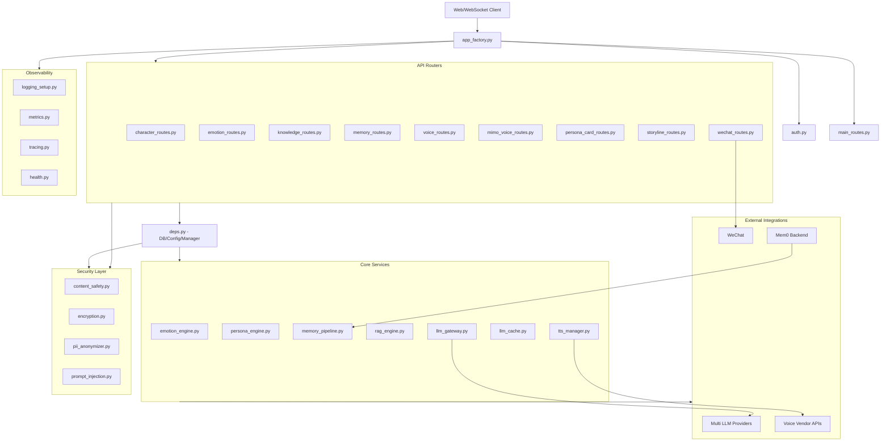
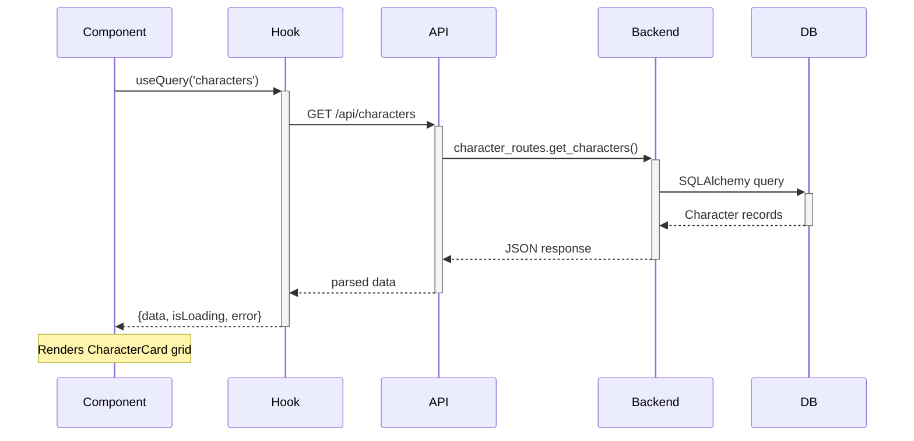
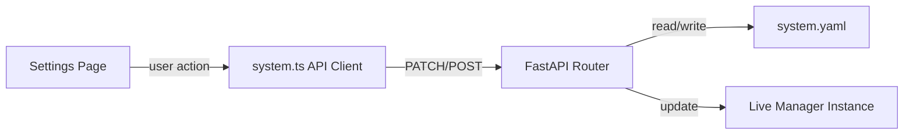

# Project Knowledge Graph

> Generated: 2026-05-31 | Maps module dependencies, routing, and data flow

---

## 1. Frontend Route Tree

```mermaid
graph TD
    App[App.tsx]
    App --> Sidebar[Sidebar.tsx]
    App --> Breadcrumb[Breadcrumb.tsx]
    App --> MobileNav[MobileNav.tsx]
    App --> Routes{Routes}

    Routes -->|"/"| Redirect[/wechat]
    Routes -->|"/wechat"| WeChat[WeChatPage.tsx]
    Routes -->|"/users"| Users[UsersPage.tsx]

    subgraph UserWorkspace[UserWorkspace.tsx]
        UW[/users/:userId]
        UW --> Create[CreateRole.tsx]
        UW --> Settings[RoleSettings.tsx]
        UW --> Status[StatusCenter.tsx]
        UW --> Storyline[StorylineEditor.tsx]
    end

    Routes -->|"/users/:userId/*"| UserWorkspace

    subgraph SystemSettings[SystemSettingsLayout.tsx]
        SS[/settings/*]
        SS --> LLM[SettingsLLM.tsx]
        SS --> Voice[SettingsVoice.tsx]
        SS --> Tools[ToolsDashboard.tsx]
        SS --> Security[SettingsSecurity.tsx]
        SS --> Logs[SettingsLogs.tsx]
    end

    Routes -->|"/settings/*"| SystemSettings
    Routes -->|"*"| NotFound[NotFoundPage.tsx]
```

### Route Parameter Structure
```
/:userId — 用户ID（UUID 或标识符）
/:userId/roles/:roleId — 角色ID
  /create  → 创建角色（3种方式）
  /settings[/:tab] → 角色设置（6 tab）
    基础 / 语音 / 消息 / 数据 / 表情包 / 时间线
  /status  → 状态中心（4统计+情绪+成就+趋势）
  /storyline → 剧情编辑器
/settings/:tab — 系统设置（5 tab）
  llm / voice / tools / security / logs
```

---

## 2. Backend Module Dependency Graph



---

## 3. Data Flow: API → Hook → Component

### Character Flow


### Chat Flow
```mermaid
sequenceDiagram
    User->>+WebSocket: ws://localhost:8765/chat
    WebSocket->>+SessionManager: route to character
    SessionManager->>+EmotionEngine: get emotional state
    EmotionEngine-->>-SessionManager: context
    SessionManager->>+LLMGateway: build prompt + stream
    LLMGateway->>+Provider: API call
    Provider-->>-LLMGateway: stream tokens
    LLMGateway-->>-SessionManager: response text
    SessionManager->>+MemoryPipeline: store conversation
    SessionManager-->>-User: stream response
    User-->>-Component: display message
```

### Settings Flow


---

## 4. Module Dependency Table

| Module | Dependencies | Depended By |
|--------|--------------|-------------|
| `emotion_engine.py` | `persona_card.py`, `config` | `user_scheduler.py`, `shisi/` |
| `memory_pipeline.py` | `vector_memory.py`, `semantic_memory.py` | `user_scheduler.py`, `api/` |
| `llm_gateway.py` | `multi_provider_gateway.py` | `user_scheduler.py`, `tools/` |
| `tts_manager.py` | `mimo_tts_provider.py`, `edge_tts_provider.py` | `api/voice_routes.py` |
| `shisi/knowledge/retriever.py` | `data/knowledge/`, `llm_gateway.py` | `api/routers/chat_routes.py` |
| `content_safety.py` | `prompt_injection.py` | `deps.py` (middleware) |
| `auth.py` | `deps.py` | All routes |
| `wechat_connector.py` | `qrcode_store.py` | `wechat_routes.py` |
| `user_scheduler.py` | All core services | `main.py`, `app_factory.py` |

---

## 5. Key Architectural Patterns

### Service Layer Pattern
```
Router → Depends(deps) → Service/Manager → External
  ↓                       ↓                    ↓
  HTTP/WS               Business Logic      DB/LLM/WeChat
```

### Provider Pattern (TTS & LLM)
```
Manager (router)
  → BaseProvider (abstract)
    → SpecificProvider1 (e.g. MiMo)
    → SpecificProvider2 (e.g. Edge-TTS)
  → Fallback chain on failure
```

### Memory Pipeline Pattern
```
Input → WorkingMemory (temporary)
     → EpisodicMemory (conversation-level)
     → SemanticMemory (knowledge-level)
     → StructuredMemory (facts/entities)
     → VectorMemory (semantic search)
```
