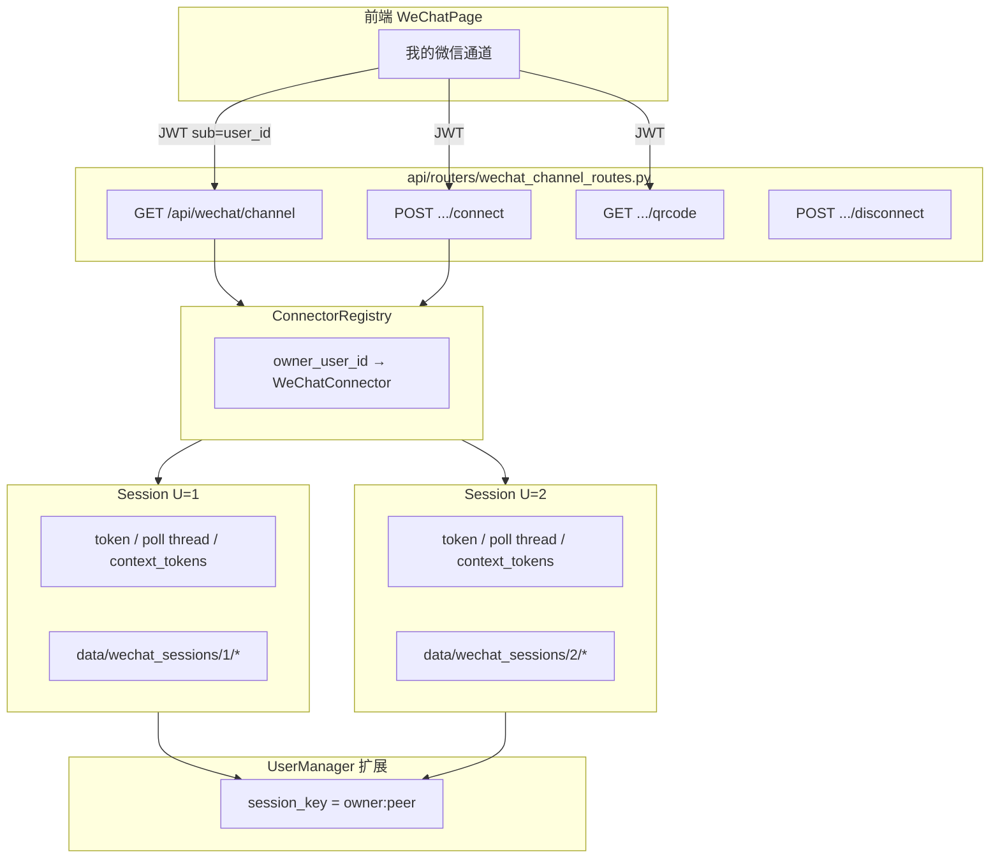

# 每人独立微信通道 — 架构改造方案

> **日期**：2026-09-19
> **性质**：设计方案（未实施代码）
> **触发**：其他注册用户登录后未扫自己的微信，却看到「微信已连接」，且连的是管理员通道
> **裁决**：产品改为**每个注册用户扫自己的微信**；凭证、状态、连接器按 `user_id` 隔离
> **真源依据**：`wechat_direct/wechat_connector.py` / `api/routers/chat_routes.py` / `api/routers/wechat_routes.py` / `user_scheduler.py` / `frontend/src/pages/WeChatPage.tsx` / `docs/history/2026-05-24-multi-user-design.md`

---

## 0. 问题根因（已实证）

当前不是「别人偷连了你的微信」，而是**通道层是全局单例，却被 UI 当成每个人的通道**。

| 层 | 现状 | 问题 |
|----|------|------|
| 凭证 | `~/.weixin_cow_credentials.json` 全服务器一份 | 谁的扫码结果都是同一份 |
| 状态 | `data/wechat_state.json` 全局 | 所有人读到同一 `connected/bot_id` |
| 二维码 | `data/wechat_qrcode.json` 全局 | 未隔离，且接口无 JWT/admin |
| 连接器 | 进程内 `_connector` 单例 | 只能跑一条 bot 轮询 |
| 状态 API | `GET /api/channels/wechat/status` | 返回全局 bot，无 per-user |
| 连接操作 | `connect/disconnect/reconnect/qrcode` | 仅 `verify_api_key_dep`，**无** `require_role("admin")` |
| API Key | `API_KEY_ENABLED` 未开时放行；前端可能打进共享 `VITE_API_KEY` | 登录用户等于拿到全局操作面 |
| 前端 | 登录默认 `/wechat`，侧栏对所有人显示「微信连接」 | 把全局状态展示成「我的微信」 |

**数据面**（好友消息 → `wechat_bindings.wxid` → 角色/记忆）已有用户维度；**通道面**没有。

ilink 登录协议本身是 **token 维度**的：每次扫码返回独立的 `bot_token` + `bot_id` + `base_url`。多实例并发在协议上可行，但**必须先做并发实测**（见 §8 Phase 0）。

---

## 1. 目标产品模型

```
注册用户 U 登录
    │
    ▼
U 在控制台扫【自己的】微信（建议小号）
    │
    ▼
系统为 U 创建独立通道 Session_U
    │  凭证 / 状态 / 二维码 / context_token / 轮询线程  全部挂 U
    │
好友 F 给 U 的微信 bot 发消息
    │
    ▼
Session_U 收包 → 会话键 (owner=U, peer=F) → U 的角色/记忆/情感
    │
    ▼
回复经 Session_U 的 token 发回 F
```

### 1.1 硬性隔离规则

1. **通道归属**：每条微信通道唯一属于一个 `user_id`；他人不可见、不可操作。
2. **会话隔离**：聊天/记忆/亲密度/主动消息按 `(channel_owner_user_id, peer_wxid)` 隔离。
3. **状态隔离**：`/wechat` 页只展示**当前登录用户自己的**通道。
4. **操作隔离**：扫码/断开/重连/读码只能操作自己的通道；跨用户 403。
5. **管理员可见性**：admin 可**查看**全部通道状态（运维）；**默认不可**静默接管/清凭证，接管需显式二次确认并写审计日志。

### 1.2 负面边界（不应变成）

- 不应把「好友在微信里找角色聊天」主路径弄坏
- 不应让管理员自己也操作不了自己的通道
- 不应静默把别人的微信绑到管理员账号
- 不应把全局 API Key 当作通道操作的充分凭证
- 不应为未扫码用户伪造「已连接」

### 1.3 与旧模型的语义差

| 维度 | 旧：单 bot 多好友 | 新：每人独立通道 |
|------|-------------------|------------------|
| 谁的微信在线 | 运营者/管理员 1 个 | 每个注册用户各自 0~1 个 |
| 好友消息归属 | 全局 bot + binding 查 web user | 只进入**该 bot 所有者**的管线 |
| 控制台「微信连接」 | 全局通道镜像 | 我的通道 |
| 未扫码用户 | 仍显示管理员已连接 | 显示「尚未连接你的微信」 |
| 主动消息出口 | 全局 connector + get_bound_wxids | 各 owner 自己的 connector + 各自 peer |

`wechat_bindings` 仍保留，语义收窄为：**在 U 的通道里，好友 F 可选用的角色卡 / 若 F 也注册了 web 账号则可关联身份**。不再表示「F 的消息该不该走全局 bot」。

---

## 2. 目标架构



### 2.1 数据模型（新增）

表 `wechat_channel_sessions`：

| 字段 | 类型 | 说明 |
|------|------|------|
| id | int PK | |
| user_id | int FK users, **unique** | 通道所有者；一人一条活跃通道 |
| bot_id | str | ilink bot_id |
| status | enum | `idle` / `waiting_qr` / `scanned` / `connected` / `error` |
| nickname | str | 通道备注（默认空） |
| credential_ref | str | 相对路径或加密 blob 引用（**禁止**明文写入可被他人 API 读出的字段） |
| last_connected_at | datetime \| null | |
| last_error | str | 最近一次错误摘要 |
| messages_today | int | 统计 |
| created_at / updated_at | datetime | |

凭证落盘（推荐，权限收紧）：

```
data/wechat_sessions/<user_id>/
  credentials.json      # token/base_url/bot_id — 文件系统隔离
  state.json
  qrcode.json
  context_tokens.json
```

可选：凭证加密存库（Fernet + 服务器密钥），磁盘只留 index。**首期建议文件隔离 + 目录权限**，降低实现风险；加密入库放二期。

废弃/迁移全局路径：

- `~/.weixin_cow_credentials.json`
- `data/wechat_state.json`
- `data/wechat_qrcode.json`
- `data/wechat_context_tokens.json`（改为 per-session）

### 2.2 连接器层改造

**现状问题**（必须改掉）：

- `wechat_connector.py:100` 全局 `_connector`
- `wechat_connector.py:58,129,137` 全局状态/凭证/context 路径
- `wechat_connector.py:589,608` `_last_user_id` 回退（跨用户投递隐患）
- `wechat_connector.py:855` `run()` 直接覆盖全局单例
- `qrcode_store.py` / `get_wechat_state()` 读全局文件

**目标**：

```python
class WeChatConnector:
    def __init__(self, user_manager, owner_user_id: int, base_url=..., session_dir: Path | None = None):
        self.owner_user_id = owner_user_id
        self.session_dir = session_dir or default_session_dir(owner_user_id)
        ...

class ConnectorRegistry:
    def get(self, user_id: int) -> WeChatConnector | None
    def ensure(self, user_id: int) -> WeChatConnector   # 懒创建，不自动 login
    def start_login(self, user_id: int) -> dict          # 生成该用户二维码
    def disconnect(self, user_id: int) -> None
    def restore_all_on_boot(self) -> int                 # 仅恢复已有凭证的会话
```

约束：

1. `login/run/qrcode/state/context_tokens` 一律走 `self.session_dir`
2. 删除进程级唯一 `_connector`；对外查询改为 `registry.get(user_id)`
3. **禁止** `send_text` 无 `to_user` 时回退到全局 `_last_user_id`；主动消息必须显式 `to_user=peer_wxid` 且 connector 的 `owner_user_id` 与调度任务一致
4. 每连接器：1 条 long-poll 线程 + 小线程池（建议 max_workers=2）；全局并发上限可配，默认 20
5. 文件锁从「全局一把锁」改为**每 user_id 一把锁**（多 worker 时每通道仅一个进程轮询）

### 2.3 消息路由与会话键

旧：

```
from_user (好友 wxid) → UserManager.process_message(from_user, ...)
```

新：

```
session_key = f"{owner_user_id}:{peer_wxid}"
→ UserManager.process_message(session_key, ..., channel="wechat", owner_id=owner_user_id, peer_wxid=peer_wxid)
```

UserManager：

- `_users` / 情感引擎 / session_id 以 `session_key` 为键
- 角色卡解析优先级：
  1. `wechat_bindings` 中 `wxid=peer` 且绑定语义仍有效 → 该绑定的 `character_card_id`
  2. 否则 → **通道所有者 U 的当前活跃角色**
- BYOK：`user_llm_config` 取 **通道所有者 U** 的配置（「我的微信女友」用我的 Key）
- 记忆/剧情线/亲密度落库键使用 `session_key`（或 `owner_id + peer_wxid` 双字段），禁止只写 `peer_wxid`（否则跨用户的同名好友会串）

**兼容**：若好友 F 自己也注册了 web 账号并完成绑定，允许「同一自然人」在 web 聊天与「作为 peer 出现在某通道」之间建立可选关联，但**不得**默认把 U 通道里的 F 会话并入 F 自己的 web 会话（除非用户显式确认绑定）。

### 2.4 主动消息 / 调度

旧 `api/run_api.py:_wechat_sender_factory`：全局 connector + `user_mgr.get_bound_wxids()`。

新：

```
for owner_user_id, connector in registry.active():
    peers = peers_of_channel(owner_user_id)  # 该通道近 N 日有会话的 peer
    for peer in peers:
        connector.send_text(msg, to_user=peer)  # 禁止无目标发送
```

- ASE 状态、配额、静默时段按 **owner_user_id**（或 owner×character）记账，与 v1.13 记账/投递解耦模型兼容
- 通道未连接 → 不记账（延续 v1.13 原则）
- 禁止出现「A 通道的消息从 B 通道发出」

### 2.5 API 设计

#### 用户侧（JWT 必填，`get_current_user_id`，不得仅靠 API Key）

| 方法 | 路径 | 语义 |
|------|------|------|
| GET | `/api/wechat/channel` | 我的通道状态（无会话则 `status=idle`，**不得**回退全局） |
| POST | `/api/wechat/channel/connect` | 为我启动扫码（生成我的 qrcode） |
| GET | `/api/wechat/channel/qrcode` | 我的二维码（他人的 404/403） |
| POST | `/api/wechat/channel/disconnect` | 断开**我的**通道 |
| POST | `/api/wechat/channel/reconnect` | 重连**我的**通道（只清我自己的凭证） |
| GET | `/api/wechat/channel/sse` | 我的状态 SSE（替代全局 status-stream） |

#### 管理员侧

| 方法 | 路径 | 语义 |
|------|------|------|
| GET | `/api/admin/wechat/channels` | 全局通道列表（状态摘要，**不含** token） |
| POST | `/api/admin/wechat/channels/{user_id}/force-disconnect` | 强断（审计） |
| GET | `/api/admin/wechat/audit` | 通道操作审计 |

#### 旧端点处置

| 旧端点 | 处置 |
|--------|------|
| `GET /api/channels/wechat/status` 等 | **删除或改 admin-only**，并声明 deprecated；普通用户 403 |
| `POST .../connect/disconnect/reconnect` | 同上；**立即**去掉「仅 API Key」的洞 |
| `GET /api/wechat/qrcode`（全局文件） | 删除或 admin-only；用户走 `/api/wechat/channel/qrcode` |
| `POST /api/wechat/bind` | 保留，语义按 §2.3 更新文案 |
| `data/wechat_connections.json` CRUD | admin-only（已是）；与 channel session 打通，避免双真源 |

**认证铁律**：通道类端点 = **JWT（本人或 admin）**。`verify_api_key_dep` 不能单独作为通道操作凭证。生产必须 `API_KEY_ENABLED=true` 且**前端不得**把 API Key 打进可被所有登录用户共享的 bundle 作为唯一防线（服务端 JWT 才是主门）。

### 2.6 前端

| 模块 | 改造 |
|------|------|
| `WeChatPage.tsx` | 状态横幅改为 `useMyWechatChannel()`；文案「我的微信桥接」；`connected` 只来自本人接口 |
| 侧栏/抽屉 | 「微信连接」保留给所有用户，但状态灯 = **我的通道**；未连接显示空态引导，不显示绿灯 |
| 扫码弹窗 | `connect` → 本人二维码轮询；成功后写 `wechat_channel_sessions`，**不再**调用 admin 的 `wechatCreateConnection` 冒充连接成功 |
| `system.ts` | 移除/改写对全局 `channels/wechat/*` 的用户侧调用 |
| 登录跳转 | 仍可去 `/wechat`（我的通道）；无通道时引导扫码或先用 Web 聊天 |
| Admin | 新增通道监控页（列表：user、bot_id、status、last_seen；无 token） |

### 2.7 启动与多 worker

- `uvicorn --workers N`：启动时扫 `data/wechat_sessions/*/credentials.json`，**按 user_id 文件锁**决定哪个 worker 拉起该通道轮询
- 禁止再用全局 `/tmp/ai-girlfriend-wechat-autostart.lock` 一把锁管所有通道
- 无凭证会话不启动线程（省资源）
- 优雅停机：registry.disconnect_all()，状态落盘 `connected=false`

---

## 3. 安全设计（必做）

1. **通道操作仅 JWT**；跨用户访问一律 403 + 日志
2. 凭证文件：仅服务进程用户可读；API 响应永不含 `token`
3. 二维码 URL 短 TTL（沿用 600s）且**绑定申请者 user_id**（生成时记录 owner，读取校验 owner）
4. 管理员强断/清凭证 → 审计日志（who/when/which user_id/reason）
5. `.env` 生产清单不变：`JWT_SECRET`≥32、`API_KEY_ENABLED=true`、强 `API_KEY`、`AI_GF_ENV=prod`
6. 数据隐私：通道目录与聊天记录同样按 user 隔离；备份/导出不得混通道
7. 微信 ToS：每用户使用自己的微信/小号，平台不鼓励批量养号；违规账号风险由使用者自担（与 Intro 文案一致）

---

## 4. 资源与容量

| 项 | 估算 | 策略 |
|----|------|------|
| 长轮询线程 | 1 / 在线通道 | 上限 `WECHAT_MAX_CHANNELS`（默认 20） |
| 消息线程池 | 2 / 通道 | 全局注意 fd/内存 |
| 磁盘 | ~数 KB/通道 + context_tokens | TTL 24h 清理 |
| LLM | 按消息 | BYOK 按 owner；全局兜底 |
| 风控 | 同 IP 多 bot 可能触发微信侧限制 | 产品提示 + 退避 |

超限行为：排队或明确提示「通道名额已满，请联系管理员」，**禁止**静默挤掉他人通道。

---

## 5. 数据迁移

1. **识别当前全局 bot 的归属**：管理员账号（或配置项 `legacy_channel_owner_user_id`）
2. 将 `~/.weixin_cow_credentials.json` + `data/wechat_state.json` + `wechat_context_tokens.json` 迁入 `data/wechat_sessions/<owner>/`
3. `wechat_channel_sessions` 插入该 owner 的 `connected` 记录
4. `wechat_bindings`：保留；文档说明语义变化；历史好友会话键做一次性迁移脚本：
   - 旧键 `F` → 新键 `{legacy_owner}:{F}`（仅迁移 legacy 通道流量）
5. 全局文件迁移后改名 `.bak`，代码路径删除读取（防回退）
6. 其它已注册用户：无通道 = `idle`，**不再**继承 connected

---

## 6. 测试计划（完整，非采样）

### 6.1 单元

- `ConnectorRegistry`：ensure/start_login/disconnect/restore；并发锁
- 凭证路径：`session_dir` 隔离，A 用户 login 不影响 B
- `get_wechat_state(user_id)`：无会话返回 idle，**不**读全局文件
- 会话键：`(U1,F)` 与 `(U2,F)` 记忆/情感互不串
- 角色解析：binding 优先，否则 owner 活跃角色
- BYOK：走 owner 的 llm_config
- `send_text`：禁止无 `to_user` 回退
- 授权：非 owner 调 channel API → 403；仅 API Key 无 JWT → 401/403
- 调度：多通道投递只进各自 peer；通道 down 不记账

### 6.2 集成 / API

- 注册用户 A 扫码（mock ilink）→ 仅 A 的 status=connected
- 用户 B 登录 → status=idle，qrcode 403/空，侧栏无绿灯
- B 调 A 的 disconnect → 403，A 仍 connected
- Admin 列表可见 A/B 状态摘要，响应无 token
- 主动消息双通道 mock：A 的消息只出 A 的 connector

### 6.3 前端 vitest

- WeChatPage：未连接空态；connected 仅本人接口
- 侧栏状态灯映射本人通道
- 扫码成功不再调用 admin connection API

### 6.4 回归

- 好友 → bot → 角色回复主路径（mock connector）
- 语音/图片/ASR 路径不被 owner 键破坏
- 现有 pytest 全量 + vitest 全量 + tsc 0 错
- 口径对齐 AGENTS §4.3（当前基线 1082 通过 / 4 跳过 + 前端 87）

### 6.5 人工验证步骤（上线前）

1. 管理员确认 legacy 通道已挂到自己账号，手机微信仍能收发
2. 新注册测试号：登录 → `/wechat` 显示未连接 → 扫码自己的小号 → 仅本人显示已连接
3. 用测试号的好友微信发消息 → 只在测试号控制台产生会话与记忆
4. 管理员微信好友发消息 → 仍进管理员管线
5. 测试号断开 → 管理员通道不受影响
6. 确认日志中无跨 owner 的 `send_text`

---

## 7. 文档同步（实施完成时）

| 文档 | 变更 |
|------|------|
| `AGENTS.md` | §0 产品形态「每人独立通道」；Owner Map wechat 职责面；修订历史 |
| `README.md` | 扫码语义、多用户通道说明 |
| `docs/FUNCTION_INVENTORY.md` | WECHAT-* 改为 per-user；新增 ADMIN-WECHAT-* |
| `docs/CODE_GRAPH.md` | 通道架构、端点表 |
| `docs/DECISION_LEDGER.md` | 2026-09-19 裁决：单 bot → 每人独立通道 |
| `docs/VISION.md` | 若仍写「单 bot 多好友」则纠正 |
| Intro 文案 | 与每人扫码模型一致 |

B 档：`commit → push` GitHub；服务器不落文档（AGENTS §3）。

---

## 8. 实施阶段（建议拆小步，每步可回滚）

| Phase | 内容 | 完成判据 | 预估 |
|-------|------|----------|------|
| **0. 协议实测** | 用 2 个测试微信号同时扫码 + 并发 `get_updates` / `send_text` 24h | 双 token 均稳定，无互相踢下线 | 0.5~1 天 |
| **1. 连接器去全局** | WeChatConnector 参数化 `owner_user_id` + session_dir；ConnectorRegistry；删 `_last_user_id` 回退 | 单测绿；双实例内存隔离 | 1~2 天 |
| **2. 数据与 API** | `wechat_channel_sessions`；用户侧 channel API JWT；旧端点 admin-only/删除 | API 测试：跨用户 403 | 1~2 天 |
| **3. 路由会话键** | UserManager `(owner:peer)`；角色/BYOK/记忆键 | 隔离测试全绿 | 1~2 天 |
| **4. 前端** | WeChatPage/侧栏/SSE/文案 | vitest + 人工双账号 | 1 天 |
| **5. 调度主动消息** | 多通道投递 + 记账按 owner | 投递/配额测试 | 1 天 |
| **6. 迁移与文档** | legacy 通道迁 admin；全量测试；文档/AGENTS | 基线不降；迁移脚本幂等 | 1 天 |

**Gate**：Phase 0 失败（多 bot 并发不可用）→ 立即回到用户裁决：降级为「权限收口 + 展示隔离」（保留单 bot），不得硬上。

---

## 9. 风险与开放问题

| # | 风险 | 缓解 |
|---|------|------|
| R1 | ilink 不支持同 IP 多 bot 长连接 | Phase 0 实测；失败则降级方案 |
| R2 | 微信封控多开小号 | 产品提示、限并发、异常退避 |
| R3 | 线程/内存随通道数上升 | 通道上限 + 懒启动 + 空闲回收 |
| R4 | 记忆键迁移遗漏导致串扰 | 迁移脚本 + 双写校验期 + 隔离测试 |
| R5 | 前端仍残留全局状态接口 | 静态扫描 `channels/wechat` 用户侧调用 = 0 |
| R6 | 生产 API_KEY 未开 | 实施同时收紧认证与部署清单 |
| R7 | 主动消息在多通道下的 ASE 状态机 | 按 owner 实例化或加 owner 维度；复用 v1.13 记账解耦 |

### 9. 待你确认的开放问题 — **已全部裁决（2026-09-19 用户确认）**

| # | 问题 | 用户裁决 |
|---|------|----------|
| 1 | 一人几条微信通道？ | **一人两条**（`MAX_CHANNELS_PER_USER=2`，slot 0/1） |
| 2 | 未绑定好友进谁的角色？ | **让他们自己选**（回复「角色」出菜单；回复序号落 `wechat_peer_preferences`） |
| 3 | 在线通道名额上限？ | **100**（`WECHAT_MAX_CHANNELS` 默认 100） |
| 4 | 遗留全局凭证归属？ | **是 → 迁到管理员账号**（`scripts/migrate_legacy_wechat_channel.py`） |
| 5 | Phase 0 测试账号？ | 用户已开始真实注册测试；实施同时落地隔离，避免测试用户继续看到管理员通道 |

### 10. 第 6 问：为什么账号隔离当初没做好？

**不是漏写一行 if，而是产品模型与通道实现长期分叉：**

1. **历史形态是「运营者单 bot」**：`main.py` 原文「多个好友可与同一 bot 聊天」。数据面（记忆/角色/`wechat_bindings`）按 user 隔离是后来加的；**通道面**从未多租户化。
2. **文案跑在代码前面**：Intro/README 写「扫码登录你的微信」，实现仍是全局 `~/.weixin_cow_credentials.json` + `data/wechat_state.json` 单例。
3. **安全审查盯的是 JWT/API Key/密钥**，通道端点只要求可选的 `verify_api_key_dep`，且 `API_KEY_ENABLED` 关闭时直接放行——「谁能看见/操作通道」不在审查清单里。
4. **前端默认登录进 `/wechat` 并展示全局状态**，把架构债放大成「每个人都连上了我的微信」的用户可见事故。

隔离本应是 foundation；本次改造把通道提到与记忆/角色同级的 per-user 真源。

---

**结论**：裁决已锁定并在 worktree `wt/wx-channel` 实施中：一人两条、好友自选、上限 100、遗留迁 admin、用户侧只看/只操作自己的通道。
