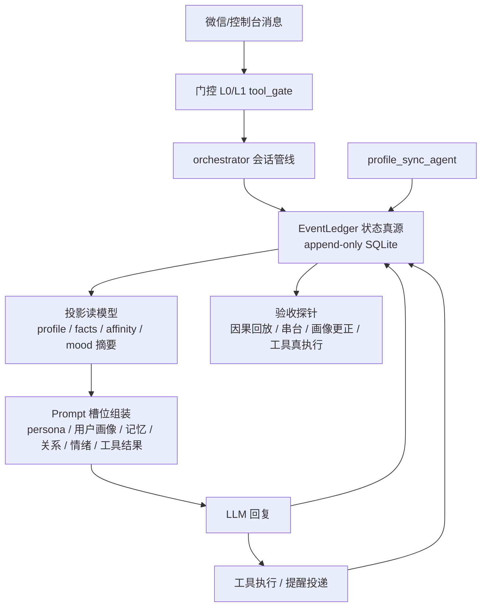

# 智能体架构转型方案（任务包 AX · 阶段 B）

> **文档类型**：重大决策转型方案（可评审）  
> **日期**：2026-09-21  
> **窗口**：`wt/agent-x` / `D:\Desktop\ai-girlfriend-agent-x`  
> **宪法**：AGENTS.md v1.33 §1.2 sliver-vibe-coding + 本方案  
> **输入**：交接书 F1–F6、实现级学习笔记、生产代码实读（profile_agent_tools / user_profile / affinity_records / orchestrator）  
> **纪律**：研究阶段不改生产热路径；骨架代码仅在 worktree，实施另批可回滚  
> **用户裁决首页声明**：上一轮「对标改造」**效果很差**；小凌学习 **文档有、工程主轴无**。本方案**禁止再报告堆叠**，以 **EventLedger 状态平面** 为唯一新增主轴，其余机制围绕主轴分批落地。

---

## B1 问题陈述（机制根因，非体感复述）

### 用户可观察失败（交接书/生产）
1. 生日/职业/约定**乱编**  
2. 双用户**串台感**  
3. 提醒/工具**假承诺**  
4. 回复**玩具感**（不跟话题、不认账）  
5. 无法回答「**角色为何这样答**」

### 代码路径根因（本 worktree 实读）

| 现象 | 根因 | 证据 |
|------|------|------|
| 画像乱编 | 长期无用户画像槽；user_facts 碎片 + 规则垃圾；prompt 曾无 `# 用户画像` | v1.32 补丁已加槽，但**写路径仍双轨**：LLM 工具 + 正则弱兜底，**失败契约未钉死**；`profile_sync` 是旁路，不绑主回复 |
| 状态「说不清」 | **状态真源碎片化**：`user_profile` 表 / `user_facts` / `affinity_records`（**只写不读**，`shisi/affinity/enhancer.py:126-137` 仅 INSERT）/ 情绪内存 / ASE 状态文件 | 无统一账本 → 无法回放「这句回复注入了什么、改了什么」 |
| 串台 | P1/P28 隔离已修键形态；残余风险=**历史/检索/主动投递多 owner**，新机制若再开真源会复发 | `user_key_from_session` 完整键纪律必须成为 EventLedger 主键的一部分 |
| 工具假承诺 | v1.18 管线已修权限/结案；残余=**执行结果不进因果账本**，验收仍靠人工 | 需 tool_call 回执写账本 |
| 报告堆叠失效 | F1–F6：研究→实施断层；`affinity_records` 雏形存在但**消费端为 0** | 本批强制：schema+API+探针 **可运行**，消费端分 P0–P3 |

### 一句话根因
> **缺少「消息 → 状态真源 → prompt 槽位 → 回复 → 事件回写」的单一因果主轴**；记忆/画像/情感/工具各自为政，失败时无统一降级与回放。

---

## B2 目标架构

### 槽位契约（目标形态，对齐 nana reply 槽位 + 本仓 ST 序列）

system 建议顺序（单测钉死，详见契约文档）：
1. 角色身份/人设（CharacterAggregate，scenario 已移除）  
2. `# 用户画像`（**只读投影**，禁止编造画像外信息）  
3. `# 关系与情绪`（affinity level hint + 投影情绪摘要）  
4. `# 记忆上下文`（facts/topics，untrusted 信封，**非对话历史**）  
5. 对话示例 mes_example（历史前 few-shot）  
6. messages：真实 user/assistant 轮  
7. 工具结果 untrusted（history 后 PHI 前）  
8. PHI/扮演规则 + 输出格式  
9. （可选）跨会话尾巴 untrusted  

**铁律**：动态状态**每轮重算投影**；禁止多处字符串拼接散落（owner=`prompt_builder` / `CharacterAggregate`）。

---

## B3 技术选型（每层：选什么 / 为何 / 备选与放弃）

| 层 | 选型 | 为何 | 备选与放弃理由 |
|----|------|------|----------------|
| **状态真源** | **EventLedger**：`shisi/agent_plane/event_ledger` + SQLite 表 `event_ledger`（append-only） | 小凌/WrenWen「账本」主轴；本仓已有 `affinity_records` 雏形但无消费；SQLite 已是生产真源，**不引入新中间件** | ① 继续散表：已证明 F3；② 全量事件溯源框架/消息队列：单机 4 worker 过重；③ 把状态塞进 prompt-only：无法回放 |
| 键 | `session_key`（完整 `N:peer`）+ `character_id` + `event_id` | 隔离 P0/P1 宪法；禁止剥 owner | 裸 wxid：已判串台根因 |
| 存储 | 同库 `data/sqlite.db` 或独立 `data/agent_plane.db`（骨架默认独立文件便于回滚） | 独立文件可整文件回滚，不污染主库 | 主库同文件也可，迁移批再合并 |
| **画像/记忆写** | **LLM 工具**（`profile_agent_tools`）+ **结构化 extract 契约**（对齐 nana/my-raze 字段）+ 正则弱兜底 | 已起步；对端证实工具/JSON 回写主路径有效 | 纯正则：用户已裁不可接受；纯对话内 JSON 改主回复：破坏沉浸式与微信链路 |
| 合并规则 | scalar 非空覆盖；deny 清空；array add-dedup；near-dup bigram≥0.6 → reinforce；失败 **不写** | nana merge + my-raze reinforce | 无阈值 append：重复事实爆炸 |
| **会话上下文** | 保留本仓 DB history + system 槽位化；**投影来自 ledger 读模型** | 多用户微信必须 DB；与 v1.31 角色归属兼容 | 重写成 nana 单 user message：丢隔离与工具管线 |
| **工具** | 保留 L0/L1 + 防假承诺；补 **turn 顶 / 同名去重 / 结果预算**；结果 untrusted；**执行回执写 ledger** | Artemis 限额 + 本仓已有门控 | 改回关键词裁决：已淘汰 |
| **主动消息** | ASE 保留；P1 增加 **阶段 min_gap 表**（MetaPact/HEARTBEAT 语义）；LLM 只润色 | 确定性可验收 | 概率骰子：体感不可控 |
| **情感** | **先收敛真源再扩**：affinity scale 为关系权威；mood 为投影字段写 ledger，**不开第 N 套状态机** | 情感真源审查结论 | 立刻上小凌全参数域：无标定 |
| **框架形态** | **不整仓重写**；`shisi/agent_plane/` 新 owner + orchestrator 读投影 | 交接书倾向；微信管线保留 | 重写 orchestrator 大爆炸：回滚不可控 |
| **许可证** | 自研实现；不拷贝 Artemis/SillyTavern 源码 | Artemis NOASSERTION / ST AGPL | 直接 vendor：法律风险 |

---

## B4 与小凌 / WrenWen / nana 映射（进生产 / 不做）

| 机制 | 来源 | 进生产？ | 批次 | 理由 |
|------|------|----------|------|------|
| EventLedger 因果账本 | 小凌/WrenWen | **是** | **P0** | 主轴；回放/验收前提 |
| 因果回放探针 | 交接书 B6 | **是** | **P0** | 验收不止 pytest |
| 画像工具契约 + 失败不写 + deny 清空 | nana extract + 本仓工具 | **是** | **P0** | 已半落地，钉契约 |
| near-dup reinforce | my-raze | **是** | **P0** | 防事实爆炸 |
| 用户画像/关系/记忆 prompt 槽位 | nana reply | **是**（复核钉序） | **P0** | v1.32 部分有，单测钉死 |
| tool 回执入账本 + turn 限额可观测 | Artemis | **是** | **P0/P1** | 工具真执行验收 |
| 双用户串台探针 | 隔离 P0 续 | **是** | **P0** | 防回归 |
| 阶段×缺失时长 min_gap | MetaPact | 是 | **P1** | 主动语义升级 |
| 夜间 curator | Artemis | 是 | **P1** | 记忆整理；非阻塞主轴 |
| summary 压缩长上下文 | nana archive | 是 | **P1** | topics/summary 续聊 |
| 五轴内驱实验 | jiwen | 可选对照 | **P2** | 禁止并行真源 |
| 记忆流 importance 打分论文级 | generative_agents | 可选 | **P2** | 需标定 |
| 参数域 initial/min/max/plasticity 全量 | 小凌手稿 | **否（非 P0）** | P3 候选 | 无标定；先账本 |
| Deep Pattern 阿赖耶识全链 | 小凌 | **不做** | — | 过度拟人+无验收路径 |
| 硬件具身 / 反射层绕过认知 | 小凌 | **不做** | — | Non-Goal |
| 识海四层完整竞争激活公式 | 小凌 | **部分借思想** | P1+ | 已有检索；只补门槛/信任维度 |
| nana 单文件 JSON 人格 | nana | **不做** | — | 多用户微信不兼容 |
| 整仓重写 / 新语言栈 | — | **不做** | — | 回滚与团队成本 |

---

## B5 迁移路径（P0–P3，每批可独立回滚）

### P0 · 状态平面骨架 + 验收探针（本 worktree 阶段 C）
- 落 `shisi/agent_plane/event_ledger.py`：schema + append/read + 统计  
- 迁移说明：`affinity_records` **保留**；P0 **双写** ledger（enhancer 可选 hook），**读路径仍以现有 scale/affinity_state 为准**（避免 P0 改热路径行为）  
- prompt 槽位契约 md + 单测（段落顺序/禁止 json.dumps 污染）  
- profile 工具 schema 文档（对齐 nana/my-raze 合并规则）  
- 探针脚本：`scripts/ax_causal_replay.py` 等（可离线跑）  
- **回滚**：删除 agent_plane 包 + 关 ledger 双写开关即可；生产未强制读

### P1 · 投影接入 + 热路径只读消费
- orchestrator：每轮组装后 `ledger.append(turn_bundle)`；prompt 读投影摘要  
- profile_sync：成功/失败均 append（失败类型化）  
- 工具：`tool_call`/`tool_result` 事件；turn 限额日志  
- 主动消息：阶段 min_gap 表  
- **兼容**：`user_profile` 表仍是画像权威**写**目标；ledger 记事件，投影可从 ledger 或现表生成（实施时二选一，禁止双真源并行写）  
- **回滚**：关闭 `AGENT_PLANE_ENABLED`；槽位退回 v1.32 现状

### P2 · 记忆整理与内驱标定
- 夜间 curator（confidence/阈值）  
- ASE vs 阶段间隔标定；可选 jiwen 对照（**读** ledger，不另开状态文件）  
- **回滚**：scheduler 任务关闭

### P3 · 参数域 / 长上下文压缩等增强
- 仅在 P0–P2 探针稳定后评估  
- 每项单独 ADR

### 与现有表兼容策略

| 现有 | P0 | P1+ |
|------|----|-----|
| `user_profile` | 保持权威写目标 | 可选改为「由 ledger 投影重建」，但必须单选 |
| `user_facts` | 保持 | 读走投影；near-dup reinforce |
| `affinity_records` | 保留；ledger 记 `affinity_delta` 镜像事件 | 可 deprecate 写入，改纯历史 |
| `affinity_state` / scale | **仍是关系数值权威** | 变更必须有 ledger 事件 |
| `chat_history` | 不改 | 不改 |
| ASE 状态文件 | 不改 | 事件写 ledger |
| `pending_intents` / reminders | 不改 | 执行回执写 ledger |

---

## B6 验收（不止 pytest）

### 工程探针（必须可脚本化）

| 探针 | 步骤 | 通过标准 |
|------|------|----------|
| **因果回放** | 取 reply_id/session/时间点 → `ledger.replay_context` | 能列出：注入画像字段、记忆条数、关系 level、工具调用与结果摘要、状态增量；「为何这句」可指到槽位 |
| **双用户串台** | userA 写入生日 X；userB 会话询问/注入 | B 的投影/回复证据中**无 X**；ledger 查询按 session_key 过滤为 0 命中 |
| **画像更正** | 「我的生日不是X是Y」→ profile_sync/工具 | profile=Y，X 清空；ledger 有 `profile_correct` 事件；坏 JSON 时 profile 不变 |
| **工具真执行** | 「明早六点叫我起床」 | reminders 有 `session_key`+trigger_time；到点 delivery 或 pending 状态可查；ledger 有 tool_call；**禁止仅有聊天气泡承诺** |

### 突变验红设计
- 故意把 `user_key_from_session` 剥 owner → 串台探针 **必须红**  
- 故意去掉 profile deny 清空 → 更正探针 **必须红**  
- 故意把槽位顺序打乱/记忆塞进「对话历史」→ 槽位单测 **必须红**  
- 故意让工具只返回话术不落库 → 工具探针 **必须红**

### 用户可观察完成定义（交接书 §6）
1. 生日/职业/约定稳定且可更正  
2. 双用户无串台体感  
3. 提醒真落库真到点  
4. 评审能回答：状态写哪、谁读、失败怎么办、如何回放  

### 回归门
- worktree：新增骨架测试绿 + 既有相关测试不红  
- 主检出收编时：分块 pytest **不回退**（角色卡 41 张在位时约 **1455+** 收集口径）

---

## B7 风险

| 风险 | 影响 | 缓解 |
|------|------|------|
| 热路径延迟（每轮 append + 投影读） | 微信回复变慢 | append 单表事务；投影缓存；P0 双写开关默认可关；异步 to_thread |
| 多 worker 写放大 | SQLite 锁竞争 | WAL；短事务；事件批量；独立 db 文件 |
| ledger 与 user_profile 双真源 | 画像再次漂移 | **P1 明确单一写权威**；P0 ledger 只记事件不替代画像读 |
| 拟人过度被当 bug | 用户困惑 | Non-Goal 清单；proactive 确定性阈值 |
| 探针造假（只测 mock） | F6 重演 | 探针读真库真 ledger；突变验红 |
| 实施窗再「报告堆叠」 | 任务失败 | 本批骨架可运行；BOARD 验收以探针为准 |
| 许可证污染 | 法律 | 不 vendor Artemis/ST；自研 |

---

## 附：失败模式规避清单（对 F1–F6）

| F | 规避动作 |
|---|----------|
| F1 只学有什么 | 本包交付 **实现级笔记**（调用链/字段/失败降级/落点） |
| F2 研究→实施断层 | **同窗**交付 EventLedger 可运行骨架 + 探针；生产接入列 P1 可评审 |
| F3 碎片补丁 | 方案以 **状态真源** 为唯一主轴；禁止再开第 N 套 |
| F4 对照仓丢失 | 重克隆 + **克隆记录 URL/SHA** 可复现 |
| F5 小凌空转 | §B4 表：**哪些进生产/哪些不做** + EventLedger 批次 |
| F6 验收靠数字 | §B6 四探针 + 突变验红 |

---

## 评审问题（供用户/主控）

1. P0 是否接受 **ledger 独立 db 文件**（默认 `data/agent_plane.db`）以便整文件回滚？  
2. P1 投影读：画像以 `user_profile` 为写权威、ledger 为事件权威——是否同意「读投影、写单点」？  
3. 主动消息 P1：采用 MetaPact 阶段 min_gap 是否覆盖你们期望的「更像一个人」？  

**未确认前：生产热路径不改**（研究+骨架 only）。
