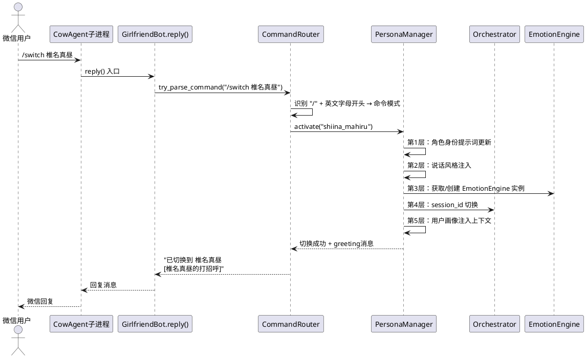
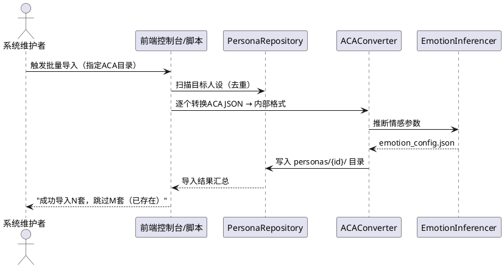
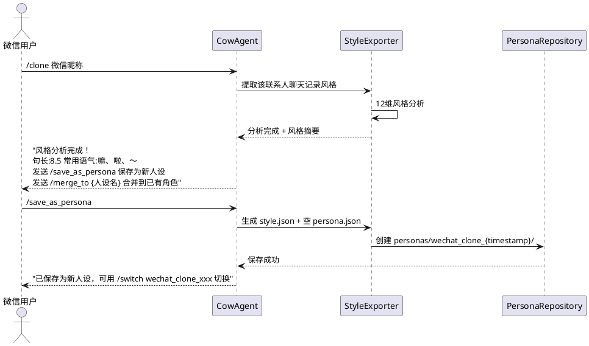
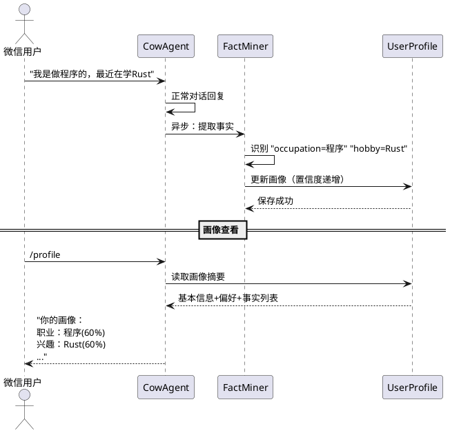
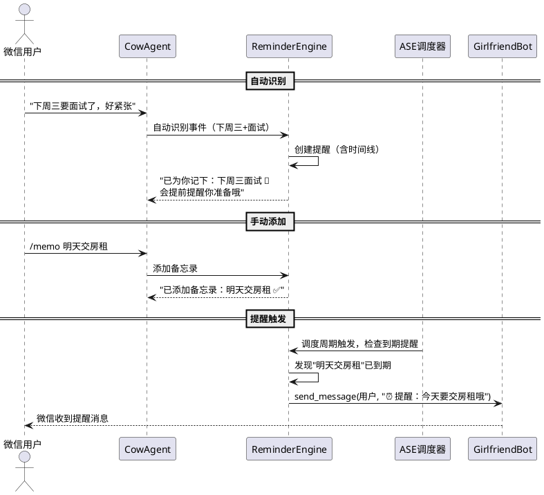
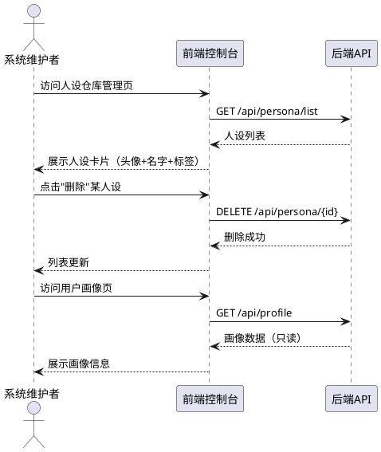

# 人设系统增强 · 需求规格

> 版本：v2.0（修正版 — 基于微信命令交互模型）
> 日期：2026-05-21
> 状态：修正定稿
> 依据：需求文档 v1.0 + 改造方案批判分析 + 用户五项修正指令

---

# 1. 组件定位

## 1.1 核心职责

本组件负责人设仓库管理与多角色切换、微信克隆风格注入人设、用户画像自动构建、备忘录事件提醒，实现AI伴侣从单角色到多角色的系统能力扩展。

## 1.2 核心输入

1. **微信用户消息**：通过 CowAgent（chatgpt-on-wechat）WeixinChannel 接收的用户聊天消息和命令消息
2. **微信聊天记录文件**：用于风格克隆分析的聊天历史导出数据
3. **ACA人设JSON文件**：从 ACA（爱语）APP 导出的26套完整人设数据
4. **前端管理操作**：通过 React 控制台发起的人设仓库管理请求（批量导入、删除、查看）
5. **定时触发信号**：来自现有主动消息引擎调度器的周期性检查触发

## 1.3 核心输出

1. **微信回复消息**：通过 CowAgent 的 GirlfriendBot.send_message() 发送给微信用户的对话回复和提醒消息
2. **人设仓库数据**：供前端控制台读取的人设列表、详情、用户画像等管理数据
3. **提醒通知消息**：通过微信主动推送的备忘录/事件到期提醒
4. **控制台日志**：微信通道不可用时的降级提醒输出

## 1.4 职责边界

- 本组件**不负责**微信通道的建立和维护（由现有 CowAgent + WeixinChannel 承担）
- 本组件**不负责**LLM推理调用（由现有 llm_provider/ 承担）
- 本组件**不负责**情感引擎的核心算法（EmotionEngine 内部逻辑不动，仅管理其实例生命周期）
- 本组件**不负责**安全层内容过滤（由现有 safety/ 承担）
- 本组件**不负责**前端用户的对话交互界面（用户与AI的所有对话在微信内完成）
- 本组件**不新建**独立模块目录，**扩展现有** character_card/、persona_extractor/、proactive/ 等模块

---

# 2. 领域术语

**人设（Persona）**
: 一个AI角色的完整设定档案，包含角色描述、性格、说话风格、情感参数、记忆空间等，以独立文件夹形式存储于仓库中。

**人设仓库（Persona Repository）**
: 存储和管理所有人设的容器，提供人设的增删改查、搜索和索引能力，基于现有 character_card/ 模块扩展。

**人设切换（Persona Switch）**
: 将当前激活的AI角色从一个人设切换到另一个人设，触发5层提示词联动和情感引擎实例重建。

**5层提示词联动（5-Layer Prompt Cascade）**
: 人设切换时依次更新的五层提示词：(1)角色身份层 (2)说话风格层 (3)情感参数层 (4)记忆上下文层 (5)用户画像层。确保切换后AI的完整人格一致性。

**5层记忆隔离（5-Layer Memory Isolation）**
: 人设切换时五层记忆的隔离策略：(1)对话历史按session_id隔离 (2)情感状态按引擎实例隔离 (3)工作记忆按session隔离 (4)情景记忆按角色namespace隔离 (5)用户画像全局共享。确保角色间记忆不串扰。

**用户画像（User Profile）**
: 系统对微信用户的"印象笔记"——记录用户的基本信息、偏好、重要日期等事实，所有角色共享访问。基于现有 persona_extractor/ 模块扩展。

**置信度（Confidence）**
: 系统对一条用户事实信息的相信程度，取值0~1。首次出现60%，重复出现递增至95%，用户明确指令直接95%。

**风格注入（Style Injection）**
: 将从微信聊天记录提取的说话风格特征打包为 style.json，通过系统提示词注入到人设中，无需切换模型。

**备忘录引擎（Reminder Engine）**
: 从对话中自动识别时间事件或接受手动添加，到时间后通过微信主动发送提醒消息。与现有主动消息引擎（ASE）并行运行。

**微信命令（WeChat Command）**
: 用户在微信聊天中以 `/` 前缀发送的指令消息，如 `/switch 椎名真昼`。由 CowAgent 的 GirlfriendBot.reply() 消息处理入口解析处理，**不修改** CowAgent 上游源码的 ChatChannel._handle()。

**CowAgent**
: 现有的 chatgpt-on-wechat 框架适配层，负责微信消息的收发、通道管理和命令解析。包含 WeixinChannel、ChatChannel、Bridge、GirlfriendBot 等组件。

---

# 3. 角色与边界

## 3.1 核心角色

**微信用户（默默）**
: 通过微信与AI对话的唯一人类角色。所有人设切换、画像查看、备忘录添加等操作均通过微信聊天命令完成。

## 3.2 外部系统

**CowAgent（chatgpt-on-wechat）**
: 微信消息通道，负责消息收发和命令解析。本组件通过 GirlfriendBot.reply() 接收用户消息，通过 GirlfriendBot.send_message() 主动发送提醒。

**ilink API**
: 微信协议适配层，CowAgent 通过 ilink API 长轮询获取微信消息和发送回复。

**现有 Orchestrator**
: 对话编排器，本组件通过修改其 session_id 实现记忆隔离，通过注入提示词实现人设切换。

**现有主动消息引擎（ASE）**
: 定时问候引擎，本组件的备忘录引擎与其并行运行，共享调度周期但不共享触发逻辑。

**前端控制台（React）**
: 仅提供管理类页面（人设仓库管理、画像查看、备忘录列表），不参与用户与AI的对话交互。

## 3.3 交互上下文

```plantuml
@startuml
left to right direction

actor "微信用户（默默）" as User
system "人设系统增强组件" as PersonaSystem
system "CowAgent" as CowAgent
system "ilink API" as Ilink
system "Orchestrator" as Orch
system "ASE主动消息引擎" as ASE
system "前端控制台" as Frontend

User --> CowAgent : 微信消息/命令
CowAgent --> PersonaSystem : 命令解析/消息处理
PersonaSystem --> CowAgent : 回复/主动提醒
CowAgent --> Ilink : 收发微信消息
PersonaSystem --> Orch : session切换/提示词注入
PersonaSystem --> ASE : 共享调度周期
Frontend --> PersonaSystem : 管理操作（导入/删除/查看）
PersonaSystem --> Frontend : 仓库数据/画像数据
@enduml
```

---

# 4. DFX约束

## 4.1 性能

- 人设切换延迟**必须** < 500ms（从命令接收到新人设激活完成）
- 微信命令解析**必须** < 50ms（在 GirlfriendBot.reply() 消息处理入口完成，不经过上游 ChatChannel._handle() 过滤）
- 5层提示词联动组装**必须** < 200ms
- 情感引擎实例重建**必须** < 300ms（懒加载首次除外）
- 备忘录提醒检查**必须** < 100ms（每次调度周期）
- 用户画像事实提取**必须** < 1s（单次对话后处理）

## 4.2 可靠性

- 人设切换**必须**是原子操作：5层联动要么全部完成，要么全部回滚到原人设
- 微信通道不可用时，提醒消息**必须**降级到控制台日志输出，**禁止**丢失提醒
- 用户画像数据**必须**持久化到 SQLite，进程重启后不丢失
- 人设仓库索引**必须**与磁盘文件保持一致（启动时扫描校验）
- 切换失败时**必须**保留原人设继续服务，**禁止**进入无人设状态

## 4.3 安全性

- 微信命令**必须**在 CowAgent 的 GirlfriendBot.reply() 消息处理入口完成，**禁止**绕过现有安全层
- 用户画像中的敏感信息（姓名、住址、身份证等）**必须**经过现有 PII 脱敏处理
- 人设文件加载**必须**校验 JSON 格式合法性，**禁止**加载损坏文件导致服务崩溃
- `/switch` 命令**必须**验证目标人设存在且可用，**禁止**切换到不存在的人设

## 4.4 可维护性

- 人设仓库操作**必须**记录操作日志（切换/导入/删除）
- 命令解析机制**必须**与现有 `clear_memory_commands` 配置机制对齐，命令列表可配置
- EmotionEngine 实例生命周期**必须**可追踪（创建/销毁/重建日志）
- 备忘录引擎**必须**接入现有调度器监控，可观测提醒触发和发送状态

## 4.5 兼容性

- **必须**扩展现有 character_card/ 模块实现人设仓库，**禁止**新建 persona_repo/ 目录
- **必须**扩展现有 persona_extractor/ 模块实现用户画像，**禁止**新建 user_profiling/ 目录
- **必须**扩展现有 proactive/ 模块实现备忘录引擎，**禁止**破坏现有 ASE 逻辑
- 现有微信消息流转链路（WeixinChannel → ChatChannel → Bridge → GirlfriendBot → Orchestrator）**禁止**变更
  - **补充说明**：命令解析**不**修改上游 ChatChannel._handle() 源码，而是在 cowagent_adapter/girlfriend_bot.py 的 reply() 方法中注入，该入口已在子进程中注册，不破坏原链路
- 现有 cowagent_config.json 命令机制**必须**兼容扩展

---

# 5. 核心能力

## 5.1 现有核心功能保持不变

### 5.1.1 业务规则

1. **模块零改动规则**：以下现有模块在本次增强中**禁止**修改内部逻辑
   - 情感引擎（EmotionEngine：10种情感 + 8级好感度）
   - 三层记忆系统（工作记忆/情景记忆/语义记忆）
   - 主动消息引擎（ASE：早安晚安等8种类型）
   - 风格克隆管线（12维分析 + LoRA训练路径保留）
   - 微信接入（CowAgent通道和消息流转链路）
   - LLM网关（多模型fallback）
   - 安全层（内容过滤/PII脱敏/注入检测）
   - 验收条件：[代码评审] → [以上模块的代码行数变更 = 0]

2. **现有配置兼容规则**：所有新增命令和配置**必须**通过扩展现有 cowagent_config.json 实现
   - 验收条件：[启动系统] → [现有 clear_memory_commands 等配置仍正常生效]

3. **禁止项**：**禁止**因新功能引入导致现有十四角色的对话体验退化
   - 验收条件：[未切换人设时与增强前系统对话] → [回复风格/情感/记忆行为完全一致]

### 5.1.2 交互流程

本模块无新增交互流程，仅保证现有流程不受影响。

### 5.1.3 异常场景

1. **增强模块加载失败**
   - 触发条件：人设仓库或画像模块初始化异常
   - 系统行为：降级为单角色模式，使用默认十四人设
   - 用户感知：微信对话正常可用，命令不可用，系统日志记录降级原因

---

## 5.2 人设仓库与微信命令切换

### 5.2.1 业务规则

1. **人设文件结构规则**：每个人设**必须**存储为独立文件夹，包含 persona.json（必选）、style.json（可选）、emotion_config.json（可选）、meta.json（自动生成）
   - 验收条件：[人设仓库扫描] → [每个人设文件夹包含合法 persona.json]

2. **仓库扩展规则**：人设仓库功能**必须**在现有 character_card/ 模块上扩展实现
   - 验收条件：[代码目录结构] → [不存在 persona_repo/ 顶层目录]

3. **5层提示词联动切换规则**：人设切换时**必须**按顺序完成5层更新
   - 第1层：角色身份提示词（persona.json → system prompt）
   - 第2层：说话风格提示词（style.json → ToneMimic 注入）
   - 第3层：情感参数配置（emotion_config.json → EmotionEngine 实例参数）
   - 第4层：记忆上下文切换（session_id 变更 → 对话历史/工作记忆/情景记忆隔离）
   - 第5层：用户画像注入（UserProfile → 共享上下文追加）
   - 验收条件：[执行 /switch 命令] → [5层全部更新完成，AI回复体现新人设身份、风格、情感、独立记忆、共享画像]

4. **5层记忆隔离规则**：人设切换时**必须**确保记忆隔离
   - 对话历史：按 `{persona_id}_{user_id}` 格式的 session_id 隔离
   - 情感状态：每个活跃人设持有独立 EmotionEngine 实例
   - 工作记忆：随 session_id 隔离
   - 情景记忆：按角色 namespace 隔离查询
   - 用户画像：全局共享，不随切换变更
   - 验收条件：[角色A的对话历史] → [角色B无法感知角色A的对话内容]；[用户画像] → [所有角色可访问相同画像数据]

5. **EmotionEngine实例生命周期规则**：
   - 每个已激活过的人设对应一个 EmotionEngine 实例，实例在首次激活时创建并缓存
   - 切换回已缓存人设时复用现有实例（情感状态延续），**禁止**每次切换都重建
   - 切换离开当前人设时，调用 `EmotionEngine.save_state()` 将情感持久化到 `emotion_state.json`；切换回来时从缓存或持久化恢复
   - **补充说明**：`save_state()` / `load_state()` 是新增的外部接口方法，不修改 EmotionEngine 内部情感计算逻辑，不违反"禁止修改内部逻辑"约束
   - 人设被删除时销毁对应实例
   - 验收条件：[切换到A → 切换到B → 切换回A] → [A的情感状态与切换前一致，非初始状态]

6. **微信命令解析规则**：命令解析**必须**在 cowagent_adapter/girlfriend_bot.py 的 reply() 方法中注入，**禁止**修改上游 CowAgent 的 ChatChannel._handle() 源码
   - 命令格式：`/命令名 参数`，以 `/` 前缀识别
   - **严格匹配规则**：仅当消息以 `/` **开头**且 `/` 后紧跟**英文字母**时才触发命令解析（如 `/switch`、`/help`），避免误触中文聊天中的 `/`
   - 命令列表**必须**在 cowagent_config.json 中可配置（与现有 clear_memory_commands 机制对齐）
   - 非命令消息**必须**正常流入现有消息处理链路（调用 Orchestrator.process_message()）
   - GirlfriendBot 运行在 CowAgent 子进程中，通过 patch.py 注册，不修改上游代码
   - 验收条件：[发送 `/switch 椎名真昼`] → [人设切换生效]；[发送普通聊天消息"这个/那个不太对"] → [不触发命令解析，正常对话]

7. **命令定义规则**：
   - `/switch {人设名}`：切换到指定人设
   - `/personas`：查看可用人设列表
   - `/profile`：查看当前用户画像摘要
   - `/memo {内容}`：手动添加备忘录
   - `/reminders`：查看提醒列表
   - `/help`：查看所有可用命令
   - 验收条件：[发送各命令] → [返回对应的正确结果]

8. **切换原子性规则**：人设切换**必须**是原子操作
   - 验收条件：[5层联动中任意层失败] → [回滚到原人设，用户收到切换失败提示]

9. **切换毫秒级规则**：人设切换（含5层联动）**必须**在500ms内完成
   - 验收条件：[执行 /switch 命令] → [从命令接收到新人设激活 < 500ms]

10. **禁止项**：**禁止**在微信命令解析中绕过现有安全层的内容过滤
    - 验收条件：[发送含恶意内容的命令参数] → [仍经过安全层过滤]

### 5.2.2 交互流程



### 5.2.3 异常场景

1. **目标人设不存在**
   - 触发条件：用户发送 `/switch 不存在的角色`
   - 系统行为：拒绝切换，保持当前人设
   - 用户感知：微信回复"人设「不存在的角色」未找到，可用 /personas 查看列表"

2. **5层联动部分失败**
   - 触发条件：style.json 格式损坏导致第2层注入失败
   - 系统行为：回滚已完成的第1层更新，恢复原人设
   - 用户感知：微信回复"切换失败，已恢复原人设，请稍后重试"

3. **命令格式错误**
   - 触发条件：用户发送 `/switch`（缺少人设名参数）
   - 系统行为：返回用法提示
   - 用户感知：微信回复"用法：/switch 人设名，如 /switch 椎名真昼"

4. **同时收到多个切换命令**
   - 触发条件：用户短时间内发送多条 /switch 命令
   - 系统行为：串行处理，最后一条命令生效
   - 用户感知：最终处于最后一个指定的人设状态

---

## 5.3 ACA人设批量导入

### 5.3.1 业务规则

1. **格式转换规则**：ACA人设JSON**必须**通过格式转换器映射为内部 persona.json 格式
   - 字段映射：ACA的 name/description/personality/scenario/creator_notes/tags → 内部格式
   - 情感参数：从 description + creator_notes 文本推断 emotion_config.json（首次导入时推断，后续可手动调整）
   - 验收条件：[导入ACA人设JSON] → [生成合规的 persona.json + emotion_config.json + meta.json]

2. **导入方式规则**：ACA批量导入**必须**通过前端控制台或脚本完成，不是微信命令
   - 验收条件：[前端管理页或脚本执行] → [人设批量入库]；[微信命令中无 /import 命令] → [成立]

3. **导入幂等规则**：重复导入同名人设**必须**跳过或提示冲突，**禁止**覆盖
   - 验收条件：[导入已存在的人设] → [提示"人设已存在，跳过"]；[原人设数据不变]

4. **头像关联规则**：导入时**必须**尝试关联头像（从 ACA avatar_path 拷贝），头像不可用时不阻断导入
   - 验收条件：[头像文件存在] → [拷贝成功]；[头像文件不存在] → [人设正常导入，meta.json标记 has_avatar=false]

5. **情感参数推断规则**：ACA人设无情感参数字段，**必须**从 description 和 creator_notes 文本推断五维情感参数
   - 验收条件：[导入含"温柔"描述的ACA人设] → [emotion_config.json 中 warmth 偏高]

6. **批量导入规模规则**：系统**必须**支持一次导入26套及以上ACA人设
   - 验收条件：[执行批量导入脚本] → [26套人设全部成功入库，仓库总数 ≥ 26]

### 5.3.2 交互流程



### 5.3.3 异常场景

1. **ACA JSON 格式不合法**
   - 触发条件：导入文件不是合法 JSON 或缺少必要字段
   - 系统行为：跳过该文件，记录错误日志
   - 用户感知：导入结果中显示"文件XXX格式异常，已跳过"

2. **导入目录不存在**
   - 触发条件：指定的 ACA 人设目录路径错误
   - 系统行为：终止导入，返回错误
   - 用户感知："目录不存在，请检查路径"

3. **磁盘空间不足**
   - 触发条件：写入人设文件时磁盘满
   - 系统行为：终止导入，保留已导入部分
   - 用户感知："磁盘空间不足，已导入N套，请清理后重试"

---

## 5.4 微信克隆风格注入人设

### 5.4.1 业务规则

1. **轻量风格注入规则**：克隆**必须**走轻量风格注入路线，只提取风格特征注入提示词，**不做** LoRA 训练
   - 验收条件：[执行克隆] → [生成 style.json，无模型训练文件产生]

2. **风格提取内容规则**：提取内容**必须**包含：句长习惯、标点用法、语气词频率、口头禅、表情包偏好、句式结构、正式度、幽默指数
   - 验收条件：[style.json] → [包含 avg_sentence_length、punctuation_density、tone_word_freq、emoji_freq、personal_markers、common_phrases 等字段]

3. **克隆管线扩展规则**：风格导出功能**必须**在现有 clone_training/ 模块上扩展（新增 style_exporter.py），**禁止**新建独立模块
   - 验收条件：[代码目录] → [clone_training/ 下新增 style_exporter.py，无新顶层模块]

4. **风格注入方式规则**：切换人设时，style.json **必须**通过系统提示词注入，**无需**切换模型
   - 验收条件：[切换到含style.json的人设] → [AI回复体现该风格特征，模型未切换]

5. **克隆结果保存规则**：克隆完成后**必须**通过微信命令提供保存选项
   - 用户可发送命令将风格保存为新人设或合并到已有角色
   - 验收条件：[克隆完成] → [AI提示用户可发送 /save_persona 或 /merge_style 命令]

6. **现有LoRA路径保留规则**：现有克隆管线的 LoRA 训练路径**必须**保留，风格导出是新增的轻量出口
   - 验收条件：[现有 LoRA 训练功能] → [仍可正常使用]

### 5.4.2 交互流程



### 5.4.3 异常场景

1. **聊天记录不足**
   - 触发条件：指定联系人的有效消息 < 50条
   - 系统行为：拒绝克隆，提示数据不足
   - 用户感知："聊天记录太少（仅N条），至少需要50条有效消息才能分析风格"

2. **联系人不存在**
   - 触发条件：/clone 指定的微信昵称在聊天记录中未找到
   - 系统行为：返回错误提示
   - 用户感知："未找到该联系人的聊天记录，请确认昵称"

3. **style.json 写入失败**
   - 触发条件：磁盘权限不足
   - 系统行为：回滚，不创建不完整的人设文件夹
   - 用户感知："保存失败，请稍后重试"

---

## 5.5 用户画像系统

### 5.5.1 业务规则

1. **画像模块扩展规则**：用户画像功能**必须**在现有 persona_extractor/ 模块上扩展实现，**禁止**新建 user_profiling/ 目录
   - 验收条件：[代码目录] → [不存在 user_profiling/ 顶层目录]

2. **自动提取规则**：系统**必须**从日常对话中自动提取用户事实信息（姓名、职业、喜好、重要日期等）
   - 提取时机：每次对话完成后异步处理
   - 验收条件：[用户在对话中说"我是做程序的"] → [画像中 occupation 字段更新为"程序"，置信度60%]

3. **置信度递增规则**：事实信息的置信度**必须**按出现次数递增
   - 首次出现：置信度 60%，标记 tentative
   - 第二次出现：置信度 80%
   - 第三次及以上：置信度 95%，标记 verified
   - 用户明确指令（如"记一下我是程序员"）：直接 95%，标记 verified
   - 验收条件：[同一事实出现3次] → [置信度 = 95%，verified = true]

4. **画像全局共享规则**：用户画像**必须**所有角色共享访问
   - 验收条件：[在角色A对话中提及"我喜欢吃火锅"] → [切换到角色B后，B能感知用户喜欢火锅]

5. **心理分析可开关规则**：心理分析功能**必须**默认关闭，用户通过微信命令 `/psych on` 手动开启
   - 关闭状态：仅记录事实信息
   - 开启状态：额外分析性格倾向和情绪模式，并调整回应方式
   - 验收条件：[默认状态下] → [无心理分析数据]；[/psych on 后] → [画像中包含 personality_traits 等心理字段]

6. **画像查看规则**：用户**必须**通过微信命令 `/profile` 查看当前画像摘要
   - 验收条件：[发送 /profile] → [返回画像摘要（基本信息+偏好+置信度标注）]

7. **与现有记忆系统关系规则**：用户画像**不替代**现有三层记忆系统，而是建立在其之上
   - 事实挖掘器从现有记忆中提取信息，存入画像
   - 每次对话时，画像作为共享上下文注入
   - 验收条件：[现有记忆系统功能] → [完全不受影响]

8. **PII脱敏规则**：画像中的敏感信息**必须**经过现有 PII 脱敏处理
   - 验收条件：[画像存储和展示中的敏感字段] → [已脱敏]

### 5.5.2 交互流程



### 5.5.3 异常场景

1. **事实提取冲突**
   - 触发条件：新提取的事实与已有事实矛盾（如职业从"程序"变为"设计"）
   - 系统行为：保留两条记录，置信度各降20%，等待后续对话确认
   - 用户感知：无直接感知（后台静默处理，矛盾在 /profile 中标注）

2. **画像数据损坏**
   - 触发条件：SQLite 画像数据库文件损坏
   - 系统行为：从备份恢复或重建空画像，记录日志
   - 用户感知：/profile 返回"画像数据异常，已重建"

3. **心理分析LLM调用失败**
   - 触发条件：心理分析开启但LLM调用超时
   - 系统行为：跳过本轮分析，下一轮重试
   - 用户感知：无感知（降级为仅记录事实）

---

## 5.6 备忘录与提醒引擎

### 5.6.1 业务规则

1. **事件自动识别规则**：系统**必须**从对话中自动识别包含时间信息的事件
   - 识别模式：时间词（明天/下周/月底等）+ 事件词（面试/交房租/开会等）
   - 识别后自动创建提醒，无需用户手动操作
   - 验收条件：[用户说"下周三要面试"] → [系统自动创建下周三面试提醒]

2. **手动添加规则**：用户**必须**可通过微信命令 `/memo 内容` 手动添加备忘录
   - 验收条件：[发送 /memo 明天交房租] → [备忘录添加成功，明天触发提醒]

3. **提醒发送主通道规则**：提醒消息**必须**通过微信（CowAgent）发送，使用现有 GirlfriendBot.send_message() 主动发消息
   - 降级通道：微信不可用时输出到控制台日志
   - **禁止**使用 WebSocket 推送（用户不在前端聊天）
   - 验收条件：[提醒到期] → [微信收到提醒消息]；[微信不可用] → [控制台日志输出提醒]

4. **提醒查看规则**：用户**必须**可通过微信命令 `/reminders` 查看当前提醒列表
   - 验收条件：[发送 /reminders] → [返回未到期的提醒列表，含时间、内容、状态]

5. **与现有ASE共存规则**：备忘录引擎**必须**与现有主动消息引擎并行运行
   - 触发方式不同：ASE=定时问候，备忘录=事件驱动提醒
   - 消息内容不同：ASE=通用关怀，备忘录=针对性提醒
   - 优先级：时间敏感的备忘录提醒优先级高于 ASE 问候
   - **禁止**互相干扰或抢占
   - 验收条件：[ASE正常运行] → [备忘录引擎启动后ASE不受影响]

6. **备忘录引擎扩展规则**：备忘录引擎**必须**在现有 proactive/ 模块中扩展实现（新增 reminder_engine.py），**禁止**新建独立模块
   - 验收条件：[代码目录] → [proactive/ 下新增 reminder_engine.py，ASE代码不变]

7. **提醒时间线规则**：重要事件的提醒**必须**设置多时间点提醒
   - 事件前一天：准备提醒
   - 事件当天：关键提醒
   - 事件后跟进：询问结果（可选）
   - 验收条件：[添加"下周三面试"提醒] → [下周二收到准备提醒，下周三收到加油提醒]

8. **提醒去重规则**：同一事件**禁止**重复发送相同提醒
   - 验收条件：[提醒已发送] → [不重复发送相同内容]

9. **调度集成规则**：备忘录引擎**必须**共享现有 ASE 调度器的检查周期（5分钟），在每个调度周期检查是否有到期提醒
   - 验收条件：[ASE调度器触发] → [备忘录引擎同时检查提醒]

### 5.6.2 交互流程



### 5.6.3 异常场景

1. **微信通道不可用**
   - 触发条件：GirlfriendBot.send_message() 调用失败
   - 系统行为：降级输出到控制台日志，标记提醒为"已发送（降级）"
   - 用户感知：微信未收到消息，控制台可见提醒内容

2. **事件时间解析失败**
   - 触发条件：用户说"找个时间聊聊"，无法解析具体时间
   - 系统行为：仅记录为普通备忘录（无提醒时间），不创建定时提醒
   - 用户感知：AI回复中标注"已记下，但没识别到具体时间，如需提醒请用 /memo 指定时间"

3. **提醒列表为空**
   - 触发条件：用户发送 /reminders 但无任何提醒
   - 系统行为：返回空列表提示
   - 用户感知："当前没有待办提醒"

4. **提醒发送频繁限制**
   - 触发条件：同一天内同一事件提醒超过3次
   - 系统行为：停止重复发送，防止打扰
   - 用户感知：不收到重复提醒

---

## 5.7 前端管理页面

### 5.7.1 业务规则

1. **前端定位规则**：前端控制台**仅**提供管理类页面，**不是**用户与AI对话的入口
   - 验收条件：[前端无聊天界面] → [成立]；[前端无人设切换点击按钮] → [成立]

2. **人设仓库管理页规则**：前端**必须**提供人设仓库管理页
   - 功能：查看人设列表、删除人设、批量导入ACA人设
   - **禁止**提供前端人设切换功能（切换通过微信 /switch 命令完成）
   - 验收条件：[管理页有删除按钮] → [成立]；[管理页无切换按钮] → [成立]

3. **用户画像查看页规则**：前端**必须**提供用户画像查看页（只读）
   - 验收条件：[画像页可查看所有画像数据] → [成立]；[画像页无编辑功能] → [成立]

4. **备忘录列表页规则**：前端**必须**提供备忘录列表页
   - 功能：查看提醒列表、手动添加备忘录、删除备忘录
   - 验收条件：[备忘录页可查看/添加/删除] → [成立]

5. **禁止项**：**禁止**前端提供角色头像卡片交互、人设切换点击功能
   - 验收条件：[前端页面中无"点击头像切换"等交互元素] → [成立]

### 5.7.2 交互流程



### 5.7.3 异常场景

1. **API服务不可用**
   - 触发条件：后端API服务未启动
   - 系统行为：前端显示连接错误
   - 用户感知："无法连接服务，请检查后端是否运行"

---

# 6. 数据约束

## 6.1 人设（Persona）

1. **id**：人设唯一标识，格式为小写英文+下划线，如 `shiina_mahiru`，必填，全局唯一
2. **name**：人设显示名称，如"椎名真昼"，必填，非空
3. **description**：角色描述，包含外貌、背景等，必填，非空
4. **personality**：性格设定，必填，非空
5. **scenario**：开场场景描述，可选
6. **creator_notes**：行为规则和OOC禁忌，可选
7. **tags**：标签列表，如["青梅竹马", "纯爱"]，可选，默认空列表
8. **source**：来源标识，取值范围：`aca_import` | `wechat_clone` | `manual`，必填

## 6.2 说话风格（Style）

1. **avg_sentence_length**：平均句长，浮点数，范围 1.0~100.0
2. **punctuation_density**：标点密度，浮点数，范围 0.0~1.0
3. **tone_word_freq**：语气词频率，浮点数，范围 0.0~1.0
4. **emoji_freq**：表情包频率，浮点数，范围 0.0~1.0
5. **personal_markers**：个人语言标记列表，如["嘛", "啦", "～"]，最多10个
6. **common_phrases**：常用短语列表，最多20个
7. **clone_source**：克隆来源，取值：`wechat` | `manual`
8. **clone_time**：克隆时间，ISO 8601 格式

## 6.3 情感参数（EmotionConfig）

1. **warmth**：温暖度，浮点数，范围 0.0~1.0
2. **playfulness**：玩心，浮点数，范围 0.0~1.0
3. **jealousy**：嫉妒倾向，浮点数，范围 0.0~1.0
4. **stubbornness**：固执度，浮点数，范围 0.0~1.0
5. **energy_baseline**：活力基线，浮点数，范围 0.0~1.0
6. **affinity_speed**：好感度增速，浮点数，范围 0.0~2.0

## 6.4 用户画像（UserProfile）

1. **user_id**：用户唯一标识，对应微信用户ID，必填，全局唯一
2. **basic_info**：基本信息字典，包含 name/preferred_name/gender/age_range/occupation/location，所有值可选
3. **preferences**：偏好字典，包含 food_likes/food_dislikes/hobbies/topic_interests/communication_style/response_preference，所有值可选
4. **facts**：事实列表，每条事实包含 category/content/confidence/source/time/verified
5. **confidence**：置信度，浮点数，范围 0.0~1.0，递增规则：60%→80%→95%
6. **verified**：是否已验证，布尔值，置信度≥95%时为 true
7. **psychology**：心理分析数据，默认为空字典，仅在心理分析开启后填充
8. **important_dates**：重要日期列表，每条含 type/date/title/note/remind_before_days

## 6.5 备忘录/提醒（Reminder）

1. **id**：提醒唯一标识，UUID格式，必填
2. **content**：提醒内容，非空字符串，必填
3. **trigger_time**：触发时间，ISO 8601 格式，必填
4. **status**：状态，取值：`pending` | `sent` | `sent_degraded` | `cancelled`，必填
5. **source**：来源，取值：`auto_detected` | `manual_memo`，必填
6. **persona_id**：创建时的人设ID，用于标记上下文，必填
7. **priority**：优先级，取值：`low` | `normal` | `high`，时间敏感事件默认 high
8. **follow_up**：跟进提醒列表，可为空

## 6.6 微信命令（WeChatCommand）

1. **prefix**：命令前缀，固定为 `/`
2. **name**：命令名，如 `switch`/`personas`/`profile`/`memo`/`reminders`/`help`/`clone`/`psych`
3. **args**：命令参数，可选，不同命令有不同参数要求
4. **命令必须在 cowagent_config.json 的 commands 配置中注册**，与现有 clear_memory_commands 机制对齐

---

# 7. EARS格式需求汇总

## 7.1 人设切换

- **When** 微信用户发送 `/switch {人设名}` 命令，the 人设系统 shall 执行5层提示词联动切换（角色身份→说话风格→情感参数→记忆隔离→画像注入），并在500ms内激活新人设
- **When** 微信用户发送 `/switch {不存在的名称}` 命令，the 人设系统 shall 拒绝切换并返回可用人设列表提示
- **When** 微信用户发送 `/personas` 命令，the 人设系统 shall 返回所有可用人设的名称列表
- **While** 5层提示词联动切换执行中任意层失败，the 人设系统 shall 回滚已完成的层并恢复原人设
- **When** 人设切换成功完成，the 人设系统 shall 通过微信回复切换确认消息和新人设的打招呼消息
- **When** 人设从A切换到B再切换回A，the 人设系统 shall 复用A的EmotionEngine实例，A的情感状态与切换前一致

## 7.2 记忆隔离

- **When** 人设切换发生，the 人设系统 shall 按 `{persona_id}_{user_id}` 格式切换 session_id，隔离对话历史和工作记忆
- **When** 人设切换发生，the 人设系统 shall 按角色 namespace 隔离情景记忆查询
- **The** 人设系统 shall 保持用户画像全局共享，所有人设均可访问相同画像数据
- **When** 角色A的对话中产生记忆，the 人设系统 shall 确保角色B无法感知角色A的对话内容

## 7.3 ACA人设导入

- **When** 系统维护者通过前端或脚本触发ACA批量导入，the 人设系统 shall 将ACA格式JSON转换为内部人设格式并存入仓库
- **When** ACA人设导入时缺少情感参数字段，the 人设系统 shall 从 description 和 creator_notes 文本推断五维情感参数
- **When** 导入同名人设已存在，the 人设系统 shall 跳过该人设并提示冲突
- **When** 导入时头像文件不可用，the 人设系统 shall 正常完成导入并在 meta.json 中标记 has_avatar=false

## 7.4 微信克隆风格注入

- **When** 微信用户发送 `/clone {微信昵称}` 命令，the 人设系统 shall 提取该联系人聊天记录的12维风格特征并生成 style.json
- **When** 风格分析完成，the 人设系统 shall 通过微信提示用户可保存为新人设或合并到已有角色
- **When** 切换到含 style.json 的人设，the 人设系统 shall 通过系统提示词注入风格特征，无需切换模型
- **When** 指定联系人的有效聊天消息不足50条，the 人设系统 shall 拒绝克隆并提示数据不足
- **Where** 现有LoRA训练路径，the 人设系统 shall 保留原有训练功能不受影响

## 7.5 用户画像

- **When** 用户在对话中提及个人信息，the 人设系统 shall 自动提取事实并按置信度递增规则更新画像
- **When** 同一事实首次出现，the 人设系统 shall 设置置信度为60%并标记tentative
- **When** 同一事实第三次及以上出现，the 人设系统 shall 设置置信度为95%并标记verified
- **When** 用户发送明确指令如"记一下XX"，the 人设系统 shall 直接设置置信度为95%并标记verified
- **When** 微信用户发送 `/profile` 命令，the 人设系统 shall 返回当前用户画像摘要
- **Where** 心理分析功能默认关闭，the 人设系统 shall 仅记录事实信息，不进行心理分析
- **When** 微信用户发送 `/psych on` 命令，the 人设系统 shall 开启心理分析，额外分析性格倾向和情绪模式
- **When** 在角色A对话中更新用户画像，the 人设系统 shall 使所有角色在后续对话中可感知该画像更新

## 7.6 备忘录与提醒

- **When** 用户在对话中提及包含时间信息的事件，the 人设系统 shall 自动识别事件并创建提醒
- **When** 微信用户发送 `/memo {内容}` 命令，the 人设系统 shall 添加备忘录并设置提醒
- **When** 微信用户发送 `/reminders` 命令，the 人设系统 shall 返回当前未到期的提醒列表
- **When** 提醒时间到期，the 人设系统 shall 通过微信（GirlfriendBot.send_message()）主动发送提醒消息
- **If** 微信通道不可用，the 人设系统 shall 降级输出提醒到控制台日志，标记为 sent_degraded
- **When** ASE调度器触发周期检查，the 备忘录引擎 shall 在同一周期检查是否有到期提醒
- **When** 同一事件的提醒已发送，the 人设系统 shall 禁止重复发送相同提醒
- **When** 重要事件提醒创建，the 人设系统 shall 设置多时间点提醒时间线（前一天准备+当天关键+后续跟进）

## 7.7 前端管理页面

- **Where** 前端控制台，the 人设系统 shall 仅提供管理类页面（人设仓库管理、画像查看、备忘录列表）
- **The** 前端控制台 shall 不提供用户与AI对话的聊天界面
- **The** 前端控制台 shall 不提供人设切换点击功能（切换通过微信 /switch 命令完成）
- **The** 用户画像查看页 shall 为只读，不提供编辑功能

## 7.8 现有功能保持

- **The** 人设系统 shall 保持现有情感引擎、三层记忆、主动消息引擎、风格克隆、微信接入、LLM网关、安全层的功能完全不变
- **The** 人设系统 shall 扩展现有 character_card/ 模块实现人设仓库，不新建 persona_repo/ 目录
- **The** 人设系统 shall 扩展现有 persona_extractor/ 模块实现用户画像，不新建 user_profiling/ 目录
- **The** 人设系统 shall 扩展现有 proactive/ 模块实现备忘录引擎，不新建独立模块
- **The** 微信命令解析机制 shall 与现有 cowagent_config.json 的 clear_memory_commands 机制对齐

---

# 8. 微信命令速查表

| 命令 | 参数 | 功能 | 示例 | 匹配规则 |
|------|------|------|------|---------|
| `/switch` | 人设名 | 切换到指定人设 | `/switch 椎名真昼` | 严格：`/`开头+英文字母 |
| `/personas` | 无 | 查看可用人设列表 | `/personas` | 严格：`/`开头+英文字母 |
| `/profile` | 无 | 查看用户画像摘要 | `/profile` | 严格：`/`开头+英文字母 |
| `/memo` | 内容 | 添加备忘录 | `/memo 明天交房租` | 严格：`/`开头+英文字母 |
| `/reminders` | 无 | 查看提醒列表 | `/reminders` | 严格：`/`开头+英文字母 |
| `/clone` | 微信昵称 | 克隆联系人说话风格 | `/clone 某某` | 严格：`/`开头+英文字母 |
| `/psych` | on/off | 开关心理分析 | `/psych on` | 严格：`/`开头+英文字母 |
| `/help` | 无 | 查看所有命令 | `/help` | 严格：`/`开头+英文字母 |

---

# 9. 微信消息流转链路（参考）

```
微信用户 → ilink API 长轮询 → WeixinChannel → ChatChannel._handle()(上游) → Bridge → GirlfriendBot.reply()
                                                                                              ↓
                                                                                    CommandRouter.try_parse()
                                                                                   ↙                ↘
                                                                              命令分支            普通消息分支
                                                                                 ↓                    ↓
                                                                          PersonaManager        Orchestrator.process_message()
                                                                          (切换/画像/备忘)        (情感→记忆→人设→LLM)
                                                                                 ↓                    ↓
                                                                          命令执行结果          AI回复文本
                                                                                    ↘                ↙
                                                                                 GirlfriendBot 返回回复
                                                                                      ↓
                                                                              WeixinChannel.send()
                                                                                      ↓
                                                                               ilink API → 微信用户
```

**关键集成点**：
- 命令解析在 `cowagent_adapter/girlfriend_bot.py` 的 `reply()` 方法中注入（**非**上游 ChatChannel._handle()）
- `CowAgent` 跑在**子进程**中（`multiprocessing.Process`），`GirlfriendBot` 在该子进程中通过 `patch.py` 注册
- 主动提醒通过 `GirlfriendBot.send_message(to_user, message)` 发送
- 人设切换通过修改 `Orchestrator.session_id` 和注入提示词实现
